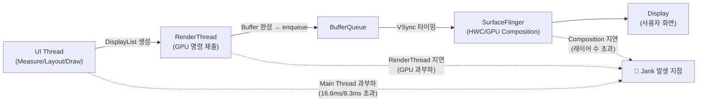

## Jank 는 UI, RenderThread, SurfaceFlinger 전 구간의 frame deadline 실패다

상위 문서: [Graphics and media contracts](graphics-media-contracts.md)

**Jank(프레임 버벅임)** 는 사용자가 시각적으로 프레임 끊김을 느끼는 현상으로, 단일 코드 지점의 오버헤드가 아니라 **UI Thread, RenderThread, BufferQueue, SurfaceFlinger 파이프라인 전체에서 VSync 프레임 마감 시간(Frame Deadline)** 을 놓쳤을 때 발생하는 시스템 합산 결과다.

### 메커니즘: Android 렌더링 파이프라인 구간별 Deadline

1. **UI Thread Deadline (Measure / Layout / Draw)**:
   - Choreographer 의 VSync-APP 신호를 받아 뷰 트리/Compose 레이아웃 및 `DisplayList` 를 작성한다.
   - 60Hz 기준 16.6ms, 120Hz 기준 8.3ms 내에 명령 생성을 완료하지 못하면 UI Jank 발생.

2. **RenderThread Deadline (GPU Execution)**:
   - UI 스레드가 넘겨준 DisplayList 를 Skia GPU 명령으로 변환하여 OpenGL/Vulkan 드라이버에 제출한다.
   - GPU 렌더링 지연으로 `queueBuffer()` 가 늦어지면 RenderJank 발생.

3. **SurfaceFlinger Deadline (Composition)**:
   - VSync-SF 타임스탬프에 맞춰 BufferQueue 에서 버퍼를 꺼내 합성한다.
   - HWC 오버레이 부족 또는 복잡한 레이어 합성으로 VSync 타임스탬프를 놓치면 Display Jank 발생.



### 프레임 예산 기준

| Refresh Rate | 프레임 예산 | 주요 적용 기기 |
|:---|:---:|:---|
| 60 Hz | ~16.6 ms | 구형 디바이스 및 저전력 모드 |
| 90 Hz | ~11.1 ms | Pixel 4+, 중급 디바이스 |
| 120 Hz | ~8.3 ms | 최신 플래그십 (Pixel 8 Pro, Galaxy S24) |

### 진단 접근 코드 예시

```bash
# 1. gfxinfo로 프레임 통계 진단 (가장 빠른 진단)
adb shell dumpsys gfxinfo com.example.app framestats

# 출력 해석:
# Total frames rendered: N
# Janky frames: M (X%)  ← M이 5% 이상이면 jank 이슈 발생
# 50th percentile: Xms, 90th: Yms, 95th: Zms, 99th: Wms

# 2. Perfetto trace로 구간별 원인 분석
adb shell perfetto -c - --txt <<EOF
buffers { size_kb: 32768 }
data_sources {
  config { name: "android.surfaceflinger_frame" }
}
EOF
```

### 관련 문서

- [VSync와 Choreographer는 frame deadline을 정의한다](vsync-and-choreographer-define-frame-deadline.md)
- [RenderThread는 렌더 작업을 나누지만 UI 스레드 비용을 없애지 않는다](renderthread-submits-render-work-without-making-ui-thread-free.md)

공식 문서: [Inspect rendering speed with JankStats](https://developer.android.com/topic/performance/jankstats)
