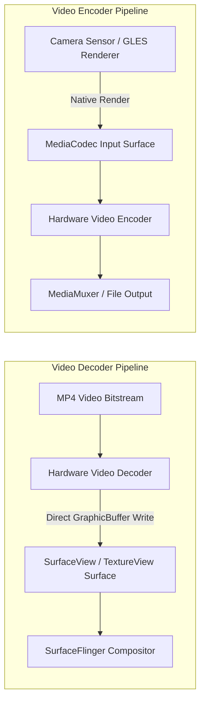

## MediaCodec Surface 모드는 영상 producer 와 consumer 를 연결한다

상위 문서: [Graphics and media contracts](graphics-media-contracts.md)

**MediaCodec Surface 모드**는 비디오 인코딩 및 디코딩 시 픽셀 데이터를 앱 CPU 메모리(`ByteBuffer`)로 전송하지 않고, **GraphicBuffer와 BufferQueue를 이용해 하드웨어 레벨에서 비디오 생산자와 소비자를 직결하는 Zero-Copy 파이프라인**이다.

### 메커니즘: Input Surface와 Output Surface의 파이프라인 결합

1. **Decoder Output Surface (Video Playback)**:
   - 디코더 생성 시 `codec.configure(format, surfaceView.holder.surface, ...)`로 Surface를 전달한다.
   - 디코더 하드웨어는 복호화된 YUV 픽셀을 앱 메모리를 거치지 않고 직접 Surface의 `GraphicBuffer`에 작성한다.
   - `codec.releaseOutputBuffer(index, render=true)` 호출 시 해당 타임스탬프 프레임이 즉시 SurfaceFlinger로 넘어가 화면에 합성된다.

2. **Encoder Input Surface (Video Recording / Transcoding)**:
   - 인코더 생성 시 `MediaCodec.createInputSurface()`로 Surface를 생성한다.
   - 카메라 센서(Camera2), GLES 렌더러, 또는 OpenGL 캔버스가 이 Surface에 렌더링하면, 인코더 하드웨어가 복사 없이 즉시 H.264/HEVC NAL 패킷으로 압축한다.



### Kotlin MediaCodec Encoder Input Surface 구성 코드

```kotlin
import android.media.MediaCodec
import android.media.MediaCodecInfo
import android.media.MediaFormat
import android.view.Surface

fun createVideoEncoderSurface(width: Int, height: Int): Pair<MediaCodec, Surface> {
    val format = MediaFormat.createVideoFormat(MediaFormat.MIMETYPE_VIDEO_AVC, width, height).apply {
        setInteger(MediaFormat.KEY_COLOR_FORMAT, MediaCodecInfo.CodecCapabilities.COLOR_FormatSurface)
        setInteger(MediaFormat.KEY_BIT_RATE, 5_000_000)
        setInteger(MediaFormat.KEY_FRAME_RATE, 30)
        setInteger(MediaFormat.KEY_I_FRAME_INTERVAL, 1)
    }

    val encoder = MediaCodec.createEncoderByType(MediaFormat.MIMETYPE_VIDEO_AVC)
    encoder.configure(format, null, null, MediaCodec.CONFIGURE_FLAG_ENCODE)

    // 인코더 입력용 Surface 생성 (Camera2 / GLES 타깃으로 전달)
    val inputSurface: Surface = encoder.createInputSurface()
    encoder.start()

    return Pair(encoder, inputSurface)
}
```

### 관찰 신호: Surface 모드 버퍼 연결 확인

```bash
# MediaCodec 활성 하드웨어 컴포넌트의 Surface 연결 덤프
adb shell dumpsys media.codec

# 주요 확인 필드:
# - client surface: ANativeWindow/Surface handle 존재 여부
# - Color format: COLOR_FormatSurface (0x7F000789) 설정 확인
```

### 관련 문서

- [Surface 기반 미디어 파이프라인은 앱 수준 픽셀 복사를 줄인다](surface-based-media-pipeline-avoids-app-level-pixel-copy.md)
- [MediaCodec ByteBuffer 모드는 앱이 sample 흐름을 소유한다](mediacodec-bytebuffer-mode-makes-the-app-own-sample-flow.md)

공식 문서: [MediaCodec Surface Encoding](https://developer.android.com/guide/topics/media/media-formats)
