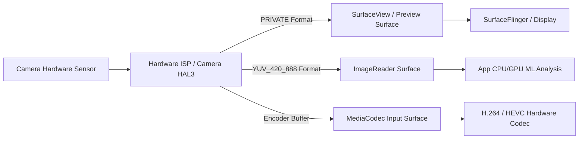

## 카메라 출력 Surface 는 프리뷰, 분석, 녹화 파이프라인을 정의한다

상위 문서: [Graphics and media contracts](graphics-media.md)

Android 카메라 시스템에서 앱은 카메라 센서 데이터를 단일 통합 스트림으로 받지 않는다. 대신 **목적에 따라 별도로 등록된 복수의 Output Surface**를 카메라 캡처 세션에 바인딩하여, 카메라 하드웨어 ISP(Image Signal Processor)가 동일한 렌더링 노출 프레임을 프리뷰, ML/컴퓨터 비전 분석, MP4 인코딩 버퍼로 멀티캐스팅하도록 파이프라인을 구성한다.

### 메커니즘: 목적별 Target Surface 파이프라인 분기

1. **Preview Pipeline (SurfaceView / TextureView)**:
   - 디스플레이 렌더링 전용. 하드웨어 비공개 픽셀 포맷(`PRIVATE` / `IMPLEMENTATION_DEFINED`)을 사용하여 메모리 복사 없이 SurfaceFlinger로 직결 오버레이 처리된다.

2. **Image Analysis Pipeline (ImageReader)**:
   - ML Kit, OpenCV, QR 코드 스캔 등 앱 프로세스가 CPU/GPU 픽셀 평면에 접근해야 하는 파이프라인.
   - 보통 `YUV_420_888` 또는 `RGBA_8888` 포맷을 사용하며, `ImageReader.acquireLatestImage()`를 통해 버퍼 메모리에 접근한다.

3. **Video Recording Pipeline (MediaCodec Surface)**:
   - 영상 저장 전용. `MediaCodec.createInputSurface()`로 생성한 Surface를 카메라 세션에 바인딩하여, 카메라 ISP 출력이 앱 CPU 메모리를 거치지 않고 직접 H.264/HEVC 하드웨어 인코더의 입력 BufferQueue로 복사 없이 통과한다.



### Kotlin Camera2 다중 Output Configuration 구성예

```kotlin
import android.hardware.camera2.CameraDevice
import android.hardware.camera2.params.OutputConfiguration
import android.hardware.camera2.params.SessionConfiguration
import android.media.ImageReader
import android.media.MediaCodec
import android.view.Surface

fun setupMultiSurfaceCameraPipeline(
    cameraDevice: CameraDevice,
    previewSurface: Surface,
    imageReader: ImageReader,
    mediaCodecSurface: Surface,
    executor: java.util.concurrent.Executor
) {
    // 1. 각 타깃 Surface를 OutputConfiguration으로 포장
    val previewConfig = OutputConfiguration(previewSurface)
    val analysisConfig = OutputConfiguration(imageReader.surface)
    val recordingConfig = OutputConfiguration(mediaCodecSurface)

    // 2. 3개의 출력 스트림 세션 결합
    val sessionConfig = SessionConfiguration(
        SessionConfiguration.SESSION_REGULAR,
        listOf(previewConfig, analysisConfig, recordingConfig),
        executor,
        object : CameraCaptureSession.StateCallback() {
            override fun onConfigured(session: CameraCaptureSession) {
                // 파이프라인 준비 완료
            }
            override fun onConfigureFailed(session: CameraCaptureSession) {}
        }
    )

    cameraDevice.createCaptureSession(sessionConfig)
}
```

### 관찰 신호: dumpsys media.camera 스트림 출력 관찰

```bash
# 활성 카메라 세션의 스트림 수 및 Surface 바인딩 현황 출력
adb shell dumpsys media.camera | grep -A 15 "Stream configuration"

# 주요 확인 항목:
# - Stream [0]: SurfaceView (format: IMPLEMENTATION_DEFINED, Usage: HW_COMPOSER)
# - Stream [1]: ImageReader (format: YUV_420_888, Usage: CPU_READ)
# - Stream [2]: MediaCodec (format: IMPLEMENTATION_DEFINED, Usage: VIDEO_ENCODER)
```

### 관련 문서

- [Camera HAL은 capture request를 result와 output buffer로 변환한다](camera-hal-converts-capture-requests-into-result-buffers.md)
- [ImageReader는 앱이 접근할 수 있는 이미지 버퍼를 제공한다](imagereader-is-for-app-accessible-image-buffers.md)

공식 문서: [Camera2 Multi-Surface Streams](https://developer.android.com/training/camera2/multi-stream)
