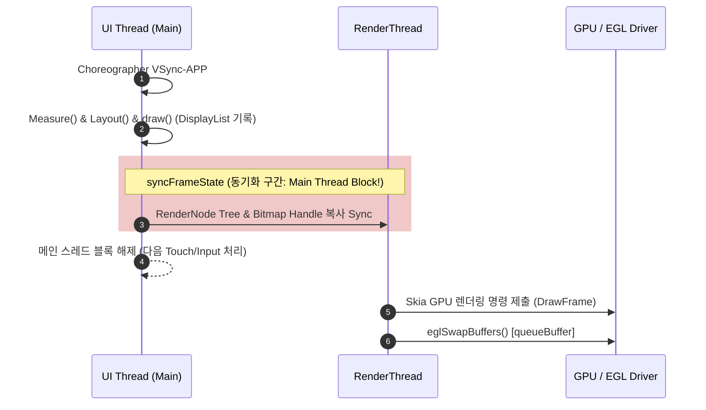

## RenderThread 는 렌더 작업을 나누지만 UI 스레드 비용을 없애지 않는다

상위 문서: [Graphics and media contracts](graphics-media.md)

Android 5.0(Lollipop)부터 도입된 **RenderThread**는 UI 스레드(Main Thread)로부터 OpenGL ES / Vulkan GPU 그리기 명령 전송 오버헤드를 분리한 전용 렌더링 스레드다. 하지만 **UI 스레드의 Measure/Layout/Draw 기록 부하를 완전히 없애주는 것이 아니며**, 동기화 구획(`syncFrameState`)에서는 두 스레드가 차단(Block) 대기한다.

### 메커니즘: UI Thread와 RenderThread의 동기화 파이프라인

1. **Draw Phase & DisplayList Recording (UI Thread)**:
   - 메인 스레드는 VSync-APP 신호를 받아 뷰 트리의 Measure, Layout을 계산하고 `DisplayList` 그리기 명령을 기록한다.

2. **Sync Phase (`syncFrameState`)**:
   - UI 스레드는 생성된 `RenderNode` 트리를 RenderThread로 복사/동기화한다.
   - **이 동기화 시간 동안 메인 스레드는 블로킹 대기 상태(Lock)**가 되므로, 뷰 트리가 비대하거나 비트맵 객체가 과다 생성되면 동기화 대기 시간으로 인한 Jank가 발생한다.

3. **Issue Draw Commands (RenderThread)**:
   - 동기화가 끝나면 메인 스레드는 즉시 차단이 해제되어 다음 이벤트 핸들링으로 복귀한다.
   - RenderThread는 넘겨받은 렌더 트리를 기반으로 GPU 셰이더 드라이버에 명령을 발행하고 EGL/Vulkan SwapBuffers(`queueBuffer`)를 수행한다.



### RenderThread 비동기 애니메이션(RenderThread Animator) Kotlin 예시

```kotlin
import android.view.View
import android.view.ViewPropertyAnimator

fun animateViewOnRenderThread(view: View) {
    // ViewPropertyAnimator는 UI 스레드 동기화 없이
    // RenderThread 내부에서 직접 렌더 변환(Translation/Alpha)을 처리함
    view.animate()
        .translationX(500f)
        .alpha(0.5f)
        .setDuration(300)
        .start()
}
```

### 관찰 신호: dumpsys gfxinfo 구간별 측정

```bash
# UI Thread vs RenderThread 구간별 지연 시간 덤프
adb shell dumpsys gfxinfo com.example.app framestats

# Framestats 열 분석 기준:
# - INTENDED_VSYNC ~ VSYNC: Choreographer 스케줄 지연
# - Process (UI Thread): Measure/Layout/Draw 기록 소요 시간
# - Draw (Sync): UI Thread -> RenderThread syncFrameState 블록 시간
# - Record / Issue (RenderThread): GPU 명령어 변환 및 제출 소요 시간
```

### 관련 문서

- [Canvas, Skia, Compose는 합성기가 아니라 그리기 명령의 생산자다](canvas-skia-and-compose-produce-drawing-commands-not-display-composition.md)
- [Jank는 UI, RenderThread, SurfaceFlinger 전 구간의 frame deadline 실패다](jank-is-frame-deadline-failure-across-ui-renderthread-and-surfaceflinger.md)

공식 문서: [Profile GPU Rendering Walkthrough](https://developer.android.com/topic/performance/rendering/profile-gpu-rendering)
