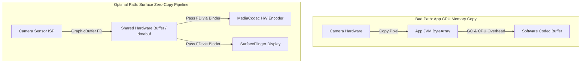

## Surface 기반 미디어 파이프라인은 앱 수준 픽셀 복사를 줄인다

상위 문서: [Graphics and media contracts](graphics-media.md)

카메라 촬영, 영상 재생, 하드웨어 트랜스코딩, OpenGL/Vulkan 렌더 텍스처 처리 시 **Surface 기반 미디어 파이프라인**을 구성하는 핵심 목적은 **대용량 픽셀 데이터(YUV/RGB)가 앱 프로세스의 CPU JVM 메모리로 복사되는 것을 원천 차단(Zero-Copy Pass-through)**하는 것이다.

### 메커니즘: Shared GraphicBuffer (gralloc / dmabuf) 직결 전달

1. **CPU Memory Copy의 한계 (Non-Surface Mode)**:
   - 카메라 캡처 데이터를 앱이 byte array로 받아 MediaCodec 인코더로 전달할 경우:
     Camera HAL -> Kernel -> App JVM Memory Copy (CPU 오버헤드 + GC 발생) -> JNI -> MediaCodec Input Buffer Copy로 인해 4K/60fps 처리가 불가능해짐.

2. **Surface Zero-Copy 파이프라인 (Gralloc Handle Pass)**:
   - `ion` 또는 `dmabuf` 메모리 할당기가 생성한 `GraphicBuffer` 하드웨어 버퍼 핸들(File Descriptor)만 Binder IPC로 전달한다.
   - 카메라 ISP -> GPU 텍스처 -> MediaCodec 하드웨어 인코더 전 과정에서 픽셀 본체 메모리는 그대로 유지되며 핸들만 통과한다.



### Native Surface 파이프라인 바인딩 C++ 예시

```cpp
#include <media/NdkMediaCodec.h>
#include <camera/NdkCameraDevice.h>

// Camera2 NDK 출력을 MediaCodec Encoder Surface로 직접 직결
void connectCameraToEncoderSurface(AMediaCodec* encoder, ACameraCaptureSession* session) {
    ANativeWindow* encoderInputWindow = nullptr;
    AMediaCodec_createInputSurface(encoder, &encoderInputWindow);

    // 카메라 capture request 타깃에 encoder native window 직접 추가
    // 픽셀이 앱 메모리를 거치지 않고 하드웨어 직접 전달됨
    ACameraOutputTarget* target = nullptr;
    ACameraOutputTarget_create(encoderInputWindow, &target);
    
    // session request 설정 생략...
}
```

### 관찰 신호: dumpsys meminfo 그래픽 메모리 관찰

```bash
# zero-copy 파이프라인 적용 시 앱 메모리(Java Heap) 사용량 비교
adb shell dumpsys meminfo com.example.app

# 확인 사항:
# - Native Heap 및 Java Heap 메모리 증가 없이 4K 비디오 처리 유지 여부
# - Gfx dev / EGL mtrack 메모리가 Shared Memory 영역으로만 잡히는지 확인
```

### 관련 문서

- [MediaCodec Surface 모드는 영상 producer와 consumer를 연결한다](mediacodec-surface-mode-connects-video-producers-and-consumers.md)
- [BufferQueue는 producer와 consumer를 버퍼 소유권으로 분리한다](bufferqueue-separates-producer-and-consumer-with-buffer-ownership.md)

공식 문서: [Android Hardware Buffer Sharing](https://developer.android.com/ndk/guides/ahardwarebuffer)
