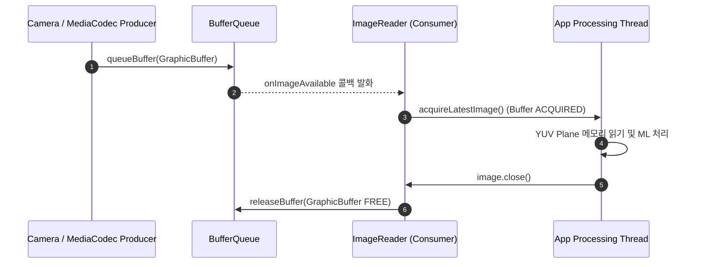

## ImageReader 는 앱이 접근할 수 있는 이미지 버퍼를 제공한다

상위 문서: [Graphics and media contracts](graphics-media.md)

**ImageReader**는 카메라, 비디오 디코더, 렌더 스크립트 등 그래픽 버퍼 생산자가 생성한 `GraphicBuffer` 메모리 평면에 **애플리케이션 CPU/GPU 메모리 공간이 직접 접근할 수 있도록 래핑한 Consumer 계약**이다.

### 메커니즘: ImageReader 버퍼 수신 및 락 관리

1. **BufferQueue Consumer 역할**:
   - `ImageReader.newInstance(width, height, format, maxImages)` 생성 시 내부적으로 `BufferQueue` 소비자 노드를 구성한다.
   - `ImageReader.getSurface()`로 취득한 Surface를 카메라 session이나 MediaCodec 출력으로 전달한다.

2. **Image / Plane 픽셀 매핑 및 Lock**:
   - `acquireLatestImage()` / `acquireNextImage()` 호출 시 하드웨어 `GraphicBuffer` 소유권을 앱이 ACQUIRED 상태로 획득한다.
   - `Image.Plane` 배열을 통해 Y, U, V 개별 채널의 `ByteBuffer` 메모리 지점과 `pixelStride`, `rowStride` 정보를 얻는다.

3. **Buffer Starvation 방지**:
   - 앱이 `image.close()`를 호출해야만 해당 `GraphicBuffer`가 BufferQueue로 반환(`releaseBuffer`)되어 다음 프레임 디코딩/캡처가 지연(Starvation)되지 않는다.



### Kotlin ImageReader YUV_420_888 픽셀 읽기 코드

```kotlin
import android.graphics.ImageFormat
import android.media.ImageReader
import android.os.Handler

fun createYuvImageReader(
    width: Int,
    height: Int,
    handler: Handler,
    onPixelProcessed: (ByteArray) -> Unit
): ImageReader {
    val reader = ImageReader.newInstance(width, height, ImageFormat.YUV_420_888, 3)
    
    reader.setOnImageAvailableListener({ ir ->
        // 가장 최근 프레임 취득 (오래된 버퍼 자동 버림)
        val image = ir.acquireLatestImage() ?: return@setOnImageAvailableListener
        try {
            val yPlane = image.planes[0]
            val yBuffer = yPlane.buffer
            val ySize = yBuffer.remaining()
            val yBytes = ByteArray(ySize)
            yBuffer.get(yBytes)

            onPixelProcessed(yBytes)
        } finally {
            // 반드시 close하여 BufferQueue로 버퍼 반환
            image.close()
        }
    }, handler)

    return reader
}
```

### 관찰 신호: dumpsys meminfo 및 ImageReader 상태

```bash
# ImageReader에 할당된 GraphicBuffer (gralloc 메모리) 관찰
adb shell dumpsys meminfo com.example.app | grep -i "Graphic"

# * close() 누수 발생 시 GraphicBuffer 메모리가 급증하며 "BufferQueue has been abandoned" 에러 발생
```

### 관련 문서

- [카메라 출력 Surface는 프리뷰, 분석, 녹화 파이프라인을 정의한다](camera-output-surfaces.md)
- [BufferQueue는 producer와 consumer를 버퍼 소유권으로 분리한다](bufferqueue-ownership.md)

공식 문서: [Android ImageReader Class](https://developer.android.com/reference/android/media/ImageReader)
