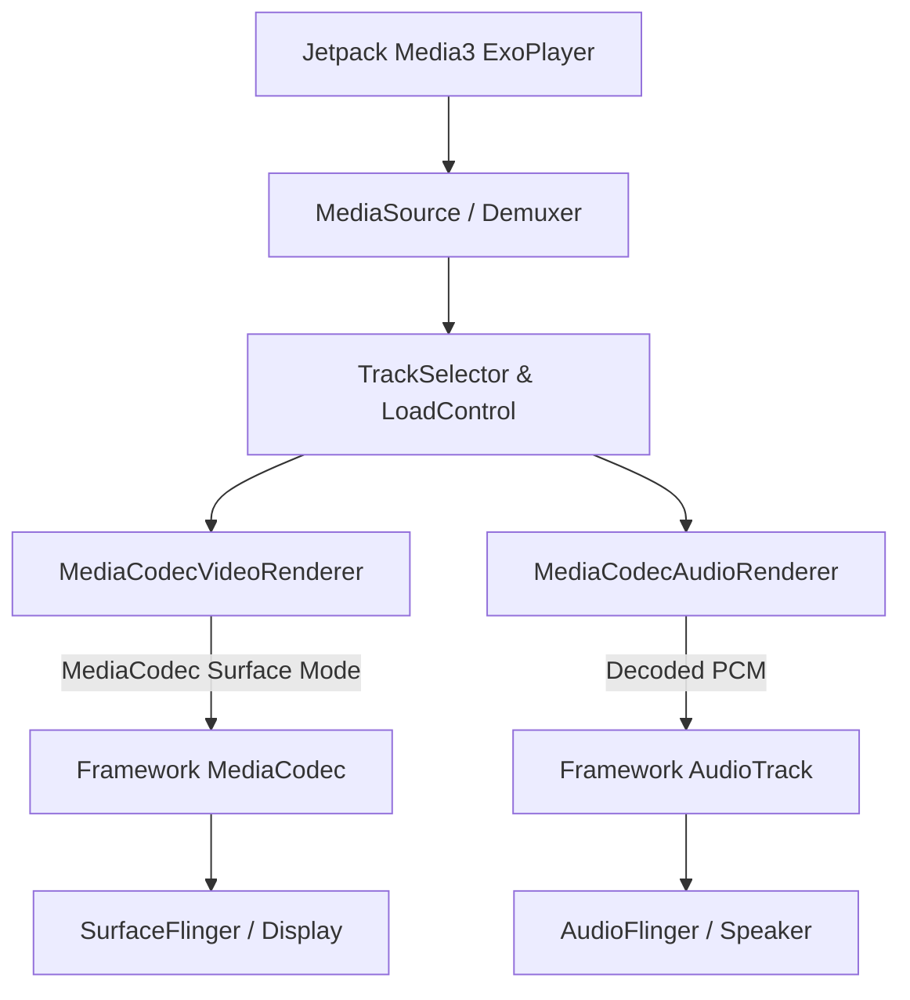

## Media3 ExoPlayer 는 playback stack 이지 저수준 codec API 가 아니다

상위 문서: [Graphics and media contracts](android-graphics-media-runtime.md)

Android **Media3 ExoPlayer**는 하드웨어 인코더/디코더 자체를 직접 구동하는 C/C++ 저수준 디코더 엔진이 아니다. 미디어 컨테이너 파싱(Demuxing), 가변 비트레이트 응답(Adaptive Bitrate Streaming: HLS/DASH), 오디오/비디오 트랙 동기화, 오디오 렌더링, DRM 키 관리, 그리고 하부 프레임워크의 저수준 **MediaCodec 및 AudioTrack**을 총괄 조율하는 **애플리케이션 계층 미디어 재생 스택(App-Level Playback Stack)**이다.

### 메커니즘: ExoPlayer 재생 파이프라인 모듈 추상화

1. **MediaSource & Extractor (Demuxing)**:
   - HTTP/FILE 스트림을 읽어 MP4/TS/MKV 컨테이너를 파싱하고 압축된 패킷(Sample)을 추출한다.

2. **TrackSelector & LoadControl (Adaptive Streaming)**:
   - 대역폭 상태를 측정하여 적절한 비트레이트 품질 트랙을 동적으로 선택하고 버퍼링 전략을 결정한다.

3. **Renderer Engine (MediaCodec & AudioTrack Bridge)**:
   - `MediaCodecVideoRenderer`: 비디오 sample 패킷을 프레임워크 `MediaCodec`에 넘겨 Surface로 출력.
   - `MediaCodecAudioRenderer`: 오디오 sample 패킷을 `MediaCodec`으로 복호화한 후 `AudioTrack`으로 전달.



### Kotlin Media3 ExoPlayer 셋업 예시

```kotlin
import androidx.media3.common.MediaItem
import androidx.media3.exoplayer.ExoPlayer
import android.content.Context

class ExoPlaybackManager(context: Context) {
    private val player = ExoPlayer.Builder(context).build()

    fun playHlsStream(url: String) {
        val mediaItem = MediaItem.fromUri(url)
        player.setMediaItem(mediaItem)
        player.prepare()
        player.playWhenReady = true
    }

    fun release() {
        player.release()
    }
}
```

### 관찰 신호: ExoPlayer 렌더링 및 MediaCodec 디버깅

```bash
# 1. ExoPlayer 백엔드로 구동 중인 하부 MediaCodec instance 덤프
adb shell dumpsys media.codec

# 2. ExoPlayer 이벤트 덤프 logcat 관찰
adb logcat -s ExoPlayerImpl MediaCodecRenderer
```

### 관련 문서

- [MediaCodec Surface 모드는 영상 producer와 consumer를 연결한다](mediacodec-surface-mode.md)
- [AudioTrack, AAudio, Oboe는 지연 시간과 포터빌리티 트레이드오프를 선택한다](android-audio-apis.md)

공식 문서: [Android Media3 ExoPlayer Architecture](https://developer.android.com/guide/topics/media/exoplayer)
