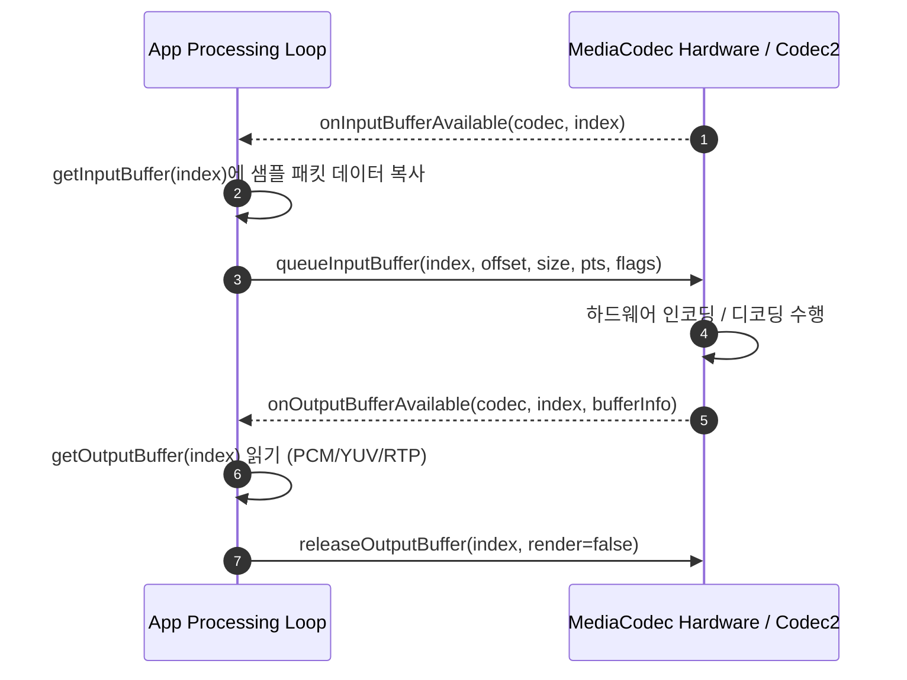

## MediaCodec ByteBuffer 모드는 앱이 sample 흐름을 소유한다

상위 문서: [Graphics and media contracts](android-graphics-media-runtime.md)

**MediaCodec ByteBuffer 모드**는 애플리케이션이 코덱 입력 및 출력 버퍼 메모리에 직접 접근하여 **인코딩/디코딩 샘플 데이터(RAW PCM / YUV / NAL Unit) 패킷 흐름을 동기식 또는 비동기식으로 제어하는 계약**이다. 비디오 Surface 모드와 달리 앱 CPU 메모리 공간을 통과하므로 오디오 처리, 패킷 변형, 커스텀 프로토콜 스트리밍(RTP/WebRTC)에 주로 사용된다.

### 메커니즘: Input / Output Buffer 인덱스 교환 상태 머신

1. **Input Queueing (`getInputBuffer` & `queueInputBuffer`)**:
   - 코덱으로부터 사용 가능한 입력 버퍼 인덱스를 비동기 콜백(`onInputBufferAvailable`)으로 넘겨받는다.
   - 앱은 해당 `ByteBuffer`에 압축 샘플(H.264 NAL Unit 또는 AAC Frame)을 작성하고 프레임 타임스탬프(PTS) 및 플래그와 함께 코덱으로 반환한다.

2. **Output Dequeueing (`getOutputBuffer` & `releaseOutputBuffer`)**:
   - 코덱이 복호화/부호화를 완료하면 출력 버퍼 인덱스를 넘겨받는다.
   - 앱은 결과 `ByteBuffer` (PCM 오디오 / YUV 비디오)를 읽은 후 반드시 `releaseOutputBuffer(index, false)`를 호출하여 코덱 메모리로 슬롯을 반환한다.



### Kotlin 비동기 MediaCodec ByteBuffer 디코딩 예시

```kotlin
import android.media.MediaCodec
import android.media.MediaFormat
import java.nio.ByteBuffer

fun setupAsyncByteBufferDecoder(mediaFormat: MediaFormat) {
    val codec = MediaCodec.createDecoderByType(mediaFormat.getString(MediaFormat.KEY_MIME)!!)

    codec.setCallback(object : MediaCodec.Callback() {
        override fun onInputBufferAvailable(codec: MediaCodec, index: Int) {
            val inputBuffer: ByteBuffer? = codec.getInputBuffer(index)
            // 1. inputBuffer에 샘플 바이트 쓰기
            val sampleSize = readSampleFromExtractor(inputBuffer)
            if (sampleSize > 0) {
                codec.queueInputBuffer(index, 0, sampleSize, getPresentationTimeUs(), 0)
            }
        }

        override fun onOutputBufferAvailable(
            codec: MediaCodec, index: Int, info: MediaCodec.BufferInfo
        ) {
            val outputBuffer: ByteBuffer? = codec.getOutputBuffer(index)
            // 2. outputBuffer (PCM / YUV) 처리
            processDecodedBytes(outputBuffer, info)
            // 3. 코덱으로 버퍼 반환
            codec.releaseOutputBuffer(index, false)
        }

        override fun onError(codec: MediaCodec, e: MediaCodec.CodecException) {}
        override fun onOutputFormatChanged(codec: MediaCodec, format: MediaFormat) {}
    })

    codec.configure(mediaFormat, null, null, 0)
    codec.start()
}

private fun readSampleFromExtractor(buffer: ByteBuffer?): Int = 0
private fun getPresentationTimeUs(): Long = 0L
private fun processDecodedBytes(buffer: ByteBuffer?, info: MediaCodec.BufferInfo) {}
```

### 관찰 신호: dumpsys media.codec 인/출력 버퍼 관찰

```bash
# 디코더/인코더의 인/출력 버퍼큐 할당 수 및 대기 상태 덤프
adb shell dumpsys media.codec

# 확인 항목:
# - Input buffer count & Output buffer count (보통 4~8개 슬롯)
# - releaseOutputBuffer 미호출에 따른 Buffer starvation 상태 발생 여부
```

### 관련 문서

- [MediaCodec Surface 모드는 영상 producer와 consumer를 연결한다](mediacodec-surface-mode.md)
- [Surface 기반 미디어 파이프라인은 앱 수준 픽셀 복사를 줄인다](surface-media-pipeline.md)

공식 문서: [Android MediaCodec Documentation](https://developer.android.com/reference/android/media/MediaCodec)
