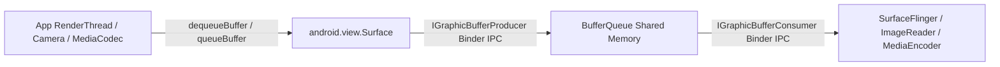

## Surface 는 그래픽 버퍼 producer 측 계약이다

상위 문서: [Graphics and media contracts](graphics-media.md)

`android.view.Surface`는 화면 디스플레이 윈도우나 뷰 컴포넌트 자체를 의미하지 않는다. **BufferQueue의 Producer 측 끝단(Endpoint)을 래핑한 객체**로서, 그리기 주체(RenderThread, Camera HAL, MediaCodec, Canvas)가 그래픽 버퍼(`GraphicBuffer`)를 생산하여 큐에 삽입할 수 있도록 인터페이스를 제공하는 생산자 계약 객체다.

### 메커니즘: Producer → BufferQueue → Consumer 모델

1. **Native ANativeWindow 바인딩 및 IPC**:
   - Java `Surface` 클래스는 C++ NDK 레벨의 `ANativeWindow`를 래핑한다.
   - 내부적으로 `IGraphicBufferProducer` [binder ipc](../ipc-and-process/binder-ipc.md) 핸들을 소유하여 다른 프로세스(예: CameraService, MediaServer)로 마샬링(Parcelable) 전달이 가능하다.

2. **생명주기 및 SurfaceHolder / SurfaceTexture**:
   - `SurfaceView`는 별도의 전용 Surface(`SurfaceHolder`)를 생성하여 SurfaceFlinger 레이어로 바로 결합된다.
   - `TextureView`는 `SurfaceTexture`를 생산자로 사용하여 뷰 트리의 GLES 렌더링 텍스처로 변환한다.

3. **Buffer Allocation 및 Format Contract**:
   - Surface는 버퍼의 너비, 높이, 픽셀 포맷(`RGBA_8888`, `YUV_420_888`), 및 그래픽 용도(`AHARDWAREBUFFER_USAGE_GPU_SAMPLED_IMAGE`, `AHARDWAREBUFFER_USAGE_COMPOSER_OVERLAY`)에 따라 메모리를 사전 할당한다.



### Kotlin 코드 예시: Surface 목적별 생성 및 Native 전달

```kotlin
import android.graphics.SurfaceTexture
import android.media.ImageReader
import android.view.Surface

class SurfaceProducerFactory {
    // 1. GLES / TextureView용 Surface 생성
    fun createSurfaceFromTexture(surfaceTexture: SurfaceTexture): Surface {
        surfaceTexture.setDefaultBufferSize(1920, 1080)
        return Surface(surfaceTexture)
    }

    // 2. ImageReader Consumer 연결용 Surface 생성
    fun createSurfaceFromImageReader(imageReader: ImageReader): Surface {
        return imageReader.surface
    }
}
```

### 관찰 신호: SurfaceFlinger 레이어 및 버퍼 상태 확인

```bash
# SurfaceFlinger에서 현재 Surface 레이어 상태 확인
adb shell dumpsys SurfaceFlinger

# 주요 출력 확인 사항:
# - Layer type: SurfaceView vs TextureView
# - BufferQueue producer/consumer PID
# - Active buffer size & format (e.g. 1080x1920 RGBA_8888)
```

### 관련 문서

- [BufferQueue는 producer와 consumer를 버퍼 소유권으로 분리한다](bufferqueue-ownership.md)
- [Android 렌더링 파이프라인은 Surface → BufferQueue → Compositor 흐름이다](android-rendering-pipeline.md)

공식 문서: [Android Surface Class](https://developer.android.com/reference/android/view/Surface)
