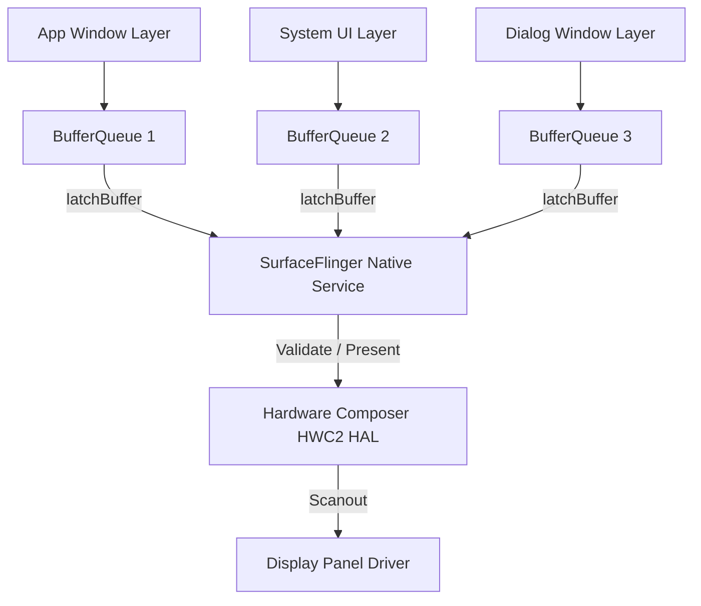

## SurfaceFlinger 는 보이는 레이어를 HWC 와 함께 합성한다

상위 문서: [Graphics and media contracts](graphics-media.md)

**SurfaceFlinger**는 Android 시스템의 코어 native 서비스로, 시스템 내에서 동작하는 모든 애플리케이션, 시스템 UI(Status Bar, Navigation Bar), 팝업 윈도우가 생산한 각각의 **Surface 레이어를 Z-order 순서에 따라 정렬하고 Hardware Composer(HWC)와 함께 최종 디스플레이 프레임버퍼로 합성(Composition)하는 전담 디스플레이 컴포지터**다.

### 메커니즘: VSync-SF 스케줄링 및 합성 트랜잭션

1. **VSync-SF 신호 수신**:
   - EventThread로부터 VSync-SF 파형을 받아 합성 루프를 시작한다.

2. **Latch Buffers (`latchBuffer`)**:
   - 각 활성 레이어의 BufferQueue에서 최신 생산 완료된 버퍼를 가져온다(`acquireBuffer`).

3. **HWC Validate & Present**:
   - HWC HAL에 레이어 목록을 전송하고, HWC가 직접 처리할 수 없는 레이어(GLES Composition)는 GPU Skia 엔진으로 먼저 렌더링한 후 HWC presentDisplay를 호출하여 화면 출력 버퍼로 내보낸다.



### SurfaceFlinger Transaction C++ / NDK 구조 개념

```cpp
// SurfaceComposerClient 트랜잭션을 통한 레이어 Z-Order 및 가시성 조정
#include <gui/SurfaceComposerClient.h>

void updateLayerGeometry(const android::sp<android::SurfaceControl>& layer) {
    android::SurfaceComposerClient::Transaction t;
    t.setLayer(layer, 1000) // Z-order 설정
     .setAlpha(layer, 0.9f) // 알파 블렌딩 설정
     .setPosition(layer, 0, 0)
     .apply(); // SurfaceFlinger로 트랜잭션 원자적 커밋
}
```

### 관찰 신호: dumpsys SurfaceFlinger 레이어 덤프

```bash
# SurfaceFlinger 전체 활성 레이어 및 Z-order, GPU vs HWC 합성 상태 관찰
adb shell dumpsys SurfaceFlinger

# 주요 덤프 항목:
# - Visible layers list & Z-order ranking
# - Composition type (GLES vs DEVICE)
# - Refresh rate state (60Hz / 90Hz / 120Hz switching)
```

### 관련 문서

- [Hardware Composer는 기기 제약 안에서 합성을 offload한다](hardware-composer.md)
- [Android 렌더링 파이프라인은 Surface → BufferQueue → Compositor 흐름이다](android-rendering-pipeline.md)

공식 문서: [SurfaceFlinger and WindowManager](https://source.android.com/docs/core/graphics/surfaceflinger)
