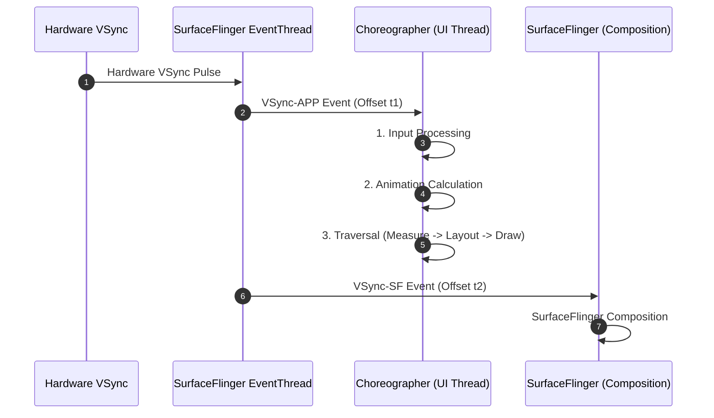

## VSync 와 Choreographer 는 frame deadline 을 정의한다

상위 문서: [Graphics and media contracts](android-graphics-media-runtime.md)

Android 렌더링 파이프라인의 시간축 기준점인 **VSync (Vertical Synchronization)** 하드웨어 디스플레이 신호와 이를 애플리케이션 프레임워크 스레드로 중계하는 **Choreographer**는 각 프레임이 주사율(60Hz, 90Hz, 120Hz)에 맞춰 완료되어야 하는 **마감 시간(Frame Deadline)**을 엄격하게 정의한다.

### 메커니즘: VSync-APP / VSync-SF 2단계 페이징

1. **Hardware VSync Pulse**:
   - 디스플레이 패널 컨트롤러가 물리 주사 주기마다 VSync 이벤트를 발생시킨다.

2. **DispSync / EventThread**:
   - SurfaceFlinger 내부의 `EventThread`가 하드웨어 VSync를 바탕으로 소프트웨어 펄스인 **VSync-APP**과 **VSync-SF**로 분리 계산한다.

3. **Choreographer Frame Callback Phase**:
   - `Choreographer`는 VSync-APP 타이머를 수신하여 UI 스레드에서 4가지 단계를 순차적으로 실행한다:
     - `CALLBACK_INPUT`: 터치 이벤트 처리
     - `CALLBACK_ANIMATION`: 애니메이션 계산
     - `CALLBACK_TRAVERSAL`: Measure -> Layout -> Draw (`DisplayList` 기록)
     - `CALLBACK_COMMIT`: 프레임 제출 준비 완료



### Kotlin Choreographer FrameCallback 등록 코드

```kotlin
import android.view.Choreographer

class FrameDeadlineMonitor : Choreographer.FrameCallback {
    private var lastFrameTimeNanos: Long = 0L

    fun startMonitoring() {
        Choreographer.getInstance().postFrameCallback(this)
    }

    override fun doFrame(frameTimeNanos: Long) {
        if (lastFrameTimeNanos != 0L) {
            val frameDurationMs = (frameTimeNanos - lastFrameTimeNanos) / 1_000_000.0
            // 120Hz 기준 8.3ms, 60Hz 기준 16.6ms 초과 시 Deadline 미스 감지
            if (frameDurationMs > 16.6) {
                // Jank 감지 로직
            }
        }
        lastFrameTimeNanos = frameTimeNanos
        // 다음 프레임 콜백 재등록
        Choreographer.getInstance().postFrameCallback(this)
    }
}
```

### 관찰 신호: dumpsys SurfaceFlinger VSync 덤프

```bash
# VSync 오프셋 및 주사율(Refresh Rate) 설정 현황 관찰
adb shell dumpsys SurfaceFlinger | grep -A 10 "VSync"

# 주요 확인 필드:
# - VSync-APP phase offset: UI 스레드 트리거 오프셋 (e.g. 1.5ms)
# - VSync-SF phase offset: SurfaceFlinger 합성 트리거 오프셋 (e.g. 6.0ms)
# - Active Refresh Rate: 60Hz, 90Hz, 120Hz 동적 가변 상태
```

### 관련 문서

- [Jank는 UI, RenderThread, SurfaceFlinger 전 구간의 frame deadline 실패다](jank-frame-deadlines.md)
- [RenderThread는 렌더 작업을 나누지만 UI 스레드 비용을 없애지 않는다](renderthread-pipeline.md)

공식 문서: [Android Choreographer Class](https://developer.android.com/reference/android/view/Choreographer)
