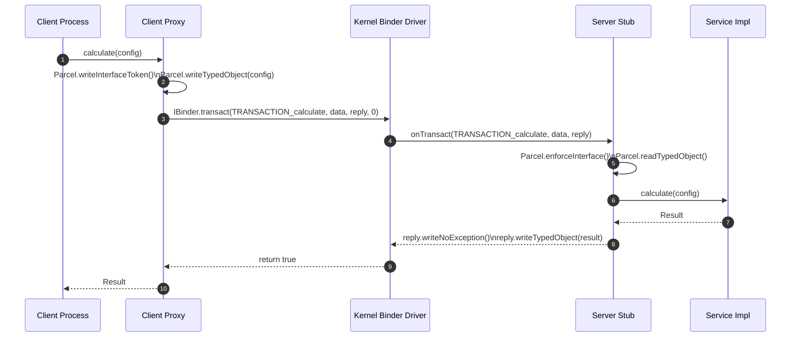

## AIDL 은 process boundary 계약이지 비즈니스 프로토콜이 아니다

상위 문서: [IPC and process contracts](binder-ipc.md)

배경 지식: [Idempotency(멱등성)](../../../../../02_references/computer-science/idempotency.md)

AIDL 은 **client proxy**(호출자 프로세스에서 원격 객체를 마치 로컬 객체처럼 부를 수 있게 감싸는 대리 클래스)와 **server stub**(수신 프로세스에서 그 호출을 실제 구현 메서드로 연결해주는 뼈대 클래스)을 생성해 Binder transaction 형식을 맞춰주는 interface definition(인터페이스 정의)이다. 이것은 process boundary 의 호출 모양을 고정하지만, 비즈니스 의미, retry, **idempotency**(멱등성 — 같은 요청을 여러 번 보내도 결과가 한 번 보낸 것과 같아야 한다는 성질), authorization, version compatibility 를 자동으로 설계해주지는 않는다.

앱 내부 module 사이의 단순 추상화에 AIDL 을 도입하면 오히려 비용과 실패 모드가 커진다. AIDL 은 실제 process boundary 가 있고 그 경계를 안정적으로 유지해야 할 때 의미가 있다.

---

### 내부 동작 메커니즘 (AIDL Code Gen & Parcel Marshaling)

AIDL 컴파일러(`aidl`)는 `.aidl` 인터페이스 선언을 분석하여 **Client Proxy**와 **Server Stub** 클래스를 생성한다.

1. **Transaction Code 매핑**: AIDL 에 정의된 각 메서드는 `FIRST_CALL_TRANSACTION + index` 형태의 정수 `code`에 1:1 매핑된다.
2. **Interface Token 검증**: **Marshaling**(객체를 전송 가능한 바이트 형태로 직렬화하는 과정) 시 `Parcel.writeInterfaceToken(DESCRIPTOR)`를 삽입하고, **Unmarshaling**(수신한 바이트를 다시 객체로 복원하는 과정) 시 Server의 `Stub.onTransact()`에서 `Parcel.enforceInterface(DESCRIPTOR)`로 인터페이스 식별자를 검증하여 잘못된 IPC 접근을 차단한다.
3. **IPC Dispatch Flow**:
   - Client가 Proxy 메서드 호출 $\rightarrow$ `Parcel.obtain()`으로 data/reply 객체 생성 $\rightarrow$ `IBinder.transact(code, data, reply, flags)` 호출.
   - Binder 커널 드라이버가 Server 프로세스로 전달 $\rightarrow$ Server process의 Binder 스레드가 `Stub.onTransact(code, data, reply, flags)` 실행 $\rightarrow$ 실제 서비스 구현체 함수 호출 후 reply 작성.



---

### 구체적 AIDL & Java Stub/Proxy 코드 예시

```aidl
// ITaskService.aidl
package com.example.service;

import com.example.service.TaskData;

interface ITaskService {
    oneway void submitTask(in TaskData data);
    int getTaskStatus(int taskId);
}
```

```java
// aidl 컴파일러가 생성하는 Stub 내부 dispatch 핵심 구현 (요약)
public abstract static class Stub extends android.os.Binder implements ITaskService {
    private static final String DESCRIPTOR = "com.example.service.ITaskService";
    static final int TRANSACTION_submitTask = (android.os.IBinder.FIRST_CALL_TRANSACTION + 0);
    static final int TRANSACTION_getTaskStatus = (android.os.IBinder.FIRST_CALL_TRANSACTION + 1);

    @Override
    public boolean onTransact(int code, android.os.Parcel data, android.os.Parcel reply, int flags) throws RemoteException {
        switch (code) {
            case TRANSACTION_getTaskStatus: {
                data.enforceInterface(DESCRIPTOR);
                int _arg0 = data.readInt();
                int _result = this.getTaskStatus(_arg0);
                reply.writeNoException();
                reply.writeInt(_result);
                return true;
            }
            default:
                return super.onTransact(code, data, reply, flags);
        }
    }
}
```

---

### 관찰 가능한 증거 (Observable Evidence)

1. **TransactionTooLargeException**:
   - Sync Binder 호출 시 data/reply Parcel 공유 버퍼 크기 제한(약 1MB shared pool) 초과 시 발생.
   - Exception: `android.os.TransactionTooLargeException: data parcel size WXYZ bytes`
2. **dumpsys 명령어로 서비스 Binder Call 현황 확인**:
   ```bash
   adb shell dumpsys binder_calls
   adb shell dumpsys activity service com.example.service/.TaskService
   ```
3. **DeadObjectException / RemoteException**:
   - IPC 도중 Server 프로세스가 Crash 나거나 Kill 되었을 때 Client Proxy 가 수신하는 예외.
   - Logcat Tag: `Binder: caught exception` or `BinderProxy: transaction failed`.

---

### 실무 규칙

- AIDL method 는 local function 처럼 보이더라도 실패, 지연, cancellation 을 원격 호출로 다룬다.
- stable AIDL 은 버전 호환성을 API 계약으로 관리해야 하는 경계에만 둔다.
- parcelable 은 전송 schema 이지 domain model 자체가 아니다.
- permission 과 caller identity 검사는 service 구현에서 명시적으로 둔다.

관련 노트: [Bound service는 프로세스 의존성과 IPC API를 노출한다](../../02_app_framework/architecture/app-components/bound-service-ipc.md)
