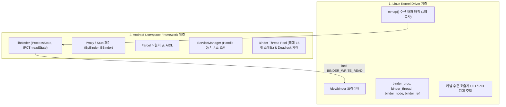

## Binder IPC 아키텍처 (Binder Inter-Process Communication)

### 개요

**Binder IPC**는 Linux 커널 드라이버(`/dev/binder`)와 Android 유저스페이스 프레임워크(`libbinder`)를 기반으로, 서로 다른 프로세스 간(예: 앱 프로세스 ↔ [system_server](../../04_system_services/system-server.md)) 메모리를 완벽히 격리한 채 고속으로 데이터와 원격 명령을 주고받는 **Android OS 핵심 IPC 아키텍처**이다.

전통적인 POSIX IPC(소켓, 파이프, 공유 메모리)와 달리, Binder 는 **커널이 직접 호출자의 신원(UID/PID)을 강제 주입하는 보안성**, **`mmap()` 을 통한 1 회 메모리 복사(Single-Copy) 고속성**, 그리고 **객체 지향적 원격 프로시저 호출(Proxy/Stub 기반 RPC)** 을 결합하여 안드로이드 플랫폼 전체의 백본(Backbone) 역할을 수행한다.

---

### Binder IPC 2 대 핵심 계층 구조

Binder IPC 시스템은 역할과 실행 공간에 따라 **커널 드라이버 계층**과 **유저스페이스 프레임워크 계층**의 2 대 축으로 명확히 나뉜다:

#### 1. [Binder 커널 드라이버 및 메모리 매핑 메커니즘](binder-kernel-driver.md) *(Linux Kernel Space)*

- `/dev/binder` 캐릭터 디바이스 드라이버의 물리적 동작
- `mmap()` 을 활용한 수신 프로세스 가상 메모리 매핑 및 1 회 복사(`copy_from_user`) 원리
- 커널 내부 핵심 자료구조 (`binder_proc`, `binder_thread`, `binder_node`, `binder_ref`)
- 커널 `task_struct` 기반 호출자 UID/PID 변조 불가 주입 메커니즘
- `BC_TRANSACTION`, `BR_REPLY` 등 커널 바인더 명령어 프로토콜 및 3 종 디바이스 분리 (`/dev/binder`, `/dev/hwbinder`, `/dev/vndbinder`)

#### 2. [Binder 유저스페이스 프레임워크 아키텍처](binder-framework.md) *(Android Userspace)*

- C++ `libbinder` 코어: `ProcessState`(프로세스당 1 개)와 `IPCThreadState`(스레드당 1 개)
- 객체 지향 Proxy/Stub 패턴: `BpBinder`(클라이언트 Proxy)와 `BBinder`(서버 Stub)
- `Parcel` 고속 직렬화 컨테이너 및 AIDL 컴파일러
- `ServiceManager`(Handle 0) 기반 서비스 등록 및 주소 검색 메커니즘
- Binder Thread Pool(기본 16 개 스레드) 스케줄링 및 서비스 동시성 제어

---

### Binder 세부 동작 원자 문서 목록

1. **[Binder 커널 드라이버](binder-kernel-driver.md)**: 커널 드라이버 및 mmap 1 회 복사 메모리 메커니즘
2. **[Binder 프레임워크](binder-framework.md)**: libbinder, Proxy/Stub, Parcel, ServiceManager
3. **[Binder 트랜잭션 수명과 1MB 버퍼 제한](binder-transaction-lifetime.md)**: Call ➔ Copy ➔ Dispatch ➔ Reply 4 단계 및 `TransactionTooLargeException`
4. **[Binder 스레드 풀과 서비스 동시성 경계](binder-thread-pool.md)**: 수신 스레드 풀(최대 16 개) 및 중첩 동기 호출 시 Deadlock 예방
5. **[Oneway 비동기 바인더 통신](oneway-binder-transactions.md)**: `oneway` 키워드 비동기 통신과 서버 백프레셔(Backpressure) 처리

---

### 전통적 POSIX IPC 와 Android Binder 핵심 비교

| 비교 항목 | 전통적 POSIX Socket / Pipe | Android Binder IPC |
| :--- | :--- | :--- |
| **메모리 복사 횟수** | 2 회 복사 (User ➔ Kernel ➔ User) | **1 회 복사 (`mmap` 수신 버퍼 직접 매핑)** |
| **호출자 보안 검증** | 패킷 페이로드 내 위조 가능 (단, Unix Socket `SO_PEERCRED` 예외) | **커널이 직접 호출자의 UID/PID 를 강제 주입** |
| **통신 패러다임** | 바이트 스트림 (Raw Byte Stream) | **객체 지향 RPC (`IBinder`, `Parcelable`, AIDL)** |
| **중앙 서비스 등록소** | DNS, 포트, 파일 경로 | **[ServiceManager](../../04_system_services/service-manager.md) (Handle 0)** |
| **상대 종료 감지** | EOF/errno 간접 추론 | **`linkToDeath()` / `DeathRecipient` 커널 능동 통지** |

---

### 상위 및 연관 문서

- [POSIX IPC vs Android Binder](../../../../operating-systems/ipc-contracts/posix-ipc-vs-android-binder.md)
- [Binder 커널 드라이버](binder-kernel-driver.md)
- [Binder 유저스페이스 프레임워크](binder-framework.md)
- [ServiceManager](../../04_system_services/service-manager.md)
- [system_server](../../04_system_services/system-server.md)
- [Zygote 와 ART 런타임 심층 계약](../boot-and-runtime/zygote-runtime/zygote-runtime.md)
- [mmap 시스템 콜과 가상 메모리 매핑](../../../../computer-science/mmap.md)
