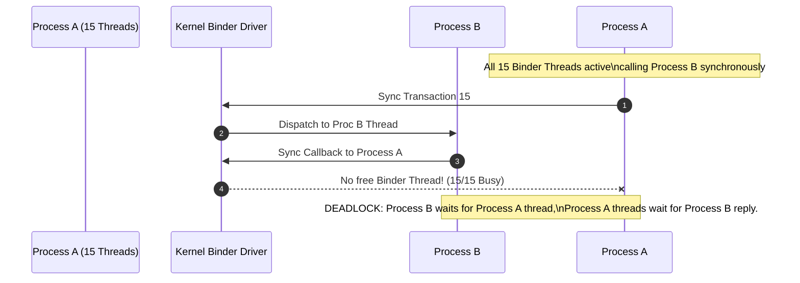

## Binder thread pool 은 service concurrency 와 deadlock 경계다

상위 문서: [IPC and process contracts](ipc-process.md)

배경 지식: [Deadlock](../../../../computer-science/deadlock.md)

Binder service 는 들어오는 transaction 을 Binder thread pool 에서 처리한다. thread pool 은 동시성을 제공하지만, blocking call 이 쌓이면 service 전체 응답성이 떨어지고 caller 와 callee 가 서로 기다리는 **deadlock**(교착 상태 — 서로가 서로의 자원이나 응답을 기다리며 아무도 더 진행하지 못하는 상태) 구조도 만들 수 있다.

Binder 를 사용하는 API 는 method 단위만 보지 말고 call graph 전체를 봐야 한다. 특히 service A 가 service B 를 동기 호출하고, 다시 B 가 A 를 호출하는 구조는 thread pool 과 lock 순서에 따라 멈출 수 있다.

---

### 내부 동작 메커니즘 (Thread Pool Sizing & Circular Deadlock)

1. **Process Thread Pool Limits**:
   - Native C++ 및 Java IPC 프로세스는 `ProcessState::self()->setThreadPoolMaxThreadCount(15)`를 통해 최대 Binder 스레드 개수(기본값 15개)를 설정한다.
   - Binder 드라이버는 스레드가 추가로 필요할 때 `BR_SPAWN_LOOPER` 커널 명령을 보내어 `binder:PID_N` 형태의 작업 스레드를 동적으로 생성한다.
2. **Circular Sync IPC Starvation Deadlock**:
   - **사나운 교착 상태(Direct Deadlock)**: Process A의 Binder Thread가 Lock X를 쥔 채 Process B로 동기 call $\rightarrow$ Process B가 다시 Process A로 동기 callback 호출하며 Lock X를 요청.
   - **스레드 풀 고갈 교착 상태(Thread Pool Exhaustion Deadlock)**: Process A의 15개 Binder 스레드가 모두 Process B로 동기 IPC 요청을 수행 중 $\rightarrow$ Process B가 작업 진행 중 Process A로 동기 callback 호출 $\rightarrow$ Process A에 사용 가능한 Binder 스레드가 0개이므로 요청 수신 불가 $\rightarrow$ Process A와 B 모두 영구 대기 상태 진입.



---

### C++ Native Binder Thread Pool 스니펫

```cpp
// Framework Server Process (C++) Binder Thread Pool 초기화
#include <binder/ProcessState.h>
#include <binder/IPCThreadState.h>

int main() {
    // 기본 maximum thread 수 설정 (15개)
    sp<ProcessState> proc(ProcessState::self());
    proc->setThreadPoolMaxThreadCount(15);
    
    // 메인 스레드를 Binder Looper로 등록 및 실행
    ProcessState::self()->startThreadPool();
    IPCThreadState::self()->joinThreadPool();
    return 0;
}
```

---

### 관찰 가능한 증거 (Observable Evidence)

1. **ANR Trace File (`/data/anr/traces.txt` 또는 `bugreport`)**:
   - Binder Thread들이 `IPCThreadState::waitForResponse` 또는 `binder_thread_read` 상태에서 영구 블락된 스택 트레이스 관찰:
   ```text
   "binder:1234_3" prio=5 tid=12 Native
     at android.os.BinderProxy.transactNative(Native Method)
     at android.os.BinderProxy.transact(BinderProxy.java:570)
     at com.example.IService$Stub$Proxy.doCallback(IService.java:180)
   ```
2. **dumpsys binder 스레드 풀 상태 정보**:
   ```bash
   adb shell dumpsys binder
   # Output:
   # threads: 15
   # requested threads: 15 (max threads reached!)
   # ready threads: 0
   ```
3. **Logcat Binder Exhaustion Warning**:
   ```text
   W/Binder: 1234:1234 binder thread pool exhausted! 15 threads busy.
   ```

---

### 실무 규칙

- Binder callback 안에서 오래 걸리는 I/O 나 lock 대기를 피한다.
- cross-service 동기 호출은 lock 보유 상태에서 실행하지 않는다.
- callback 재진입 가능성을 API 문서와 구현 양쪽에서 고려한다.
- ANR 분석은 UI thread 뿐 아니라 Binder thread 의 block stack 도 같이 본다.

관련 노트: [ANR은 단일 timeout이 아니라 responsiveness contract 위반이다](../boot-and-runtime/system-server/anr-responsiveness.md)

