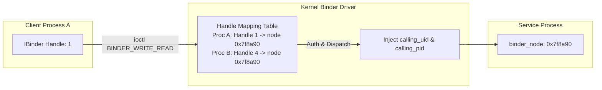

## Binder 는 객체 참조를 커널이 중재하는 capability IPC 다

상위 문서: [IPC and process contracts](ipc-process-contracts.md)

Binder 의 핵심은 byte stream 이 아니라 remote object reference 다. client 는 handle 을 통해 service 의 method 를 호출하고, kernel Binder driver 는 process 간 buffer 전달, object reference, death notification, caller identity 를 중재한다.

그래서 Binder 를 단순 직렬화나 socket 대체물로 보면 중요한 경계를 놓친다. 권한 검사는 API 표면의 permission 만이 아니라 service 등록, caller UID/PID, SELinux binder policy, exported component 경계와 함께 해석해야 한다.

---

### 내부 동작 메커니즘 (Handle Translation & Capability Security)

Binder 는 Kernel Level Capability-based Security 모델이다.

1. **Handle 0 (servicemanager)**: 모든 프로세스는 시작 시 Handle 0 번(ServiceManager)을 기본 할당받는다.
2. **`flat_binder_object` & `binder_fd_object` Translation**:
   - Server 가 Binder 객체나 File Descriptor 를 전달할 때 커널 Binder 드라이버는 직렬화된 Parcel 내부의 offset 배열을 스캔하여 Wire Protocol 데이터 구조체(`flat_binder_object`, `binder_fd_object`)를 변환한다.
   - Binder 참조: Server 의 `BINDER_TYPE_BINDER` (커널 포인터 `binder_node`)를 Client 전용의 정수 Handle (`BINDER_TYPE_HANDLE`)로 1:1 매핑 변환한다. Client 는 정수 Handle 값만 가질 뿐 타 프로세스의 Binder 메모리를 임의 조작할 수 없다.
   - File Descriptor: Client/Server 프로세스 간 FD 공유 시 `BINDER_TYPE_FD`(`binder_fd_object`)를 매개로 커널이 수신 프로세스의 fd table 에 새로운 fd 번호를 생성 할당(File Descriptor Dup)하여 안전한 IPC 파일 공유를 보장한다.
3. **Spoofing 불가능한 Caller Identity**:
   - `ioctl(fd, BINDER_WRITE_READ, …)` 수행 시 커널이 호출자의 `uid` 와 `pid` 를 `binder_transaction_data` 구조체에 직접 주입한다.
   - Server Java 레벨에서 `Binder.getCallingUid()`, `Binder.getCallingPid()` 를 호출하면 커널이 보증한 신원 정보가 반환된다.



---

### 구체적 Identity Check 코드 스니펫

```java
// Java Framework Server 단에서의 Kernel Caller Identity 검증
public void performRestrictedOperation() {
    int callingUid = Binder.getCallingUid();
    int callingPid = Binder.getCallingPid();
    
    // Kernel이 주입한 UID를 기반으로 권한 검사 (Spoofing 불가)
    if (UserHandle.getAppId(callingUid) != Process.SYSTEM_UID) {
        throw new SecurityException("Calling UID " + callingUid + " is not system user");
    }
    
    final long token = Binder.clearCallingIdentity();
    try {
        // system privilege 로 내부 동작 수행
        doInternalSystemWork();
    } finally {
        Binder.restoreCallingIdentity(token);
    }
}
```

---

### 관찰 가능한 증거 (Observable Evidence)

1. **SELinux Binder Denial 로그**:
   - 허용되지 않은 프로세스가 Binder call 시도 시 audit log 발동:
   ```text
   type=1400 audit(1620000000.123:45): avc: denied { call } for pid=1234 comm="app_process" scontext=u:r:untrusted_app:s0 tcontext=u:r:system_server:s0 tclass=binder permissive=0
   ```
2. **dumpsys binder 로 프로세스별 Binder Node/Ref 상태 분석**:
   ```bash
   adb shell dumpsys binder
   # Proc / Kernel binder transaction state
   adb shell cat /sys/kernel/debug/binder/proc/<PID>
   ```
3. **servicemanager logcat**:
   ```bash
   adb shell logcat -s servicemanager
   # Output: servicemanager: Found service 'media.camera' or SecurityException: Permission denied
   ```

---

### 실무 규칙

- Binder API 는 "누가 이 handle 을 얻을 수 있는가"를 먼저 설계한다.
- system service 호출은 library call 처럼 보여도 process boundary 와 permission boundary 를 지난다.
- 큰 payload, file descriptor, long-running work 는 transaction 비용과 lifetime 을 분리한다.
- native/HAL Binder 는 앱 AIDL 과 같은 단어를 쓰더라도 안정성, 버전, SELinux 경계가 다르다.

관련 노트: [SELinux policy는 Binder service와 file boundary를 함께 제어한다](../../kernel-and-hal/kernel-contracts/selinux-policy-controls-binder-service-and-file-boundaries.md)
