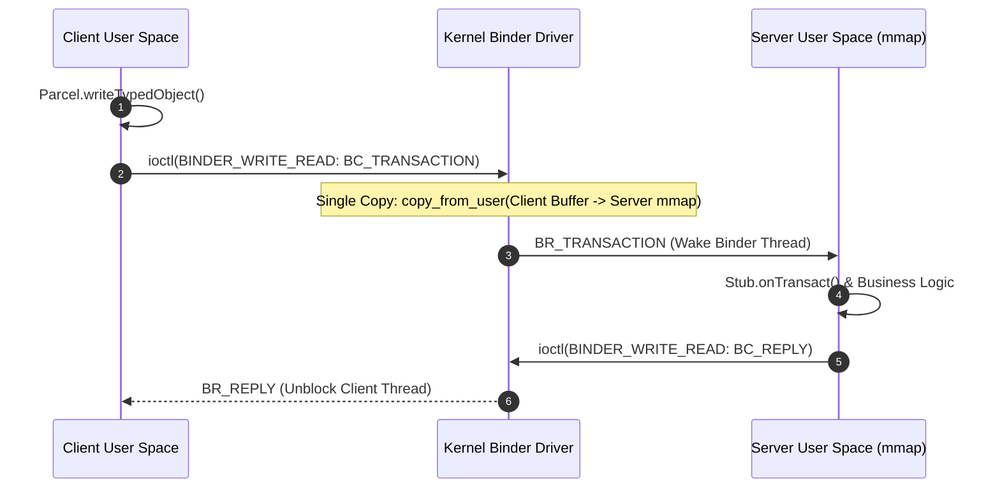

## Binder transaction lifetime 은 call, copy, dispatch, reply 로 나뉜다

상위 문서: [IPC and process contracts](ipc-process-contracts.md)

동기 Binder 호출은 caller 가 transaction 을 보내고, Binder driver 가 data 와 object reference 를 target process 의 Binder buffer 로 전달하고, target Binder thread 가 `onTransact()` 를 처리한 뒤 reply 를 돌려주는 흐름이다.

이 흐름 때문에 Binder 비용은 "함수 호출 비용"이 아니다. thread scheduling, buffer copy, parcel marshaling, callee work, reply 대기 시간이 모두 caller 지연으로 관찰된다.

---

### 내부 동작 메커니즘 (Single-Copy mmap & 4-Phase Lifecycle)

Binder transaction 은 **Single-Copy (단 1회의 메모리 복사)** 구조로 동작한다. 일반 서드파티 앱 프로세스는 오픈 시 커널 `/dev/binder`에 대해 `mmap()`을 수행하며, 수신 전용 Binder buffer 공간은 커널 소스 코드(`ProcessState.cpp`)에 의해 정확히 `(1MB - 8KB)`인 **1016 KB (`1024 * 1024 - 2 * PAGE_SIZE`)**로 제한 할당된다.

1. **Call Phase (Client Userspace)**:
   - Client가 Parcel 데이터 작성 후 `IPCThreadState::transact()` 호출 $\rightarrow$ `BC_TRANSACTION` 헤더와 함께 `ioctl(fd, BINDER_WRITE_READ, ...)` 실행 $\rightarrow$ Client 스레드 대기(Blocked).
2. **Copy Phase & Buffer Allocation (Kernel Space)**:
   - Binder 드라이버 커널 모듈(`binder_alloc.c`)이 수신자(Server) 프로세스의 공유 `mmap` ring buffer 영역(`binder_proc->alloc`)에서 `binder_buffer` 블록을 할당한다.
   - Client 사용자 공간 메모리 데이터를 Server의 mmap 버퍼 영역으로 **직접 copy_from_user** 수행 (중간 커널 임시 버퍼를 거치지 않는 1회 복사).
   - **Buffer Exhaustion Boundary**: 1016 KB 제한은 단일 트랜잭션 수치일 뿐만 아니라 프로세스 내 실행 중인 **모든 동시성 Binder 수신 스레드가 공유하는 총량**이다. 단일 호출이 1MB 미만이라도 다수의 스레드가 동시 처리 중이면 버퍼 고갈로 `TransactionTooLargeException` 또는 커널 `NO_MEMORY (-ENOMEM)` 에러가 발생한다.
3. **Dispatch Phase (Server Userspace)**:
   - 드라이버가 Server 프로세스의 `todo` 큐에 `BR_TRANSACTION`을 추가하고 Binder 스레드 풀에서 자고 있는 스레드를 깨운다.
   - Server 스레드가 `BBinder::onTransact()` / Java `Stub.onTransact()`를 수행하여 비즈니스 로직을 처리한다.
4. **Reply Phase (Server $\rightarrow$ Kernel $\rightarrow$ Client)**:
   - Server가 `BC_REPLY`로 결과를 커널에 전달 $\rightarrow$ 커널이 Client mmap 버퍼로 결과 복사 후 `BR_REPLY` 발송 $\rightarrow$ Client 스레드 unblock 및 커널 `binder_buffer` 해제.



---

### C++ `IPCThreadState::transact` 호출 스니펫

```cpp
// Native IPCThreadState 내부 거래 실행 로직 (frameworks/native/libs/binder/IPCThreadState.cpp)
status_t IPCThreadState::transact(int32_t handle, uint32_t code, const Parcel& data,
                                  Parcel* reply, uint32_t flags) {
    status_t err;
    flags |= TF_ACCEPT_FDS; // File Descriptor 전달 허용
    
    // 1. Command 데이터 패킹 (BC_TRANSACTION)
    writeTransactionData(BC_TRANSACTION, flags, handle, code, data, nullptr);
    
    if ((flags & TF_ONEWAY) == 0) { // Sync call인 경우 reply 대기
        if (reply) {
            err = waitForResponse(reply);
        }
    } else { // Async call인 경우 대기 없이 즉시 리턴
        err = waitForResponse(nullptr, nullptr);
    }
    return err;
}
```

---

### 관찰 가능한 증거 (Observable Evidence)

1. **Perfetto / Systrace Binder Traces**:
   - Trace 상에 `binder transaction` slice 표시.
   - Client 측: `binder transaction` block 기간 (Call ~ Reply 수신까지의 전체 시간).
   - Server 측: `binder reply` 및 `onTransact()` 실제 실행 시간.
2. **ftrace kernel event 관찰**:
   ```bash
   adb shell "echo 1 > /sys/kernel/debug/tracing/events/binder/binder_transaction/enable"
   adb shell "cat /sys/kernel/debug/tracing/trace_pipe"
   # Output format:
   # binder_transaction: transaction=123456 dest_node=789 dest_proc=567 dest_thread=0 reply=0 flags=0x10 size=128
   ```
3. **dumpsys binder transactions 확인**:
   ```bash
   adb shell dumpsys binder transactions
   ```

---

### 실무 규칙

- UI thread 에서 느린 Binder 호출을 직접 실행하지 않는다.
- transaction payload 는 작게 유지하고 대용량 데이터는 file descriptor 나 shared buffer 경계로 넘긴다.
- remote exception 과 service death 를 정상 실패 경로로 모델링한다.
- trace 에서는 caller block 시간과 callee 처리 시간을 분리해서 본다.

관련 노트: [IPC 디버깅은 service 등록, call path, thread state에서 시작한다](ipc-debugging-starts-from-service-registration-call-path-and-thread-state.md)

