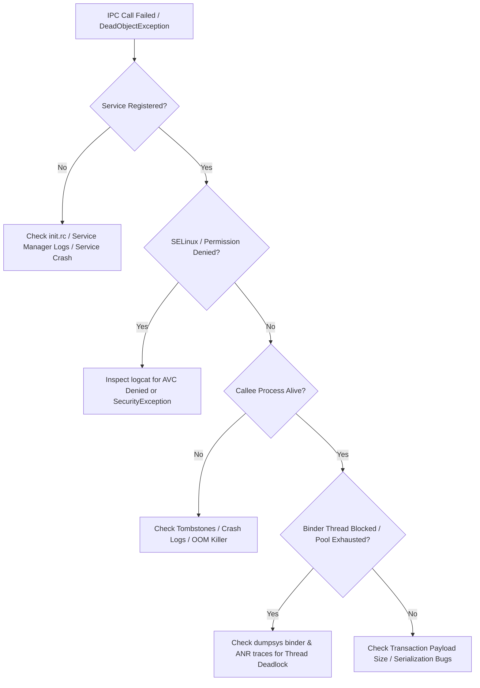

## IPC 디버깅은 service 등록, call path, thread state 에서 시작한다

상위 문서: [IPC and process contracts](ipc-process-contracts.md)

배경 지식: [SELinux](01_inbox/linux/security/selinux.md)

IPC 문제는 "호출이 실패했다"만 보면 원인이 넓다. service 가 등록됐는지, caller 가 **handle**(원격 객체를 가리키는 정수 토큰 — 자세한 내용은 [Binder는 객체 참조를 커널이 중재하는 capability IPC다](binder-is-kernel-mediated-object-capability-ipc.md) 참고)을 얻었는지, permission 이 통과했는지, Binder thread 가 막혔는지, callee process 가 살아 있는지를 순서대로 좁혀야 한다.

앱 레벨에서는 logcat stack trace 보다 boundary 상태가 더 중요할 때가 많다. platform/service 레벨에서는 `dumpsys`, service list, binder stats, tombstone, SELinux denial 을 함께 봐야 한다.

---

### 내부 동작 및 디버깅 흐름 (4-Step Triage Flow)

IPC 오류는 단계별 인터페이스 검증을 거쳐야 원인을 신속하게 격리할 수 있다.

1. **Service Registration & Discovery**: ServiceManager에 등록되었는지 확인 (`cmd service check <name>`). 등록되지 않았다면 Init 레벨 서비스 시작 실패 또는 crash 발생.
2. **Security & Permission Check**: Caller UID/PID 및 **SELinux Context**(프로세스/파일에 붙는 보안 레이블 — 이 레이블 조합이 정책상 허용되는지를 커널이 DAC 와 별도로 강제 검사한다) 검증. SecurityException 또는 `avc: denied` audit log 관찰.
3. **Process & Thread State**: Callee 프로세스가 살아있는지(`ps -A`), Binder thread pool 이 exhaust 되었거나 lock contention 으로 block 되었는지(`dumpsys binder`) 관찰.
4. **Data & Execution Limit**: Payload 크기 초과(`TransactionTooLargeException`) 또는 Native crash(**`tombstone`**: 네이티브 크래시 발생 시 시스템이 남기는 크래시 덤프 파일) 수집.



---

### 구체적 adb shell 디버깅 명령어 세트

```bash
# 1. Service 등록 여부 확인
adb shell service check status_bar
adb shell service list | grep -i "telephony"

# 2. Binder IPC 스레드 상태 및 버퍼 현황 덤프
adb shell dumpsys binder stats
adb shell dumpsys binder failed-transactions

# 3. HAL (AIDL/HIDL) 서비스 상태 점검 (Native/VINTF)
adb shell lshal list --long

# 4. Kernel Binder Driver 프로세스별 노드 및 트랜잭션 덤프
adb shell cat /sys/kernel/debug/binder/proc/<PID>
```

---

### 관찰 가능한 증거 (Observable Evidence)

1. **ServiceManager 등록 실패 및 Security Exception**:
   ```text
   E ServiceManager: addService for 'custom_service' failed: Permission denied
   java.lang.SecurityException: Requires ACCESS_FINE_LOCATION permission
   ```
2. **SELinux AVC Denial 로그 (Binder Transfer/Call Failure)**:
   ```text
   type=1400 audit(1621234567.890:12): avc: denied { find } for service=media.camera pid=4321 scontext=u:r:untrusted_app:s0:c512,c768 tcontext=u:object_r:camera_service:s0 tclass=service_manager permissive=0
   ```
3. **Binder IPC Crash / DeadObjectException**:
   - Logcat Tag: `AndroidRuntime`, `BinderProxy`
   - Trace output: `android.os.DeadObjectException` (Callee process died during transaction).

---

### 실무 규칙

- 먼저 service discovery 와 permission denial 을 확인한다.
- 다음으로 caller thread block 과 callee Binder thread stack 을 분리한다.
- native boundary 가 있으면 tombstone, `lshal`, VINTF, SELinux denial 을 함께 본다.
- performance issue 는 transaction 횟수, payload 크기, callee 처리 시간을 나눠 측정한다.

관련 노트: [dumpsys는 system service 상태 검사 인터페이스다](../../boot-and-runtime/system-server-contracts/dumpsys-is-system-service-state-inspection-interface.md), [Native service debugging은 init, Binder, VINTF, SELinux, tombstone을 분리한다](../../kernel-and-hal/hal-native-contracts/native-service-debugging-separates-init-binder-vintf-selinux-and-tombstones.md)

