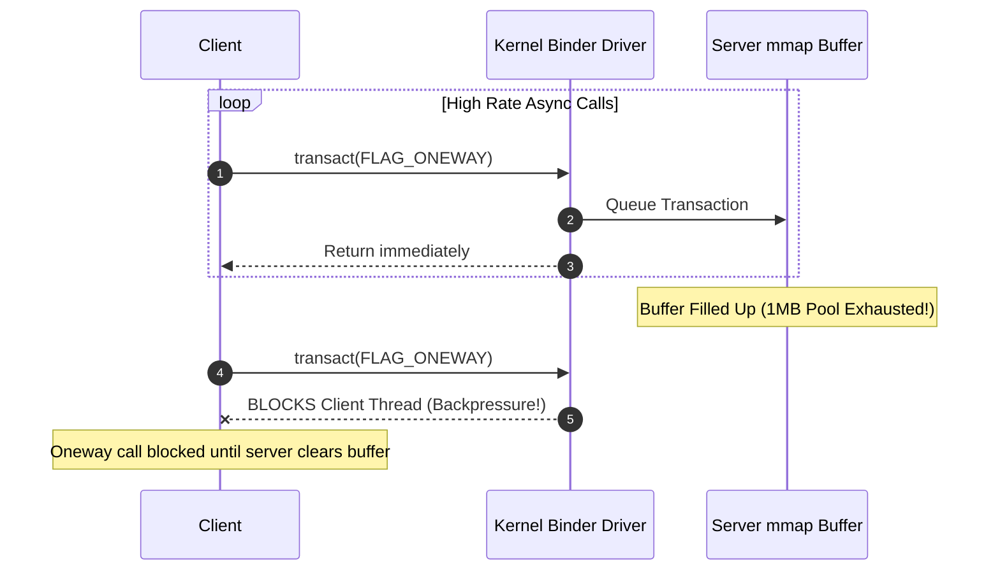

## oneway Binder 는 caller 대기를 없애지만 server backpressure 를 없애지 않는다

상위 문서: [IPC and process contracts](ipc-process-contracts.md)

배경 지식: [Idempotency(멱등성)](../../../../../../02_references/computer-science/idempotency.md)

`oneway` AIDL 호출은 caller 가 reply 를 기다리지 않는 비동기 transaction 으로 바뀐다. 하지만 이것은 server 의 queue, Binder thread pool, 처리 비용, 순서 제약을 사라지게 하지 않는다 — 즉 **backpressure**(수신 측이 처리 속도를 따라가지 못해 큐가 쌓이고, 그 압박이 결국 송신 측 호출에도 영향을 주는 현상)는 여전히 존재한다.

따라서 `oneway` 는 **latency hiding**(caller 가 응답을 기다리는 지연 시간을 체감하지 못하게 감추는 기법)일 뿐 무제한 이벤트 버스가 아니다. 호출 빈도가 높거나 payload 가 큰 경계에서는 queue 적체, memory pressure, server thread 고갈을 별도로 설계해야 한다.

---

### 내부 동작 메커니즘 (FLAG_ONEWAY & Server Buffer Backpressure)

1. **Kernel Driver Execution Flow**:
   - AIDL 메서드에 `oneway` 키워드를 붙이면 컴파일러가 `IBinder.transact()` 호출 시 `IBinder.FLAG_ONEWAY` (0x01) 플래그를 전달한다.
   - Binder 커널 드라이버는 Client 데이터를 Server 프로세스의 mmap 버퍼로 copy 한 뒤, reply 대기 없이 **즉시 호출자(Client)로 복귀**시킨다.
2. **Strict In-Order Execution Guarantee**:
   - 커널은 동일한 Binder 객체에 대한 `oneway` 호출 순서를 보장하기 위해 Server 단에서 해당 객체의 transaction 을 **단일 스레드로 순차 처리**하도록 큐잉한다.
3. **Async Buffer Exhaustion (Backpressure)**:
   - Server가 요청을 소화하는 속도보다 Client가 `oneway` 호출을 전송하는 속도가 빠르면 Server의 mmap 버퍼(약 1MB shared pool)가 가득 차게 된다.
   - 버퍼 고갈 시, 비동기 호출임에도 불구하고 **Client 의 `transact()` 함수가 Server 버퍼가 비워질 때까지 커널에서 블락**되거나 `TransactionTooLargeException`을 던지며 실패한다.



---

### AIDL & Generated Client Proxy Code

```aidl
// EventCallback.aidl
interface IEventListener {
    oneway void onEventFired(in EventData event);
}
```

```java
// Generated Client Proxy Code Snippet
public class Proxy implements IEventListener {
    private android.os.IBinder mRemote;
    
    @Override
    public void onEventFired(EventData event) throws RemoteException {
        android.os.Parcel _data = android.os.Parcel.obtain();
        try {
            _data.writeInterfaceToken(DESCRIPTOR);
            _data.writeTypedObject(event, 0);
            // FLAG_ONEWAY (0x01) 전달로 비동기 실행 요청
            boolean _status = mRemote.transact(TRANSACTION_onEventFired, _data, null, android.os.IBinder.FLAG_ONEWAY);
            if (!_status) {
                throw new RemoteException("IBinder.transact returned false");
            }
        } finally {
            _data.recycle();
        }
    }
}
```

---

### 관찰 가능한 증거 (Observable Evidence)

1. **Async Buffer Exhaustion Exception**:
   - `oneway`폭주 시 수신 프로세스의 버퍼 고갈로 발생:
   ```text
   android.os.TransactionTooLargeException: data parcel size WXYZ bytes (async binder buffer full)
   ```
2. **Perfetto / Systrace Async Binder Slice**:
   - Trace 마커: `binder transaction async`
   - Client는 즉시 return 하나, Server 쪽에 async transaction 큐가 길게 꼬리를 물며 지연되는 현상 확인 가능.
3. **dumpsys binder stats로 비동기 버퍼 사용량 측정**:
   ```bash
   adb shell dumpsys binder stats
   # Output:
   # async transactions pending: 42
   # async buffer free: 12KB / 1024KB
   ```

---

### 실무 규칙

- `oneway` 는 결과가 필요 없고 caller 가 실패를 즉시 복구할 수 있는 이벤트에만 쓴다.
- 상태 변경 명령은 idempotency(멱등성 — 같은 요청을 여러 번 보내도 결과가 한 번 보낸 것과 같아야 한다는 성질)와 재동기화 경로를 둔다.
- progress, ack, error reporting 이 필요하면 별도 callback 이나 관찰 API 를 설계한다.
- "caller 가 안 기다림"과 "system 에 비용이 없음"을 혼동하지 않는다.

관련 노트: [Binder thread pool은 service concurrency와 deadlock 경계다](binder-thread-pool-is-service-concurrency-and-deadlock-boundary.md)

