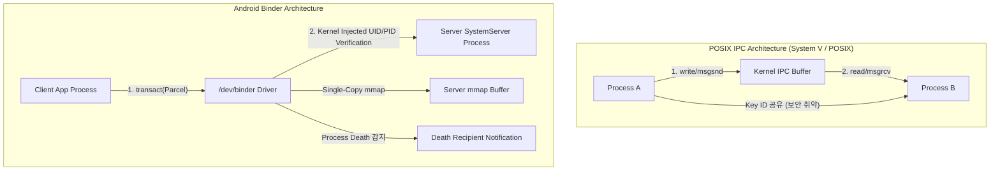

## Android는 보안·자원 수명·Zero-Copy 우수를 위해 전통적 POSIX IPC 대신 Binder와 Ashmem을 도입했다

> **핵심 명제**: Linux 커널 기반인 Android가 전통적인 POSIX IPC(System V / POSIX Message Queue, Shared Memory)를 배제하고 Binder와 Ashmem(DMA-BUF)을 자체 IPC 패러다임으로 선택한 이유는 커널 레벨 신원 검증(UID/PID), 참조 카운팅 기반 수명 관리, 복사 오버헤드 최소화(Single-Copy), 그리고 동시성 스레드 풀 제어 때문이다.

---

### 1. POSIX IPC vs Android Binder/Ashmem 비교 매트릭스

| 축 (Axis) | 전통적 POSIX IPC (SHM / MQ / Pipe) | Android Binder / Ashmem (DMA-BUF) |
| :--- | :--- | :--- |
| **보안 및 신원 (Security & Identity)** | 유저 공간에 명시적 토큰/키(ftok, Key ID) 공유. Caller의 UID/PID를 커널이 자동 검증해주지 않음. | 커널 드라이버(`/dev/binder`)가 트랜잭션 수신 시 **Caller의 UID/PID를 위변조 불가능하게 주입**. |
| **데이터 복사 (Data Copy)** | Pipe/MQ: 2-Copy (User→Kernel→User)<br/>POSIX SHM: 0-Copy (동기화 락 필요) | Binder: **1-Copy** (mmap 기반 callee 버퍼 전송)<br/>Ashmem/DMA-BUF: **0-Copy** (Large payload) |
| **자원 수명 (Resource Lifetime)** | 프로세스가 파괴되어도 IPC 메모리/큐가 커널 상에 **영구 잔류** (`ipcrm` 필히 수행). | **Reference Counting & Death Recipient**: Process death 시 커널이 자원을 자동 수거하고 사망 알림. |
| **호출 모델 및 동시성** | Byte Stream 또는 Raw Struct 전송.<br/>스레드 풀 처리 모델 부재. | **RPC (Remote Procedure Call)** 및 AIDL 기반 Interface. 커널 중재 **Binder Thread Pool (최대 15개)** 제어. |

---

### 2. 커널 아키텍처 비교 다이어그램



---

### 3. 핵심 아키텍처 결정을 이끈 4가지 이유

1. **커널 중재 신원 확인 (Kernel-Injected Identity & App Sandbox)**
   - POSIX IPC는 수신 측 프로세스가 메시지를 보낸 송신 측의 실제 UID/PID를 신뢰성 있게 검증할 수 없다.
   - Android의 App Sandbox 모델에서는 권한(Permission) 및 AppOps 검사를 위해 **"이 호출을 한 앱의 UID가 누구인가?"**를 반드시 알아야 한다. Binder 커널 드라이버는 caller의 패킷에 UID/PID를 자동으로 강제 주입하여 보안 위변조를 차단한다.
2. **참조 카운팅과 사망 통지 (Reference Counting & Death Recipient)**
   - POSIX 공유 메모리/메시지 큐는 프로세스가 무단 종료(Crash)되었을 때 자원이 커널에 누수된다.
   - Binder는 커널 드라이버 레벨에서 `linkToDeath()`를 통해 서비스 프로세스가 사망하면 클라이언트의 참조 카운트를 즉시 정리하고 알림을 발생시킨다.
3. **메모리 복사 최적화 (Single-Copy & Ashmem Pinning)**
   - Binder는 Sender 프로세스의 메모리에서 Receiver 프로세스의 `mmap` 영역(기본 1016KB)으로 **단 1회만 커널이 복사(Single-Copy)**한다.
   - 대용량 비트맵/비디오의 경우 `Ashmem`/`DMA-BUF` 공유 메모리 링 버퍼와 `ParcelFileDescriptor`를 결합하여 **Zero-Copy**로 전달한다.
4. **동시성 스레드 풀 관리 (Concurrency Control)**
   - POSIX IPC는 IPC 전송 후 수신 측 스레드 할당을 유저 앱이 직접 관리해야 한다.
   - Binder는 프로세스당 최대 15개의 **Binder Thread Pool**을 커널 드라이버가 직접 스케줄링하여 IPC 대기열 및 ANR 방지를 제어한다.

---

### 4. 관측 가능한 증거 (Observable Evidence)

```bash
# 1. Android 커널의 Binder IPC 통계 및 1-Copy mmap 버퍼 확인
adb shell dumpsys activity processes | grep -i "binder"
adb shell cat /d/binder/stats

# 2. Binder를 통한 UID/PID 검증 실패 시 발생 로그 (Logcat)
adb logcat | grep "SecurityException"
# java.lang.SecurityException: Permission Denial: requires android.permission.CAMERA from pid=1234, uid=10050
```

---

### 관련 문서 및 다리

- [IPC Process Contracts Index](ipc-process-contracts.md)
- [Binder 핵심 계약](./binder-is-kernel-mediated-object-capability-ipc.md)
- [Binder Transaction Lifetime](./binder-transaction-lifetime-is-call-copy-dispatch-and-reply.md)
- [OS IPC 메커니즘 지도](../../../../../operating-systems/ipc-mechanisms.md)
