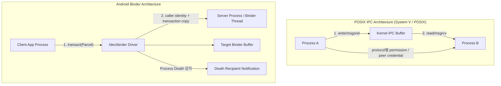

## Binder는 Android framework의 typed RPC이고 POSIX IPC를 배제하지 않는다

배경 지식: [IPC 메커니즘](01_inbox/operating-systems/ipc-mechanisms.md)

Android는 pipe, Unix domain socket, shared memory, file descriptor 전달 같은 Linux IPC도 사용한다. Binder는 이들을 없애는 대체물이 아니라 framework·app·service 사이에 object reference, typed RPC, caller identity, death notification을 함께 제공하는 주 IPC다. 큰 payload는 Binder transaction에 직접 넣기보다 `SharedMemory`/`ASharedMemory`, hardware buffer, DMA-BUF 같은 별도 buffer의 file descriptor를 Binder나 Unix socket으로 전달한다.

---

### 1. POSIX IPC vs Android Binder/Ashmem 비교 매트릭스

| 축 (Axis) | 전통적 POSIX IPC (SHM / MQ / Pipe) | Android Binder / Ashmem (DMA-BUF) |
| :--- | :--- | :--- |
| **보안 및 신원** | mechanism별로 다르다. Unix domain socket은 `SO_PEERCRED`/`SCM_CREDENTIALS`, SELinux label과 filesystem permission을 사용할 수 있다. | Binder driver가 transaction caller의 UID/PID를 전달하고 SELinux binder policy와 service permission 검사를 결합한다. PID는 one-way call 등 조건에 따라 보안 판단에 부적합할 수 있어 UID/permission 중심으로 본다. |
| **데이터 이동** | pipe/socket은 kernel buffer를 거치며, shared memory는 mapping 후 명시적 동기화가 필요하다. | 일반 Binder transaction은 kernel이 target address space로 transaction을 복사한다. Android 8의 scatter-gather는 일부 serialization copy를 줄인다. 큰 payload에는 별도 shared buffer를 쓴다. |
| **자원 수명** | pipe/socket/FD-backed memory는 마지막 FD가 닫히면 정리된다. named POSIX/System V object는 unlink·remove 정책이 별도로 필요할 수 있다. | Binder object reference와 FD는 process death 때 정리되고 `linkToDeath()`로 remote binder death를 관찰할 수 있다. 앱이 가진 모든 논리 자원을 자동 정리해 주는 것은 아니다. |
| **호출 모델 및 동시성** | stream/message/shared-memory protocol과 worker model을 애플리케이션이 설계한다. | AIDL이 interface와 marshalling을 생성한다. server process의 Binder thread pool 크기와 shared-state synchronization은 구현자가 구성·관리한다. 고정 15개가 보편 계약은 아니다. |

---

### 2. 커널 아키텍처 비교 다이어그램



---

### 3. 선택 기준

1. **커널 중재 신원 확인 (Kernel-Injected Identity & App Sandbox)**
   - Unix domain socket도 kernel-verified peer credential을 제공할 수 있다. Binder의 장점은 caller identity가 RPC transaction 및 Android permission/SELinux model과 통합된다는 점이다.
2. **참조 카운팅과 사망 통지 (Reference Counting & Death Recipient)**
   - FD 기반 POSIX 자원도 process death 때 FD가 닫힌다. Binder는 remote object reference와 death notification을 RPC model의 일부로 제공한다는 차이가 있다.
3. **작은 RPC와 큰 buffer의 분리**
   - Binder transaction은 크기 제한이 있고 serialization·copy 비용이 있으므로 작은 control message와 handle 전달에 적합하다.
   - 큰 데이터는 `SharedMemory`/`ASharedMemory`, hardware buffer 또는 DMA-BUF를 사용하고 FD/handle만 전달한다. mapping이 copy를 줄일 수 있지만 producer·consumer나 device 사이의 모든 단계가 자동으로 zero-copy가 되는 것은 아니다. Android 17의 `ASharedMemory`는 조건에 따라 legacy ashmem 또는 memfd를 사용한다.
4. **동시성 스레드 풀 관리 (Concurrency Control)**
   - Binder driver는 대기 중인 Binder thread에 transaction을 전달하지만 thread-pool 설정과 service method의 동시성 안전성은 userspace 책임이다. synchronous nested call과 lock 순서가 잘못되면 Binder도 deadlock과 ANR을 만들 수 있다.

---

### 4. 관측 가능한 증거 (Observable Evidence)

```bash
# 1. Binder service와 transaction 상태 확인(경로·권한은 build type에 따라 다름)
adb shell dumpsys activity processes
adb shell ls /sys/kernel/debug/binder /dev/binderfs 2>/dev/null

# 2. Binder를 통한 UID/PID 검증 실패 시 발생 로그 (Logcat)
adb logcat | grep "SecurityException"
# java.lang.SecurityException: Permission Denial: requires android.permission.CAMERA from pid=1234, uid=10050
```

---

### 관련 문서 및 다리

- [IPC Process Contracts Index](ipc-process-contracts.md)
- [Binder 핵심 계약](./binder-is-kernel-mediated-object-capability-ipc.md)
- [Binder Transaction Lifetime](./binder-transaction-lifetime-is-call-copy-dispatch-and-reply.md)
- [OS IPC 메커니즘 지도](../../../../../operating-systems/ipc-mechanisms.md)

공식 문서: [Binder overview](https://source.android.com/docs/core/architecture/ipc/binder-overview), [Binder IPC details](https://source.android.com/docs/core/architecture/hidl/binder-ipc), [ASharedMemory](https://developer.android.com/ndk/reference/group/memory), [Android 17 shared-memory transition](https://source.android.com/docs/security/features/selinux/compatibility#shared_memory_changes_for_android_17).
