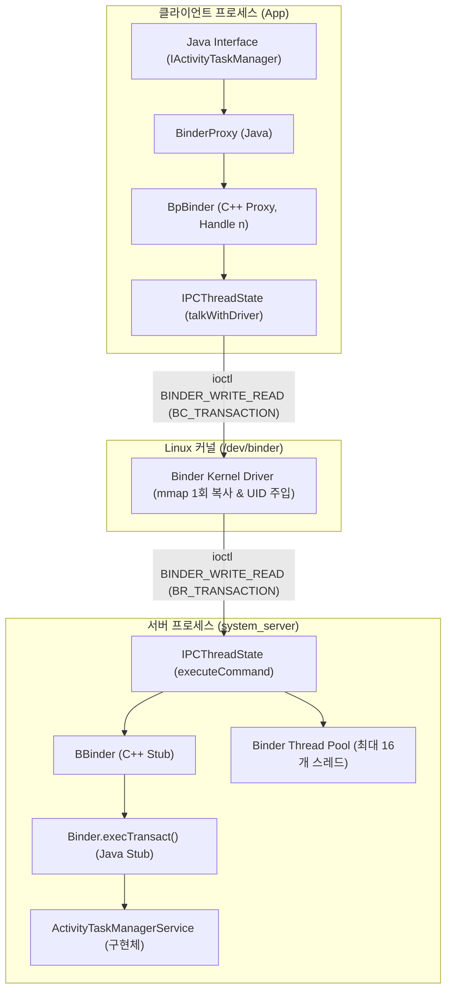
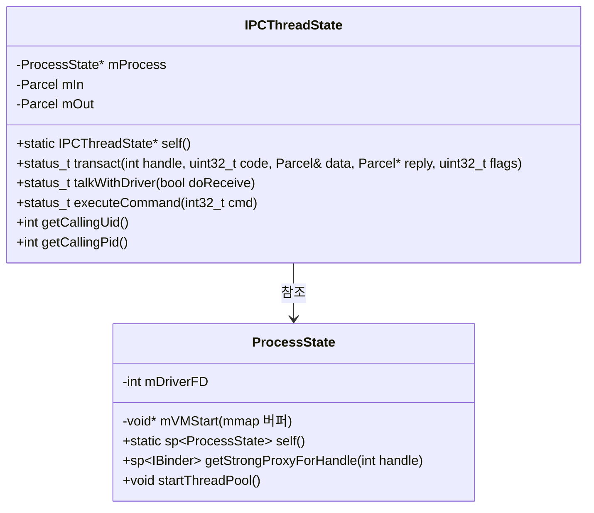
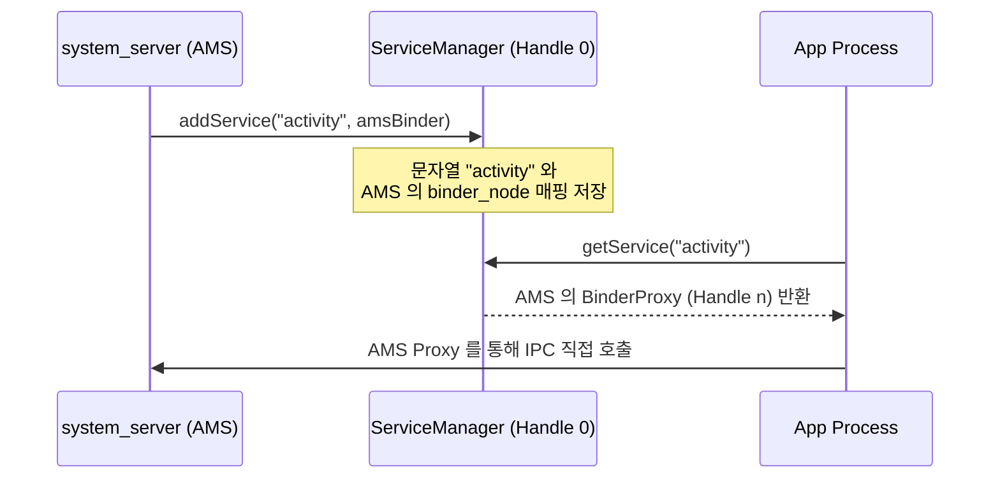

## Binder 유저스페이스 프레임워크 아키텍처 (Binder Userspace Framework)

### 개요

**Binder 유저스페이스 프레임워크**는 [Binder 커널 드라이버](binder-kernel-driver.md)의 로우레벨 `ioctl` 시스템 콜을 추상화하여, 애플리케이션 및 시스템 서비스 개발자에게 객체 지향적인 원격 프로시저 호출(RPC, Remote Procedure Call) 환경을 제공하는 C++ 네이티브(`libbinder`) 및 Java/Kotlin 프레임워크 계층이다.

클라이언트와 서버가 서로 다른 프로세스 메모리 공간에 격리되어 있더라도, **Proxy / Stub 패턴(`BpBinder` / `BBinder`)**, **타입 세이프 직렬화 컨테이너(`Parcel`)**, **중앙 서비스 등록소([ServiceManager](../../../04_system_services/service-manager.md))**, 그리고 **자동화된 인터페이스 정의 언어(AIDL)** 를 통해 마치 로컬 객체의 메서드를 호출하는 것처럼 투명한 IPC 를 가능하게 한다.



---

### 1. `libbinder` 핵심 엔진: `ProcessState` 와 `IPCThreadState`

C++ 네이티브 레이어의 `libbinder` 는 프로세스 단위와 스레드 단위의 두 가지 핵심 싱글톤 객체로 바인더 통신을 구동한다.



#### 1) `ProcessState` (프로세스당 단 1 개 생성되는 싱글톤)
- 프로세스가 처음 바인더를 사용할 때 `/dev/binder`를 `open()`하고 `mmap()` 을 호출하여 약 1MB 크기의 수신 공유 버퍼를 초기화한다.
- 커널 드라이버가 발급한 정수형 핸들(`Handle`)을 바탕으로 클라이언트 프록시(`BpBinder`) 객체를 캐싱하고 관리한다.
- `startThreadPool()` 을 호출하여 바인더 작업 수신 스레드들을 가동한다.

#### 2) `IPCThreadState` (스레드당 단 1 개 생성되는 Thread-Local 싱글톤)
- 실제로 커널 드라이버와 `ioctl(BINDER_WRITE_READ)` 을 주고받으며 바인더 프로토콜 루프를 실행하는 엔진이다.
- `talkWithDriver()`: 송신할 명령 버퍼(`mOut`)를 커널에 보내고, 커널로부터 도착한 응답 버퍼(`mIn`)를 채워온다.
- `executeCommand()`: 커널이 보낸 `BR_TRANSACTION` 명령을 해석하여 대상 `BBinder::transact()` 로 작업을 디스패치한다.

---

### 2. Proxy / Stub 패턴 (`BpBinder` vs `BBinder`)

Binder 프레임워크는 원격 프로세스의 객체를 호출하기 위해 **Proxy(대리자)**와 **Stub(수신자)** 패턴을 엄격히 구현한다:

| 계층 | 클라이언트 측 (Proxy) | 서버 측 (Stub) | 역할 |
|---|---|---|---|
| **C++ 네이티브** | `BpBinder` (Binder Proxy) | `BBinder` (Binder Stub) | `Handle` 번호 포장 및 원격 `transact()` 호출 / `onTransact()` 수신 |
| **Java 프레임워크** | `android.os.BinderProxy` | `android.os.Binder` | JNI 브릿지를 통해 Java 객체와 C++ 바이너리 객체 연결 |
| **AIDL 생성 코드** | `IInterface.Stub.Proxy` | `IInterface.Stub` | 비즈니스 메서드를 바인더 트랜잭션 코드(`TRANSACTION_foo`)로 마샬링 |

```text
클라이언트 호출:
myService.getUser(100)
    ➔ Proxy.getUser(100) : Parcel 에 "100" writeInt() 마샬링
    ➔ BinderProxy.transact(TRANSACTION_GET_USER, data, reply, 0)
    ➔ BpBinder.transact() ➔ IPCThreadState ➔ 커널 드라이버

서버 수신:
커널 드라이버 ➔ IPCThreadState ➔ BBinder.transact()
    ➔ Binder.execTransact() ➔ Stub.onTransact()
    ➔ Stub.getUser(100) : Parcel 에서 readInt() 언마샬링
    ➔ 실제 구현 클래스.getUser(100) 실행 후 결과 Parcel 반환
```

---

### 3. 직렬화 컨테이너 (`Parcel`)와 AIDL

- **`Parcel`**:
  - 원시 타입(int, float 등), 문자열, 바이트 배열을 직렬화할 뿐만 아니라, **파일 디스크립터(File Descriptor - `dup()`을 통한 프로세스 간 공유)** 와 **다른 `IBinder` 객체 참조 자체(`writeStrongBinder`)** 를 바이트 스트림 안에 포함하여 전송할 수 있는 안드로이드 특화 고속 직렬화 컨테이너이다.
- **AIDL (Android Interface Definition Language)**:
  - 개발자가 인터페이스 정의 파일(`.aidl`)을 작성하면, 컴파일러가 위 Proxy/Stub 마샬링 및 언마샬링 보일러플레이트 코드를 Java, C++, Rust 로 자동 생성해 주는 도구이다.

---

### 4. 서비스 등록 및 탐색 ([ServiceManager](../../../04_system_services/service-manager.md))

원격 프로세스와 통신하려면 먼저 상대방의 `IBinder` 객체(핸들)를 알아야 한다. 이 주소록 역할을 전담하는 데몬이 **`ServiceManager` (정수 Handle `0`)**이다.



---

### 5. Binder Thread Pool 과 동시성 경계

서버 프로세스(예: `system_server`)는 동시에 쏟아지는 클라이언트의 바인더 요청을 병렬 처리하기 위해 **Binder Thread Pool**을 유지한다.

- **스레드 개수**: 기본 최대 15 개 스레드 + 메인 스레드 1 개 = **총 16 개 스레드**.
- **스레드 이름**: `binder:PID_N` (예: `binder:1234_1`, `binder:1234_2`).
- 커널 드라이버가 유휴(Idle) 스레드가 부족하다고 판단하면 `BR_SPAWN_LOOPER` 명령을 유저스페이스로 보내 동적으로 스레드를 추가 생성한다.
- 동기 호출이 16 개를 초과하면 클라이언트는 서버 스레드가 반환될 때까지 블로킹 대기 상태에 빠지므로, 장시간 소요 작업은 `oneway` 비동기 통신을 사용해야 한다.

---

### 상위 및 연관 문서

- [Binder IPC 종합 허브](../../binder-ipc.md)
- [Binder 커널 드라이버 및 메모리 매핑 메커니즘](binder-kernel-driver.md)
- [Binder 트랜잭션 생명주기와 1MB 버퍼 제한](binder-transaction-lifetime-is-call-copy-dispatch-and-reply.md)
- [Binder 스레드 풀과 서비스 동시성 경계](binder-thread-pool-is-service-concurrency-and-deadlock-boundary.md)
- [Oneway 비동기 바인더 통신](oneway-binder-removes-caller-waiting-not-server-backpressure.md)
- [ServiceManager](../../../04_system_services/service-manager.md)
