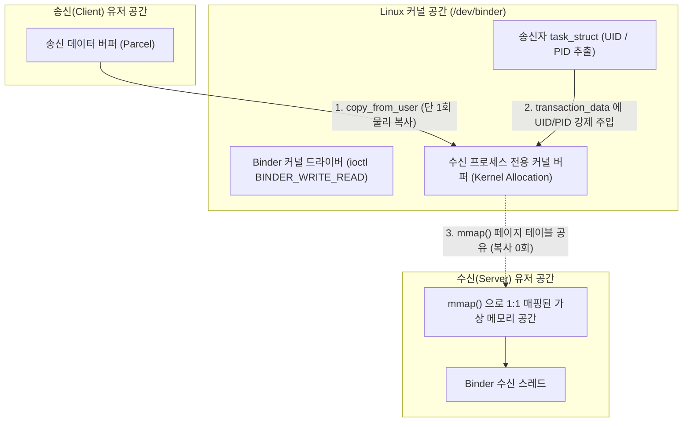
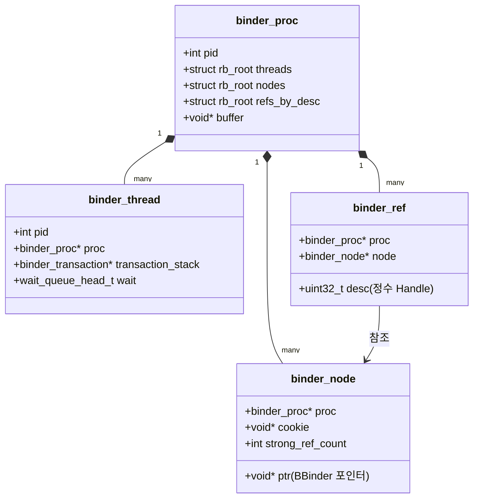

## Binder 커널 드라이버 및 메모리 매핑 메커니즘 (Binder Kernel Driver)

### 개요

**Binder 커널 드라이버(`/dev/binder`)** 는 Linux 커널 공간(`drivers/android/binder.c`)에 상주하며, 서로 다른 프로세스 간의 통신을 중재하는 Android IPC 시스템의 물리적 실행 엔진이다.

일반적인 Linux IPC(소켓, 파이프)가 데이터를 주고받기 위해 유저 공간과 커널 공간 사이에서 총 2 회의 메모리 복사(User ➔ Kernel ➔ User)를 수행하는 반면, Binder 커널 드라이버는 **`mmap()` 시스템 콜을 활용한 수신 버퍼 1 회 매핑(Single-Copy) 기법**과 **커널 수준의 호출자 신원(UID/PID) 강제 주입**을 통해 고속성과 강력한 보안 격리를 동시에 달성한다.



---

### 1. `mmap()` 기반 1 회 메모리 복사 (Single Copy) 메커니즘

Binder IPC 의 높은 성능은 데이터를 수신하는 프로세스가 프로세스 시작 시점에 커널 드라이버와 맺는 메모리 매핑 계약에서 비롯된다.

```c
// 프로세스 초기화 시 (ProcessState)
int fd = open("/dev/binder", O_RDWR | O_CLOEXEC);
// 수신용 가상 메모리 공간 할당 (일반 앱 기준 약 1MB - 8KB)
void* mmap_addr = mmap(NULL, BINDER_VM_SIZE, PROT_READ, MAP_PRIVATE, fd, 0);
```

#### 물리적 동작 원리

1. **수신 버퍼 매핑**: 수신 프로세스가 `/dev/binder` 디바이스 파일에 대해 `mmap()` 을 호출하면, 커널 드라이버는 해당 프로세스를 위한 물리 메모리 페이지를 할당하고 **수신 프로세스의 유저 공간 가상 메모리와 커널 공간 가상 메모리에 동일한 물리 페이지를 동시 매핑** 한다.
2. **단 1 회 복사 (`copy_from_user`)**: 클라이언트 프로세스가 데이터를 전송하면, 커널 드라이버는 클라이언트 유저 공간의 데이터를 수신 프로세스에 미리 매핑된 커널 버퍼로 `copy_from_user()` 를 통해 복사한다.
3. **복사 없는 수신**: 수신 프로세스는 이미 자신의 유저 공간 가상 메모리에 매핑되어 있으므로, 커널에서 유저 공간으로 다시 복사(`copy_to_user`)할 필요 없이 포인터를 역참조하여 데이터를 즉시 읽는다.

---

### 2. 커널 내부 핵심 자료구조

커널 드라이버는 프로세스, 스레드, 그리고 원격 객체 간의 관계를 다음 4 가지 핵심 C 구조체로 관리한다:



| 구조체                 | 역할 및 저장 위치                                                                   |
| ------------------- | ---------------------------------------------------------------------------- |
| **`binder_proc`**   | 바인더를 사용하는 각 프로세스의 상태 (스레드 풀, 메모리 버퍼, 노드/참조 목록)                               |
| **`binder_thread`** | IPC 호출을 수행하거나 수신 대기 중인 개별 작업 스레드 상태                                          |
| **`binder_node`**   | 서버 프로세스 내에 존재하는 **실제 C++ `BBinder` 객체의 커널 내 표현**                             |
| **`binder_ref`**    | 클라이언트 프로세스가 특정 `binder_node` 를 가리키기 위해 사용하는 **정수형 토큰(`Handle`, Descriptor)** |

- 클라이언트가 정수 핸들 `0`을 지정하여 전송하면, 커널은 `refs_by_desc` 트리에서 `Handle 0`에 해당하는 `binder_node` 를 찾아 **[ServiceManager](../../../04_system_services/service-manager.md)** 프로세스로 라우팅한다.

---

### 3. 커널 수준 호출자 신원 (UID/PID) 강제 주입

전통적인 소켓 통신은 송신자가 패킷 헤더에 자신의 ID 를 임의로 조작하여 전송할 수 있는 보안 취약점이 존재한다. Binder 는 커널이 송신자의 신원을 직접 보증한다.

```c
// drivers/android/binder.c 내부 트랜잭션 처리 루틴
struct binder_transaction_data tr;
// Linux 커널의 task_struct 에서 현재 송신 스레드의 실제 UID/PID 추출
tr.sender_euid = from_kuid(&init_user_ns, current_euid());
tr.sender_pid = task_tgid_vnr(current);
```

- 수신 서버 프로세스는 `Binder.getCallingUid()` 또는 `IPCThreadState::getCallingUid()`를 호출할 때, 클라이언트가 보낸 값을 읽는 것이 아니라 **커널 드라이버가 트랜잭션 헤더에 강제로 기록해 둔 `sender_euid` 값을 읽으므로 절대 위조할 수 없다**.
- 안드로이드의 모든 보안 권한 검사(Permission Check, AppOps)는 이 커널 주입 UID 를 기반으로 동작한다.

---

### 4. 바인더 프로토콜 명령어 (`BC_*` vs `BR_*`)

유저스페이스와 커널 드라이버는 `ioctl(fd, BINDER_WRITE_READ, &bwr)` 단일 시스템 콜을 통해 명령과 응답을 교환한다.

```text
유저스페이스 (libbinder) ──[ BC_* (Binder Command) ]──> 커널 드라이버 (/dev/binder)
유저스페이스 (libbinder) <──[ BR_* (Binder Return) ]─── 커널 드라이버 (/dev/binder)
```

| 프로토콜 | 방향 | 주요 명령어 | 설명 |
|---|---|---|---|
| **`BC_TRANSACTION`** | User ➔ Kernel | 트랜잭션 전송 | 클라이언트가 서버로 동기/비동기 IPC 호출 요청 |
| **`BC_REPLY`** | User ➔ Kernel | 트랜잭션 응답 | 서버가 클라이언트의 요청 처리를 마치고 결과 반환 |
| **`BC_ENTER_LOOPER`** | User ➔ Kernel | 스레드 풀 등록 | 현재 스레드를 바인더 작업 수신 스레드로 등록 |
| **`BR_TRANSACTION`** | Kernel ➔ User | 트랜잭션 도착 | 커널이 대기 중인 서버 스레드를 깨우며 작업 전달 |
| **`BR_REPLY`** | Kernel ➔ User | 응답 도착 | 커널이 대기 중인 클라이언트 스레드에 응답 데이터 전달 |
| **`BR_SPAWN_LOOPER`** | Kernel ➔ User | 스레드 생성 요청 | 트랜잭션 큐가 밀릴 때 커널이 프로세스에 신규 바인더 스레드 생성 지시 |

---

### 5. 삼중 바인더 디바이스 노드 분리 (`/dev/binder`, `/dev/hwbinder`, `/dev/vndbinder`)

Android 8.0 (Project Treble) 이후 하드웨어 벤더 영역과 시스템 프레임워크 영역의 간섭을 차단하기 위해 바인더 디바이스 노드가 3 개로 물리 분리되었다:

| 디바이스 노드 | 대상 통신 영역 | 서비스 관리자 |
|---|---|---|
| **`/dev/binder`** | 앱 ↔ `system_server` 프레임워크 간 고수준 IPC | `servicemanager` |
| **`/dev/hwbinder`** | 프레임워크 ↔ HAL (Hardware Abstraction Layer) 간 통신 | `hwservicemanager` |
| **`/dev/vndbinder`** | 벤더 프로세스 ↔ 벤더 HAL 간 내부 통신 (Vendor Partition) | `vndservicemanager` |

---

### 상위 및 연관 문서

- [Binder IPC 종합 허브](../../binder-ipc.md)
- [Binder 유저스페이스 프레임워크 아키텍처](binder-framework.md)
- [Binder 트랜잭션 생명주기와 1MB 버퍼 제한](binder-transaction-lifetime-is-call-copy-dispatch-and-reply.md)
- [POSIX IPC vs Android Binder](../../../../../operating-systems/ipc-contracts/posix-ipc-vs-android-binder.md)
- [mmap 시스템 콜과 가상 메모리 매핑](../../../../../computer-science/mmap.md)
