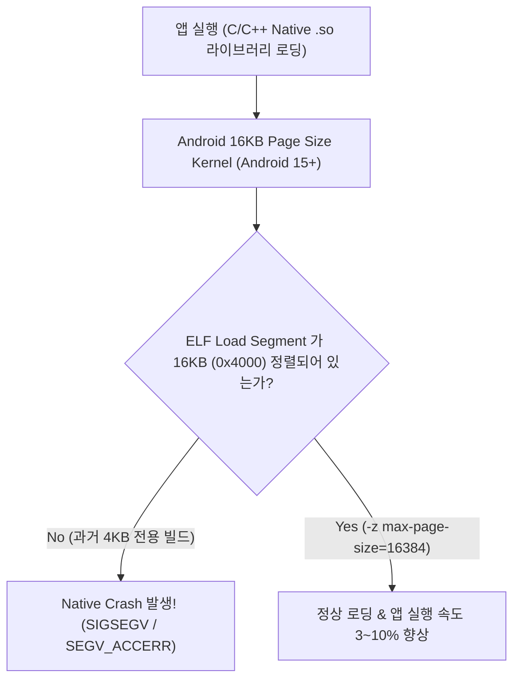

# Android 16KB Page Size Alignment (16KB 메모리 페이지 정렬 규약)

## 1. 개요 (Overview)

**Android 16KB Page Size Alignment** 는 Android 15 (API 35) 및 최신 차세대 ARM64 하드웨어 칩셋(SoC) 환경에서, 기존의 **4KB [virtual-memory-paging](../../../../computer-science/virtual-memory-paging.md) 크기 대신 16KB 페이지 크기를 적용하여 앱 실행 속도를 3~10% 향상시키고 전력 효율을 높이는 최신 시스템 [data-structure-alignment](../../../../computer-science/data-structure-alignment.md) 규약**이다.

C/C++ Native 코드(`.so` [elf-executable-and-linkable-format](../../../../computer-science/elf-executable-and-linkable-format.md) 공유 라이브러리)를 포함하는 안드로이드 앱 및 SDK 가 16KB 메모리 정렬로 재빌드되지 않고 4KB 에 고정되어 있으면, [linker-and-loader](../../../../computer-science/linker-and-loader.md) 및 OS [virtual-memory](../../../../computer-science/virtual-memory.md) 로딩 과정에서 메모리 세그먼트 불일치로 인해 앱 실행 직후 **Native Crash (`SIGSEGV` / `SEGV_ACCERR`)** 가 발생한다.

---

### 초보자를 위한 쉽게 이해하는 비유

* **4KB vs 16KB Page (소형 택배 박스 대 대형 트럭 컨테이너)**:
  - 기존 4KB 시스템은 물건(메모리 데이터)을 옮길 때 4KB 단위의 작은 상자 4개를 각각 들고 4번(4KB x 4) 이동해야 했음.
  - 16KB 시스템은 16KB 규격의 대형 수송 컨테이너 1개로 메모리를 한꺼번에 처리하여 CPU 의 TLB(Translation Lookaside Buffer) 미스를 획기적으로 줄이고 전력과 앱 로딩 속도를 높이는 방식.



---

## 2. NDK 빌드 버전별 설정 및 써드파티 호환성

### 1) NDK 버전별 링커 플래그 적용

- **NDK r28 이상**: 기본적(Default)으로 16KB ELF Alignment 가 자동 적용된다.
- **NDK r27 이하**: C/C++ NDK 프로젝트의 `CMakeLists.txt` 에 16KB 링커 플래그를 명시해야 한다:
  ```cmake
  # CMakeLists.txt 예시 (NDK r27 이하)
  target_link_options(my_native_lib PRIVATE "-Wl,-z,max-page-size=16384")
  # NDK r22 이하 구버전의 경우 다음 플래그도 추가 필요
  # "-Wl,-z,common-page-size=16384"
  ```
- **AGP (Android Gradle Plugin) 8.5.1+ 필수**: 최신 AGP 는 빌드 시 16KB 정렬을 자동 검증해 준다.

### 2) 써드파티 Prebuilt `.so` 라이브러리 검증 및 16KB Alignment (llvm-objdump)

본인 코드뿐만 아니라 사용 중인 외부 서드파티 prebuilt `.so` 파일도 16KB 로 정렬되었는지 검증해야 한다:

```bash
# NDK 내 llvm-objdump 로 LOAD 세그먼트 Align 값 확인
$NDK_PATH/toolchains/llvm/prebuilt/<host>/bin/llvm-objdump -p libmy_native_lib.so | grep LOAD
```

- **합격 기준**: output 의 `align 2**14` 또는 `align 0x4000` 표시 (16384 바운더리).
- **불합격 기준**: `align 2**12` (0x1000 = 4KB 정렬 ➔ 해당 서드파티 SDK 업데이트 필수).

---

## 3. 연결 문서 (Related Links)

- [virtual-memory](../../../../computer-science/virtual-memory.md) - CS 가상 메모리 시스템
- [virtual-memory-paging](../../../../computer-science/virtual-memory-paging.md) - CS 가상 메모리 페이징 기법
- [data-structure-alignment](../../../../computer-science/data-structure-alignment.md) - CS 메모리 정렬 원리
- [linker-and-loader](../../../../computer-science/linker-and-loader.md) - 링커와 로더
- [elf-executable-and-linkable-format](../../../../computer-science/elf-executable-and-linkable-format.md) - ELF 바이너리 포맷
- [android-kernel-runtime](android-kernel-runtime.md) - 안드로이드 커널 런타임
- [linux-kernel](../../../../operating-systems/linux-kernel.md) - 리눅스 커널 가상 메모리 관리
- [hal](hal-native/hal-userspace-boundary.md) - 하드웨어 추상화 레이어
- [art](../boot-and-runtime/zygote-runtime/art.md) - 안드로이드 런타임 (ART)
