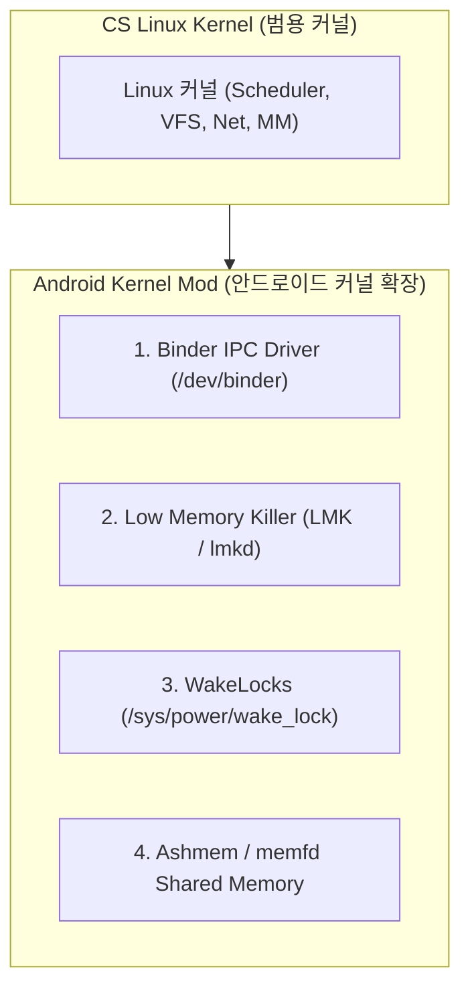

## Android Kernel (안드로이드 커널 서브시스템 확장)

### 1. 개요 (Overview)

이 노드는 컴퓨터 과학의 [Linux 커널](../../../../operating-systems/linux-kernel.md) 하부 아키텍처를 기반으로, **Google 과 SoC 제조사가 모바일 컴퓨팅 환경의 전력, 메모리, 프로세스 간 통신(IPC) 제약을 극복하기 위해 메인라인 Linux 커널에 추가·개조한 안드로이드 특화 커널 서브시스템 명세**이다.

Android 커널은 [Binder IPC 커널 드라이버](../binder-ipc.md), [Low Memory Killer (LMK)](../lmk-low-memory-killer.md), [WakeLocks 전력 제어](../wake-locks.md), 및 [Ashmem / memfd 공유 메모리](../ashmem.md) 를 표준 커널 확장 모듈로 장착하고 있다.

---

#### 초보자를 위한 쉽게 이해하는 비유

- **Android Kernel (모바일 전용으로 특수 튜닝된 레이싱 엔진)**:
  - 컴퓨터 과학의 [표준 Linux 커널 엔진](../../../../operating-systems/linux-kernel.md) 에 배터리 아끼는 터보 부스터([WakeLocks](../wake-locks.md)), 메모리 좁을 때 자리를 비워주는 초스피드 요원([LMK](../lmk-low-memory-killer.md)), 부서 간 빛의 속도로 연결하는 고속 통로([Binder IPC](../binder-ipc.md)), 및 공동 칠판([Ashmem](../ashmem.md))을 부착한 안드로이드 스마트폰 전용 튜닝 커널.



---

### 2. Android Kernel 4 대 핵심 커널 개조 기술

1. **[Binder IPC 드라이버 (`/dev/binder`)](../binder-ipc.md)**:
   - 커널 수준의 원복사(One-copy) 공유 메모리 기반 프로세스 간 통신 드라이버 및 보안 UID/PID 주입기.
2. **[Low Memory Killer (LMK / lmkd)](../lmk-low-memory-killer.md)**:
   - 가용 RAM 부족 시 `oom_score_adj` 점수에 따라 백그라운드 프로세스를 단계별로 수거하는 선제적 메모리 관리기.
3. **[WakeLocks (`/sys/power/wake_lock`)](../wake-locks.md)**:
   - 화면이 꺼진 후에도 CPU 가 Deep Sleep 에 들어가지 않도록 전력을 강제 유지하는 전력 관리 시스템.
4. **[Ashmem / memfd 익명 공유 메모리](../ashmem.md)**:
   - 비트맵과 대용량 그래픽 버퍼를 메모리 복사 없이 초고속 공유하는 unpin/pin 메커니즘.

---

### 3. 관측 가능 증거 및 CLI 명령어

`adb shell` 로 안드로이드 기기 내 활성화된 커널 모듈 및 드라이버 상태를 진단할 수 있다:

```bash
# 안드로이드 커널 버전 및 커널 릴리스 정보 조회
adb shell uname -a

# /dev/binder 및 /dev/ashmem 커널 드라이버 존재 여부 확인
adb shell ls -l /dev/binder /dev/ashmem
```

---

### 4. 연결 문서 (Related Links)

- [CS Linux 커널](../../../../operating-systems/linux-kernel.md) - CS 범용 Linux 커널 정본 노드 (SSOT)
- [Binder IPC](../binder-ipc.md) - 안드로이드 Binder 커널 드라이버
- [Low Memory Killer (LMK)](../lmk-low-memory-killer.md) - 안드로이드 LMK 메모리 회수기
- [WakeLocks 전력 유지](../wake-locks.md) - 안드로이드 WakeLocks 전력 통제
- [Ashmem 공유 메모리](../ashmem.md) - 안드로이드 Ashmem / memfd 공유 메모리
- [HAL (Hardware Abstraction Layer)](../hal.md) - 커널 드라이버 상부 HAL 레이어
