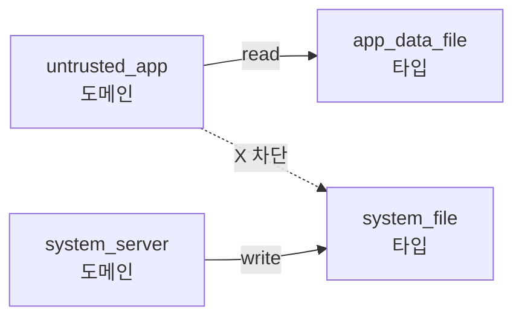

# 도메인과 타입

- **Domain**: 프로세스의 SELinux 레이블. 예: `untrusted_app`, `system_server`, `init`.
- **Type**: 파일/소켓/Binder 서비스의 레이블. 예: `app_data_file`, `system_file`, `surfaceflinger_service`.

정책 예:

```
# untrusted_app은 자기 데이터 파일만 읽기/쓰기 가능
allow untrusted_app app_data_file:file { read write };

# system_server는 모든 앱에 Binder 호출 가능
allow system_server appdomain:binder call;

# untrusted_app은 system_file을 절대 쓸 수 없음
neverallow untrusted_app system_file:file write;
```


