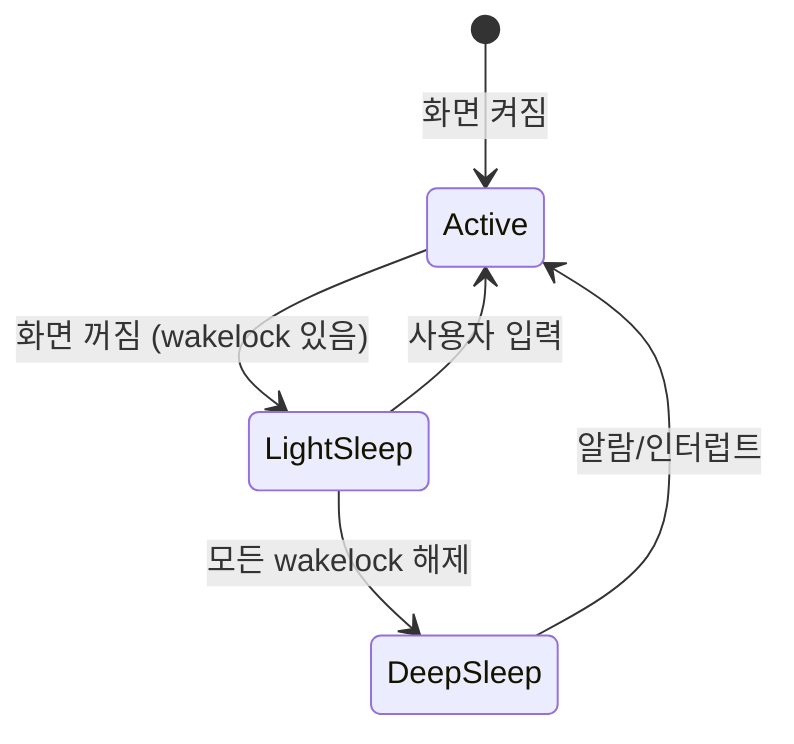

# 전원 관리 심화

상위 노트: [android-kernel](01_inbox/mobile/android/01_system_internals/kernel-and-hal/android-kernel.md)

### Suspend 와 Deep Sleep



**Light Sleep**: CPU 는 저전력 상태 (CPUIdle), 하지만 suspend 는 아님. wakelock 이 있는 상태.

**Deep Sleep**: `echo mem > /sys/power/state` 실행. CPU/대부분 주변기기 정지. RTC(Real-Time Clock), GPIO 인터럽트만 깨울 수 있음.

### Thermal Management

CPU/GPU 가 과열되면:

1. 온도 센서가 임계값 초과 감지.
2. `thermal_core` 가 cooling device 실행.
3. CPU 주파수 제한 (throttling), GPU 주파수 제한.
4. 극단적인 경우 시스템 종료.

```bash
watch -n1 'cat /sys/class/thermal/thermal_zone*/temp'
```

---
