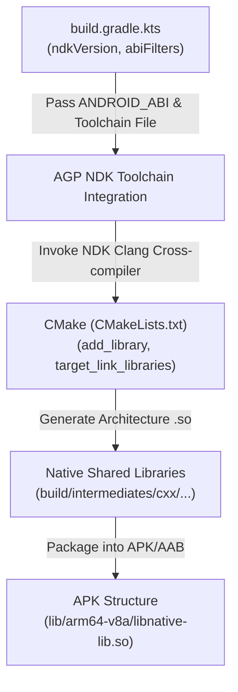

## CMake, Gradle, ABI는 native build와 packaging 계약을 나눈다

상위 문서: [HAL native contracts](hal-native-contracts.md)
배경 지식: [가상 메모리](02_references/operating-systems/virtual-memory.md)

Android 앱 개발 환경에서 Native C/C++ 코드를 컴파일하고 패키징할 때 CMake, AGP(Android Gradle Plugin), 그리고 ABI(Application Binary Interface)는 명확히 책임이 분리된 빌드 계약을 이룬다.

CMake는 C/C++ 소스 컴파일 대상과 링킹 타깃을 정의하고, AGP의 `externalNativeBuild`는 CMake 크로스 컴파일 워크플로우를 Gradle 빌드 변리언트(Debug/Release)에 바인딩하며, ABI(arm64-v8a, armeabi-v7a, x86_64) 설정은 빌드 결과물인 `.so` 공유 라이브러리가 APK/AAB 내의 `lib/<abi>/` 파티션 경로에 어떻게 포함될지 규정한다.

---

### 메커니즘: CMake 및 Gradle 툴체인 cross-compilation 파이프라인



1. **Cross-Compilation Binding**: CMake 실행 시 AGP는 NDK 내부의 toolchain file(`android.toolchain.cmake`)을 주입하고 `-DANDROID_ABI=arm64-v8a` 및 `-DANDROID_PLATFORM=android-24` 옵션을 전달하여 기기 타깃 아키텍처에 맞게 C/C++ 바이너리를 빌드한다.
2. **APK Packaging Contract**: APK 내부의 native library는 `lib/<abi_name>/lib<name>.so` 구조로 패키징된다. 압축되지 않고 적절히 ZIP-aligned된 `.so`는 platform dynamic linker가 APK에서 직접 `mmap()`할 수 있다. ART가 ELF shared object를 직접 로딩한다고 설명하지 않는다. AGP가 생성한 manifest·packaging 설정과 16KB ZIP/ELF alignment를 artifact에서 검증한다.

---

### `build.gradle.kts` 및 `CMakeLists.txt` 선언 예시

```kotlin
// app/build.gradle.kts 예시
android {
    compileSdk = 34
    ndkVersion = "26.1.10909125"

    defaultConfig {
        externalNativeBuild {
            cmake {
                cppFlags("-std=c++20 -frtti -fexceptions")
                arguments("-DANDROID_STL=c++_shared")
            }
        }
        ndk {
            abiFilters.addAll(setOf("arm64-v8a", "x86_64"))
        }
    }

    externalNativeBuild {
        cmake {
            path = file("src/main/cpp/CMakeLists.txt")
            version = "3.22.1"
        }
    }
}
```

```cmake
# src/main/cpp/CMakeLists.txt 예시
cmake_minimum_required(VERSION 3.22.1)
project("native-lib")

add_library(native-lib SHARED native-lib.cpp)

find_library(log-lib log)
find_library(android-lib android)

target_link_libraries(native-lib ${log-lib} ${android-lib})
```

---

### 실무 규칙

- 64비트 아키텍처 지원이 필수이므로, APK 배포 시 `armeabi-v7a`만 포함하고 `arm64-v8a` 라이브러리를 누락하면 Google Play 스토어 등록이 거부되거나 최신 64-bit only 디바이스(Pixel 7+)에서 `UnsatisfiedLinkError` 패닉이 발생한다.
- 여러 native dependency가 `libc++_shared.so`를 포함하면 하나의 호환되는 libc++ runtime으로 버전과 packaging을 통일한다. `pickFirsts`는 중복 파일 중 하나를 임의 정책으로 선택할 뿐 ABI 호환성을 증명하지 않으므로 마지막 수단으로만 쓴다. `c++_static`도 여러 shared library에 각각 포함하면 allocation·exception·RTTI 객체를 library 경계로 넘길 때 문제가 생길 수 있어 전체 dependency 구성을 검토해야 한다.

---

### 관측 가능한 증거 (Observable Evidence)

1. **빌드된 APK 내의 ABI 디렉터리 구조 및 `.so` 존재 확인**:
   ```bash
   unzip -l app-release.apk | grep "lib/"
   # lib/arm64-v8a/libnative-lib.so
   # lib/x86_64/libnative-lib.so
   ```
2. **`dumpsys` 명령으로 앱 설치 시 `.so` 라이브러리 추출 및 mmap 방식 확인**:
   ```bash
   adb shell dumpsys package com.example.app | grep -E "legacyNativeLibraries|primaryCpuAbi"
   # primaryCpuAbi=arm64-v8a
   # legacyNativeLibraries=false
   ```

---

### 관련 문서

- [NDK는 앱 아키텍처가 아니라 native library toolchain 경계다](ndk-is-native-library-toolchain-not-app-architecture.md)
- [Native 성능과 crash debugging은 경계 비용에서 시작한다](native-performance-and-crash-debugging-start-at-the-boundary.md)

공식 문서: [Add C and C++ Code to Your Project](https://developer.android.com/studio/projects/add-native-code), [Android ABIs](https://developer.android.com/ndk/guides/abis), [C++ library support](https://developer.android.com/ndk/guides/cpp-support), [16KB page-size packaging](https://developer.android.com/guide/practices/page-sizes)
