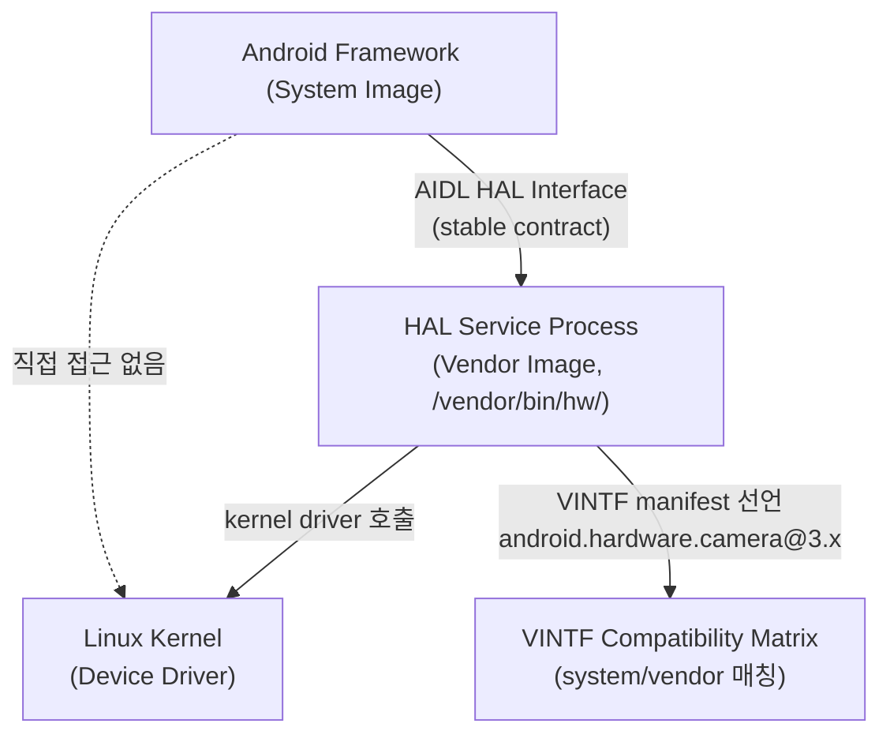

## HAL은 framework와 vendor 구현 사이의 안정된 userspace contract다

상위 문서: [HAL native contracts](hal-native-contracts.md)
배경 지식: [커널/유저 모드](../../../../../../02_references/operating-systems/kernel.md)

HAL 은 하드웨어 제조사 구현을 Android framework 코드와 분리하기 위한 표준 **userspace**(유저 모드 — CPU 의 특권 명령 실행 권한이 없어 하드웨어에 직접 접근하지 못하고, 커널이 제공하는 시스템 콜을 통해서만 그 기능을 사용할 수 있는 일반 프로세스 실행 영역) interface 다.


### 메커니즘: HAL 계층 구조



### AIDL HAL 선언 예시 (카메라)

```
// hardware/interfaces/camera/provider/aidl/android/hardware/camera/provider/ICameraProvider.aidl
// Vendor측 구현체가 이 stable interface를 구현한다
package android.hardware.camera.provider;

@VintfStability
interface ICameraProvider {
    ICameraDevice getCameraDeviceInterface(@utf8InCpp String cameraDeviceName);
    void getCameraIdList(out String[] cameraDeviceNames);
    void setCallback(ICameraProviderCallback callback);
}
```

```bash
# 기기에서 실행 중인 HAL 서비스 목록 확인
adb shell lshal

# 특정 HAL 인터페이스 상태 확인
adb shell lshal | grep -i camera

# VINTF manifest(vendor측이 제공하는 interface 목록) 확인
adb shell cat /vendor/etc/vintf/manifest.xml | grep -A5 "camera"
```

### 판단 기준

- Framework 또는 system component 는 HAL client 가 되고, vendor/device-specific 구현은 HAL service 가 된다.
- HAL 을 kernel wrapper 나 driver 와 동일시하면 계층이 흐려진다. HAL service 가 kernel driver 를 호출할 수는 있지만, HAL 자체는 userspace process다.
- Android 8(Treble) 이후 HAL 은 stable interface, process boundary, manifest/matrix 검증과 함께 이해해야 한다.
- 새로운 HAL은 AIDL HAL로 작성한다. HIDL은 기존 레거시 인터페이스로 신규 HAL에는 사용하지 않는다.

### 경계

- framework/vendor 경계를 가능하게 하는 Treble 업데이트 모델은 [Treble은 system과 vendor 업데이트 경계를 stable interface로 분리한다](treble-separates-system-and-vendor-through-stable-interfaces.md)가 다룬다.
- HAL 호환성 선언은 [VINTF는 framework/vendor 호환성을 manifest와 matrix로 선언한다](vintf-declares-framework-vendor-compatibility.md)가 다룬다.

### 관측 가능한 증거 (Observable Evidence)

```bash
# HAL 서비스 실행 상태 확인
adb shell ps -A | grep -E "android.hardware|vendor"

# HAL과 framework 사이 Binder 트랜잭션 확인
adb shell dumpsys activity service android.hardware.camera.provider

# HAL service crash 시 tombstone 위치
adb shell ls /data/tombstones/
adb logcat | grep -E "HAL|service died|hidl_death"
```

### 관련 문서

- [Treble은 system과 vendor 업데이트 경계를 stable interface로 분리한다](treble-separates-system-and-vendor-through-stable-interfaces.md)
- [VINTF는 framework/vendor 호환성을 manifest와 matrix로 선언한다](vintf-declares-framework-vendor-compatibility.md)
- [AIDL HAL은 새로운 HAL의 현재 stable interface 표준이다](aidl-hal-is-current-stable-interface-for-new-hals.md)

공식 문서: [AOSP HAL overview](https://source.android.com/docs/core/architecture/hal)
