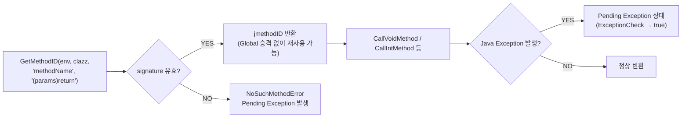

## JNI method/field ID와 pending exception은 runtime state다

상위 문서: [HAL native contracts](hal-native-contracts.md)


`GetMethodID`, `GetStaticMethodID`, `GetFieldID` 는 이름과 JNI signature 를 runtime metadata 로 해석해 ID 를 돌려준다. JNI 호출이 Java exception 을 발생시키면 C++ stack 처럼 자동 unwind 되지 않고 pending state 로 남는다.

### JNI Signature 규칙 및 ID 캐시 패턴



```cpp
// 자주 사용하는 method ID를 JNI_OnLoad에서 캐시 (재사용 안전)
static jmethodID g_onResult = nullptr;

JNIEXPORT jint JNI_OnLoad(JavaVM* vm, void* reserved) {
    JNIEnv* env;
    vm->GetEnv((void**)&env, JNI_VERSION_1_6);

    jclass cls = env->FindClass("com/example/Callback");
    // jmethodID는 object reference가 아니므로 GlobalRef 불필요
    g_onResult = env->GetMethodID(cls, "onResult", "(Ljava/lang/String;I)V");
    
    if (env->ExceptionCheck()) {
        // GetMethodID 실패 → NoSuchMethodError 처리
        env->ExceptionDescribe();
        env->ExceptionClear();
        return -1;  // 로드 실패
    }
    return JNI_VERSION_1_6;
}

// Pending exception 처리 패턴
void safeCallMethod(JNIEnv* env, jobject obj, jstring arg) {
    env->CallVoidMethod(obj, g_onResult, arg, 200);
    
    if (env->ExceptionCheck()) {
        // Java 예외가 발생했을 때 처리
        env->ExceptionDescribe();  // logcat에 스택트레이스 출력
        env->ExceptionClear();     // pending state 클리어 (다음 JNI 호출을 위해)
        // 또는 env->Throw(e) 로 다른 예외로 교체
    }
}
```

### JNI Type Signature 참조표

| Java 타입 | JNI Signature |
|:---|:---|
| `void` | `V` |
| `int` | `I` |
| `long` | `J` |
| `boolean` | `Z` |
| `String` | `Ljava/lang/String;` |
| `byte[]` | `[B` |
| `(int, String) → void` | `(ILjava/lang/String;)V` |

### 판단 기준

- `jmethodID` 와 `jfieldID` 는 object reference 가 아니므로 `NewGlobalRef` 로 감싸지 않는다. 반복 경로에서 캐시는 안전하고 권장된다.
- JNI 호출이 Java exception 을 발생시키면 pending exception 상태가 남는다. 이 상태에서 대부분의 JNI 호출을 계속하면 **VM abort**(ART 런타임이 스스로 오류를 감지하고 프로세스 전체를 즉시 강제 종료시키는 것 — 일반 Java exception 처럼 catch 로 잡을 수 없다)가 발생할 수 있다.
- `ExceptionCheck()`를 먼저 호출해 pending state를 확인한 뒤 `ExceptionClear()`로 해제하거나 `Throw()`로 상위로 전달한다.
- `ExceptionDescribe()`는 logcat에 스택트레이스를 출력하지만 pending state를 클리어하지 않는다.

### 경계

- method/field ID 사용을 위한 클래스 참조 수명은 [JNI reference는 local, global, weak lifetime이 다르다](jni-references-have-local-global-and-weak-lifetimes.md)가 다룬다.

### 관측 가능한 증거 (Observable Evidence)

```bash
# JNI signature 오류 로그
# "java.lang.NoSuchMethodError: no non-static method ..."
adb logcat | grep -E "NoSuchMethodError|JNI signature"

# Pending exception 미처리로 인한 abort
# "JNI DETECTED ERROR IN APPLICATION: ... with pending exception"
adb logcat | grep "JNI DETECTED ERROR"

# CheckJNI 모드에서 더 상세한 오류 확인
adb shell setprop debug.checkjni 1
adb logcat | grep "JNI WARNING"
```

### 관련 문서

- [JNI reference는 local, global, weak lifetime이 다르다](jni-references-have-local-global-and-weak-lifetimes.md)
- [Native 성능과 crash debugging은 경계 비용에서 시작한다](native-performance-and-crash-debugging-start-at-the-boundary.md)

공식 문서: [Android JNI tips](https://developer.android.com/ndk/guides/jni-tips)
