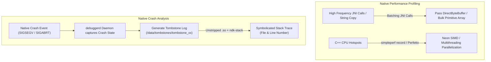

## Native 성능과 crash debugging은 경계 비용에서 시작한다

상위 문서: [HAL native contracts](hal-native-contracts.md)
배경 지식: [시그널](01_inbox/operating-systems/signals.md)

C/C++ Native 코드의 성능 병목(Performance Bottleneck) 및 불투명한 패닉 크래시(Native Crash)를 진단할 때는 C++ 내부 연산 알고리즘 단독보다 **Managed Java/Kotlin과 Native C++ 간의 JNI 경계 호출 비용**에서 분석을 시작해야 한다.

과도한 JNI 호출 횟수(Cross-boundary JNI Overhead), 빈번한 String/Primitive Array 마샬링, 및 Native 메모리 손상(Use-After-Free, Out-of-Bounds Write) 현상은 ART 런타임을 정지시키거나 Tombstone 파일 기반의 Native Crash를 유발한다.

---

### 메커니즘: Native 성능 최적화 및 크래시 심볼리케이션 파이프라인



1. **JNI Boundary Cost Reduction**: Java에서 C++을 루프 내에서 반복 호출하는 단발성 JNI 대신 `DirectByteBuffer` 메모리 공유 또는 바이트 배열 Bulk 전송 기법을 채택하여 경계 전송 오버헤드를 소멸시킴.
2. **`debuggerd` & Tombstone Processing**: C/C++ 레벨에서 Segfault(`SIGSEGV`)나 Abort(`SIGABRT`)가 발생하면 Android `debuggerd` 데몬이 시그널을 가로채 레지스터 상태(PC, LR, SP)와 콜스택 주소를 `/data/tombstones/` 파일에 영구 보존.

---

### Native Profiling (`simpleperf`) 및 Crash Symbolization CLI 예시

```bash
# 1. simpleperf를 이용한 Native CPU 프로파일링 캡처
NDK_PATH=/path/to/ndk
$NDK_PATH/simpleperf record -p $(adb shell pidof com.example.app) --duration 10 -o /data/local/tmp/perf.data
$NDK_PATH/simpleperf report -i /data/local/tmp/perf.data --sort comm,pid,tid,symbol

# 2. Crash Tombstone 덤프 읽기 및 ndk-stack 심볼리케이션
adb shell cat /data/tombstones/tombstone_00 | ndk-stack -sym app/build/intermediates/merged_native_libs/release/out/lib/arm64-v8a

# 3. HWASan (Hardware-assisted AddressSanitizer) 빌드 시 메모리 손상 감지
# Tombstone Output:
# ERROR: HWAddressSanitizer: tag-mismatch on address 0x005600123450
# WRITE of size 4 at 0x005600123450 thread T0 (example.app)
```

---

### 실무 규칙

- 릴리스 빌드 시 `.so` 파일에서 심볼(Symbol Table)을 `strip` 하더라도, 빌드 산출물로 생성된 미삭제 `.so` 파일(Unstripped `.so`)을 별도 아카이브 디렉터리에 보관해야 생산 환경에서 전달된 Tombstone 주소를 정확히 코드 라인으로 복원할 수 있다.
- Memory corruption(Use-After-Free, Double Free, Buffer Overflow) 문제를 해결할 때는 NDK의 **HWASan** 또는 **ASan** 빌드 플래그를 적용하여 개발 단계에서 무효화된 포인터 참조를 탐지해야 한다.

---

### 관측 가능한 증거 (Observable Evidence)

1. **Tombstone 생성 및 Signal 11 (SIGSEGV) 패닉 로그 확인**:
   ```bash
   adb logcat | grep -E "DEBUG|tombstone"
   # DEBUG: *** *** *** *** *** *** *** *** *** *** *** *** *** *** *** ***
   # DEBUG: Build fingerprint: 'google/raven/raven:14/UP1A...'
   # DEBUG: Timestamp: 2026-08-04 15:50:00
   # DEBUG: pid: 1234, tid: 5678, name: WorkerThread  >>> com.example.app <<<
   # DEBUG: signal 11 (SIGSEGV), code 1 (SEGV_MAPERR), fault addr 0x0000000000000000
   ```
2. **`dumpsys`를 통한 Native Heap 메모리 가용량 분석**:
   ```bash
   adb shell dumpsys meminfo com.example.app | grep -E "Native Heap|Native Allocation"
   ```

---

### 관련 문서

- [CMake, Gradle, ABI는 native build와 packaging 계약을 나눈다](cmake-gradle-and-abi-define-native-build-and-packaging.md)
- [Native service 디버깅은 init, Binder, VINTF, SELinux, tombstone을 분리한다](native-service-debugging-separates-init-binder-vintf-selinux-and-tombstones.md)
- [NDK는 앱 아키텍처가 아니라 native library toolchain 경계다](ndk-is-native-library-toolchain-not-app-architecture.md)

공식 문서: [Android Studio Native Debugging](https://developer.android.com/studio/debug/native-debugging), [Simpleperf Documentation](https://developer.android.com/ndk/guides/simpleperf)

