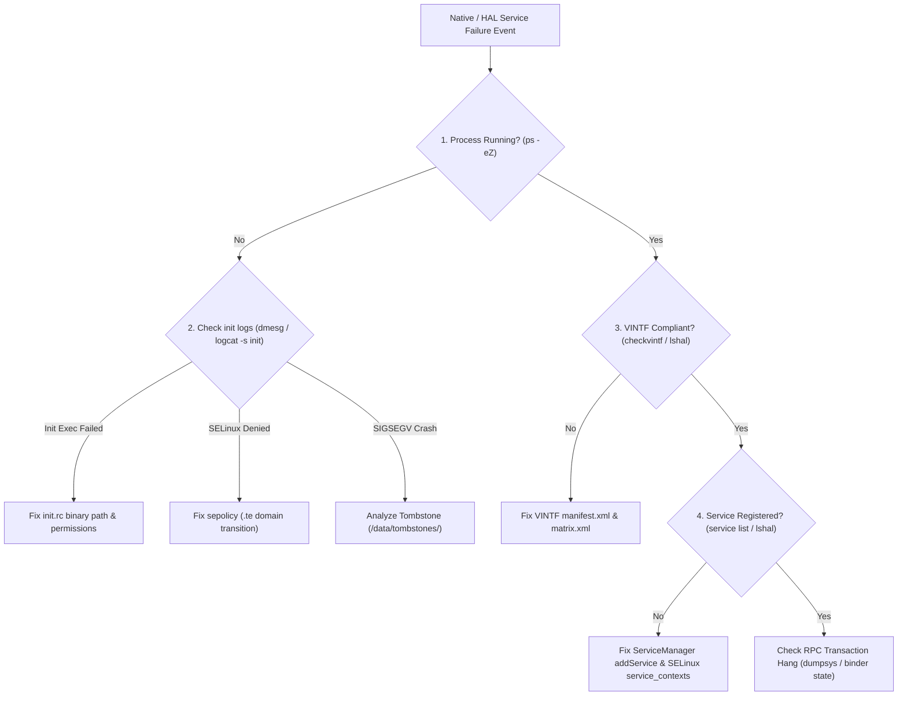

## Native service 디버깅은 init, Binder, VINTF, SELinux, tombstone을 분리한다

상위 문서: [HAL native contracts](hal-native-contracts.md)
배경 지식: [SELinux](01_inbox/linux/security/selinux.md)

Native Daemon 및 HAL 서비스의 부팅 거부, 무응답(Hang), 사망 반복(Crash Loop) 장애를 분석할 때는 모든 현상을 단순한 "서비스 미작동"으로 뭉뚱그려 진단해서는 안 된다.

원인은 (1) init 실행 스크립트(`init.rc`) 등록 에러, (2) SELinux MAC 거부(`avc: denied`), (3) VINTF 매니페스트 버전 호환성 실패, (4) ServiceManager 바인더 서비스 등록 거부, (5) C++ 메모리 오염 패닉(Tombstone) 중 하나에 해당하므로, 실패 레이어를 정확히 분리하여 좁혀 나가야 한다.

---

### 메커니즘: Native Service 장애 원인 격리 의사결정 트라이아지



1. **Layer 1: Init Execution**: `init.rc` 파일 경로 오타, 바이너리 파일 실행 권한, `user`/`group` 누락으로 인한 프로세스 미출범.
2. **Layer 2: SELinux MAC Policy**: `init`이 프로세스를 시작할 때 `type_transition` 규칙 부족 또는 디바이스 노드 접근 거부로 인한 즉시 사망.
3. **Layer 3: VINTF Matrix Alignment**: Vendor `manifest.xml`과 System `compatibility_matrix.xml` 간의 AIDL/HIDL 버전 비호환으로 인한 서비스 바인딩 차단.
4. **Layer 4: Binder Service Registration**: `AServiceManager_addService()` 실행 시 `service_contexts` 누락으로 인한 등록 거부.
5. **Layer 5: Native Crash**: NULL Pointer Dereference 또는 Double Free로 인한 `debuggerd` 톰스톤 덤프 생성.

---

### 각 레이어별 진단 명령 모음 CLI

```bash
# 1. 프로세스 존재 여부 및 SELinux 보안 도메인 검증
adb shell ps -eZ | grep -E "cameraserver|hal_camera"

# 2. init 서비스 재시작 로깅 관측
adb logcat -s init | grep -i "restarting"

# 3. SELinux AVC Denial 차단 내역 조회
adb shell dmesg | grep "avc: denied"

# 4. ServiceManager 등록 상태 검증
adb shell service check android.hardware.camera.provider.ICameraProvider/default

# 5. Tombstone 덤프 콜스택 조회
adb shell ls -t /data/tombstones/ | head -n 1 | xargs -I {} adb shell cat /data/tombstones/{}
```

---

### 실무 규칙

- 서비스가 끊임없이 재시작(`init: Service 'foo' (pid 1234) killing/restarting`)되는 경우 `init.rc`에 `oneshot` 옵션이 지정되어 있지 않은 상태에서 서비스 main 함수가 에러로 0이 아닌 값을 반환하며 종료되고 있는지 탐지해야 한다.
- `adb shell service list`는 Java 및 AIDL Native 바인더 서비스 목록만 출력하므로, HIDL 및 Passthrough HAL의 상태를 진단할 때는 반드시 `adb shell lshal` 명령을 병행 사용해야 한다.

---

### 관측 가능한 증거 (Observable Evidence)

1. **VINTF 호환성 매칭 검증 명령 도구 실행 결과**:
   ```bash
   adb shell checkvintf
   # Compatible: Success
   ```
2. **`init`에 의한 서비스 비정상 크래시 재시작 로그**:
   ```bash
   adb logcat -s init
   # init: Service 'vendor.camera-provider' (pid 4321) exited with status 11
   # init: Sending signal 9 to service 'vendor.camera-provider'
   # init: Scheduling restart of service 'vendor.camera-provider' in 50ms
   ```

---

### 관련 문서

- [Native system service는 init이 띄우고 Binder로 발견되는 endpoint다](native-system-services-are-init-managed-binder-endpoints.md)
- [Native 성능과 crash debugging은 경계 비용에서 시작한다](native-performance-and-crash-debugging-start-at-the-boundary.md)
- [VINTF는 framework/vendor 호환성을 manifest와 matrix로 선언한다](vintf-declares-framework-vendor-compatibility.md)

공식 문서: [AOSP AIDL for HALs Debugging](https://source.android.com/docs/core/architecture/aidl/aidl-hals), [Android Native Debugging](https://developer.android.com/studio/debug/native-debugging)

