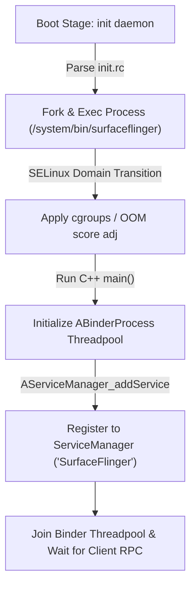

## Native system service 는 init 이 띄우고 Binder 로 발견되는 endpoint 다

상위 문서: [HAL native contracts](hal-native-contracts.md)

배경 지식: [fork/exec](../../../../../operating-systems/process-states-lifecycle.md)

Native System Service(SurfaceFlinger, AudioFlinger/audioserver, media.extractor, installd, keystore2 등)는 C++/Rust 로 작성되어 `init` 데몬의 실행 스크립트(`init.rc`)에 의해 독립된 프로세스로 출범하고, `ServiceManager` 에 IPC 바인더 서비스로 등록되는 시스템 엔드포인트다.

하드웨어 추상화를 담당하는 HAL 서비스와 달리 Native System Service 는 하드웨어 제어뿐만 아니라 그래픽 컴포지팅(SurfaceFlinger), 오디오 트랙 믹싱(AudioFlinger), 패키지 설치(installd) 등 Framework 층이 의존하는 핵심 비즈니스 로직 및 리소스 조율을 수행한다.

---

### 메커니즘: Init 프로세스 생명주기 제어 및 ServiceManager 바인더 등록 흐름



1. **Init Lifecycle Control**: `init`은 `init.rc` 파일에 정의된 `user`, `group`, `seclabel`, `capabilities`, `onrestart` 지침에 따라 프로세스를 **분기(fork)하고 새 실행 파일로 치환(exec)**하여 띄우며(부모 프로세스인 `init` 을 그대로 복제한 뒤 그 복제본 위에 새 프로그램 이미지를 덮어쓰는 전통적인 Unix 프로세스 생성 모델), 프로세스가 예기치 않게 종료되면 자동으로 다시 띄운다(Respawn).
2. **ServiceManager Registration**: 실행된 네이티브 프로세스는 `defaultServiceManager()->addService()`를 호출하여 자사 [binder ipc](../../binder-ipc.md) 핸들을 `servicemanager` 에 등록한다. 클라이언트(Java Framework 또는 타 Native Process)는 서비스 이름을 통해 이 Binder 엔드포인트를 획득하여 통신한다.

---

### Native Service `init.rc` 정의 및 C++ main() 등록 코드 예시

```text
# /system/etc/init/surfaceflinger.rc 예시
service surfaceflinger /system/bin/surfaceflinger
    class core animation
    user system
    group graphics drmrpc readproc
    capabilities SYS_NICE
    onrestart restart zygote
    task_profiles HighPerformance
```

```cpp
// frameworks/native/services/surfaceflinger/main_surfaceflinger.cpp 예시
#include <binder/IServiceManager.h>
#include <binder/IPCThreadState.h>
#include <binder/ProcessState.h>

int main(int argc, char** argv) {
    // 1. Binder 스레드 풀 구성 (최대 스레드 수 4개 설정)
    sp<ProcessState> ps = ProcessState::self();
    ps->setThreadPoolMaxThreadCount(4);
    ps->startThreadPool();

    // 2. Native Service 인스턴스 생성 및 ServiceManager 등록
    sp<SurfaceFlinger> flinger = new SurfaceFlinger();
    defaultServiceManager()->addService(
        String16("SurfaceFlinger"), flinger, false /* allowIsolated */);

    // 3. 메인 스레드를 Binder 루프에 조인
    IPCThreadState::self()->joinThreadPool();
    return 0;
}
```

---

### 실무 규칙

- Java Framework `system_server` 내부에서 동기식(Synchronous)으로 다수의 서비스를 동작시키는 Java System Service 와 달리, Native System Service 는 각기 별도의 프로세스로 나뉘어 있으므로 IPC 트랜잭션 경계 비용 및 스레드 풀 교착 상태(Deadlock)를 감안하여 인터페이스를 설계해야 한다.
- Native Service 사망 시 `onrestart` 지침을 통해 연관 서비스(`zygote`, `audioserver`)가 함께 재시작되도록 명시되어 있으면 단일 서비스 crash 가 전체 UI 재부팅으로 이어질 수 있으므로 무분별한 `onrestart restart zygote` 사용을 지양해야 한다.

---

### 관측 가능한 증거 (Observable Evidence)

1. **실행 중인 Native System Service 의 SELinux Context 및 PID 관측**:
   ```bash
   adb shell ps -eZ | grep -E "surfaceflinger|audioserver|installd|keystore"
   # u:r:surfaceflinger:s0         system        567     1 /system/bin/surfaceflinger
   # u:r:audioserver:s0             audioserver   678     1 /system/bin/audioserver
   ```
2. **`service check` 를 통한 ServiceManager 등록 정상 여부 확인**:
   ```bash
   adb shell service check SurfaceFlinger
   # Service SurfaceFlinger: found
   ```

---

### 관련 문서

- [Native service 디버깅은 init, Binder, VINTF, SELinux, tombstone을 분리한다](native-service-debugging-separates-init-binder-vintf-selinux-and-tombstones.md)
- [Binder는 객체 참조를 커널이 중재하는 capability IPC다](../../ipc-and-process/ipc-process-contracts/binder-is-kernel-mediated-object-capability-ipc.md)
- [HAL은 framework와 vendor 구현 사이의 안정된 userspace contract다](hal-is-stable-userspace-contract-between-framework-and-vendor.md)

공식 문서: [AOSP Native Services Overview](https://source.android.com/docs/core/architecture/aidl)
