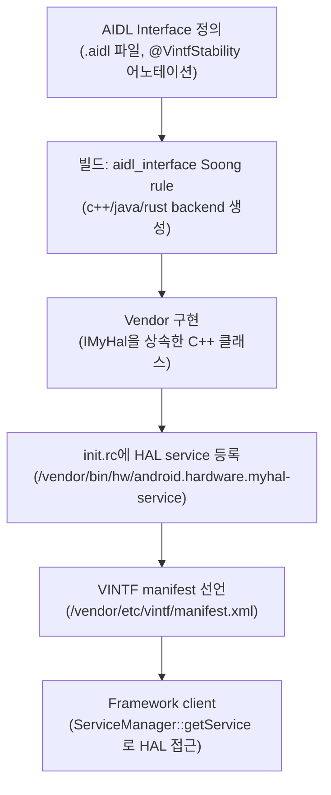

## AIDL HAL 은 신규 HAL 의 현재 stable interface 표준이다

상위 문서: [HAL native contracts](hal-native.md)


AIDL HAL 은 Android 11 부터 HAL 구현에 사용할 수 있게 된 방식이며, 가능한 신규 HAL 에는 Stable AIDL 을 사용하는 방향이 권장된다.

### 메커니즘: AIDL HAL 선언부터 서비스 등록까지



### AIDL HAL 인터페이스 + 서비스 등록 예시

```
// android/hardware/myhal/IMyHal.aidl
package android.hardware.myhal;

@VintfStability  // system-vendor 경계를 넘는 stable interface 선언
interface IMyHal {
    void doOperation(in byte[] data, out byte[] result);
    int getVersion();
}
```

```cpp
// vendor 측 구현 (C++)
class MyHalImpl : public BnMyHal {
    ndk::ScopedAStatus doOperation(
            const std::vector<uint8_t>& data,
            std::vector<uint8_t>* result) override {
        // 하드웨어 접근 구현
        return ndk::ScopedAStatus::ok();
    }
};

int main() {
    auto hal = ndk::SharedRefBase::make<MyHalImpl>();
    // ServiceManager에 HAL 서비스 등록
    const std::string name = IMyHal::descriptor + std::string("/default");
    AServiceManager_addService(hal->asBinder().get(), name.c_str());
    ABinderProcess_joinThreadPool();
}
```

```xml
<!-- /vendor/etc/vintf/manifest.xml - VINTF manifest 선언 -->
<manifest version="2.0" type="device">
    <hal format="aidl">
        <name>android.hardware.myhal</name>
        <version>1</version>
        <interface>
            <name>IMyHal</name>
            <instance>default</instance>
        </interface>
    </hal>
</manifest>
```

### 판단 기준

- Framework component 가 `system.img` 에 있고 hardware component 가 `vendor.img` 에 있는 partition 경계를 넘는 HAL 통신은 `@VintfStability` Stable AIDL 을 사용해야 한다.
- AIDL HAL 은 interface 안정성만으로 끝나지 않는다. VINTF manifest 선언, service 등록, SELinux service type, VTS 가 함께 맞아야 device/framework contract 가 성립한다.
- HIDL 은 레거시 인터페이스로 신규 HAL 에는 사용하지 않는다.

### 경계

- VINTF 호환성 선언은 [VINTF는 framework/vendor 호환성을 manifest와 matrix로 선언한다](vintf-declares-framework-vendor-compatibility.md)가 다룬다.
- Native system service와 Binder endpoint 등록은 [Native system service는 init이 띄우고 Binder로 발견되는 endpoint다](native-system-services-are-init-managed-binder-endpoints.md)가 다룬다.

### 관측 가능한 증거 (Observable Evidence)

```bash
# AIDL HAL 서비스가 실행 중인지 확인
adb shell lshal | grep -i "aidl"

# 특정 HAL의 VINTF 선언 확인
adb shell cat /vendor/etc/vintf/manifest.xml | grep -A10 "myhal"

# HAL 서비스 등록 상태 확인
adb shell service list | grep -i "hardware"

# HAL 서비스 crash → logcat에서 확인
adb logcat | grep -E "vendor\.bin\.hw|hidl_death|service died"
```

### 관련 문서

- [VINTF는 framework/vendor 호환성을 manifest와 matrix로 선언한다](vintf-declares-framework-vendor-compatibility.md)
- [Native system service는 init이 띄우고 Binder로 발견되는 endpoint다](native-system-services-are-init-managed-binder-endpoints.md)
- [HAL은 framework와 vendor 구현 사이의 안정된 userspace contract다](hal-is-stable-userspace-between-framework-and-vendor.md)

공식 문서: [AOSP AIDL for HALs](https://source.android.com/docs/core/architecture/aidl/aidl-hals), [AOSP AIDL overview](https://source.android.com/docs/core/architecture/aidl)
