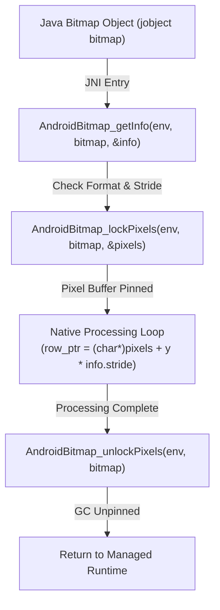

## AndroidBitmap native 접근은 format, stride, lock lifetime을 확인해야 한다

상위 문서: [HAL native contracts](hal-native.md)

NDK의 `AndroidBitmap_*` API는 Java/Kotlin Managed 영역의 `android.graphics.Bitmap` 객체를 JNI 경계를 통해 Native C/C++ 레벨에서 Direct Pixel Buffer로 획득할 수 있게 지원하는 표준 인터페이스다.

`AndroidBitmap_getInfo()`를 통한 비트맵 메타데이터(Width, Height, Stride, Pixel Format) 검증, `AndroidBitmap_lockPixels()`를 통한 픽셀 버퍼 주소 고정(Pinning), 및 연산 완료 후 반드시 `AndroidBitmap_unlockPixels()`를 호출해야 하는 엄격한 라이프사이클 계약을 준수해야 한다.

---

### 메커니즘: Lock, Pixel Address Indexing 및 Unlock 라이프사이클



1. **Stride Padding (행 폭 패딩)**: 메모리 정렬(Memory Alignment) 제약으로 인해 `info.stride` (한 행의 실제 바이트 크기)는 `width * bytesPerPixel` 수치보다 클 수 있다. 단순 `width * 4` 바이트 오프셋으로 주소를 계산하면 이미지 왜곡(Skewing)이나 Segfault 패닉이 유발된다.
2. **Lock Lifetime & GC Integrity**: `lockPixels()` 호출 성공 시 커널/ART GC가 해당 Graphic Buffer 메모리를 이동하거나 회수하지 못하도록 Pinned 상태가 되므로, 픽셀 조작 후 즉시 `unlockPixels()`를 호출하여 메모리 잠금을 해제해야 한다.

---

### AndroidBitmap Native C++ 조작 소스 예시

```cpp
#include <android/bitmap.h>
#include <jni.h>
#include <android/log.h>

extern "C" JNIEXPORT void JNICALL
Java_com_example_app_NativeImageProcessor_processBitmap(
        JNIEnv* env, jobject clazz, jobject bitmap) {
    
    AndroidBitmapInfo info;
    void* pixels = nullptr;
    
    // 1. Bitmap 메타데이터 검증
    if (AndroidBitmap_getInfo(env, bitmap, &info) < 0) return;
    if (info.format != ANDROID_BITMAP_FORMAT_RGBA_8888) return; // RGBA_8888만 지원
    
    // 2. Pixel Buffer 잠금 및 포인터 획득
    if (AndroidBitmap_lockPixels(env, bitmap, &pixels) < 0 || !pixels) return;
    
    // 3. Stride 기반 Row-by-Row 픽셀 조작 (Invert Red/Green)
    for (uint32_t y = 0; y < info.height; ++y) {
        uint32_t* line = reinterpret_cast<uint32_t*>(
            reinterpret_cast<char*>(pixels) + y * info.stride);
        for (uint32_t x = 0; x < info.width; ++x) {
            uint32_t color = line[x];
            // RGBA 픽셀 비트 조작
            uint8_t a = (color >> 24) & 0xFF;
            uint8_t b = (color >> 16) & 0xFF;
            uint8_t g = (color >> 8) & 0xFF;
            uint8_t r = color & 0xFF;
            line[x] = (a << 24) | (b << 16) | (r << 8) | g; // Swap R & G
        }
    }
    
    // 4. 반드시 lock 해제
    AndroidBitmap_unlockPixels(env, bitmap);
}
```

---

### 실무 규칙

- C++ 가상 연산 도중 C++ 예외(Exception)가 발생하거나 `return` 문으로 탈출하더라도, RAII 패턴(Smart Pointer Wrapper)을 사용하여 `AndroidBitmap_unlockPixels()`가 무조건 실행되도록 보장해야 한다.
- `Bitmap.Config.HARDWARE` (AHardwareBuffer 기반 비트맵) 객체는 CPU 읽기/쓰기가 불가능하므로 `AndroidBitmap_lockPixels()` 호출 시 `ANDROID_BITMAP_RESULT_JNI_EXCEPTION` 또는 에러 코드를 반환한다. H/W 비트맵은 `copy(Config.ARGB_8888, true)`로 소프트웨어 비트맵 변환 후 조작해야 한다.

---

### 관측 가능한 증거 (Observable Evidence)

1. **Hardware Bitmap 잠금 실패 시 logcat 에러 출력**:
   ```bash
   adb logcat | grep -E "AndroidBitmap|graphic"
   # AndroidBitmap_lockPixels failed for HARDWARE bitmap format (-4)
   ```
2. **Native Memory Crash Tombstone (Stride 오버플로우)**:
   ```bash
   adb shell cat /data/tombstones/tombstone_00 | grep -E "signal 11|backtrace"
   # Cause: null pointer dereference or Out-of-bounds read at row_ptr offset
   ```

---

### 관련 문서

- [JNI string/array 접근은 copy, pin, release 계약이다](jni-strings-and-arrays-have-copy-pin-and-release.md)
- [Native 성능과 crash debugging은 경계 비용에서 시작한다](native-performance-and-crash-debugging-start-at-the-boundary.md)

공식 문서: [Android NDK AndroidBitmap Reference](https://developer.android.com/ndk/reference/group/bitmap)

