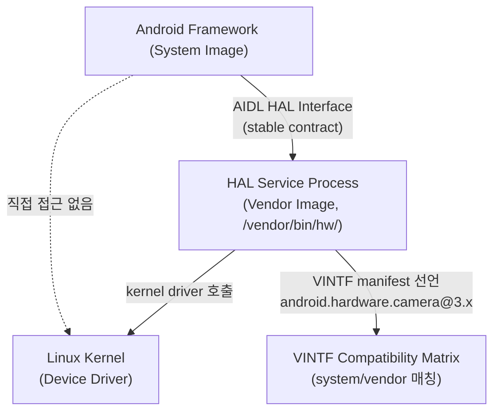
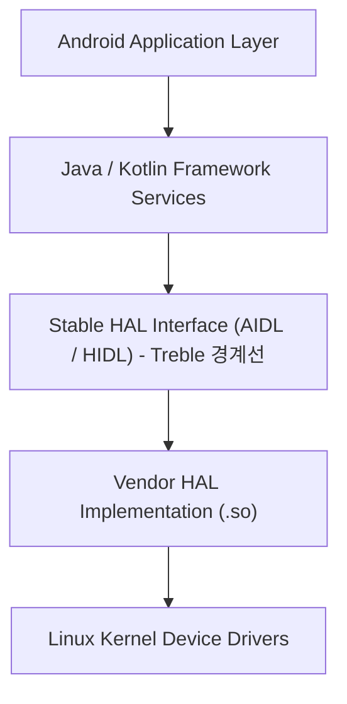

## HAL은 framework와 vendor 구현 사이의 안정된 userspace contract다

상위 문서: [HAL native contracts](hal-native.md)
배경 지식: [커널/유저 모드](../../../../../../02_references/operating-systems/kernel.md)

HAL 은 하드웨어 제조사 구현을 Android framework 코드와 분리하기 위한 표준 **userspace**(유저 모드 — CPU 의 특권 명령 실행 권한이 없어 하드웨어에 직접 접근하지 못하고, 커널이 제공하는 시스템 콜을 통해서만 그 기능을 사용할 수 있는 일반 프로세스 실행 영역) interface 다.


### 메커니즘: HAL 계층 구조



### AIDL HAL 선언 예시 (카메라)

```
// hardware/interfaces/camera/provider/aidl/android/hardware/camera/provider/ICameraProvider.aidl
// Vendor측 구현체가 이 stable interface를 구현한다
package android.hardware.camera.provider;

@VintfStability
interface ICameraProvider {
    ICameraDevice getCameraDeviceInterface(@utf8InCpp String cameraDeviceName);
    void getCameraIdList(out String[] cameraDeviceNames);
    void setCallback(ICameraProviderCallback callback);
}
```

```bash
# 기기에서 실행 중인 HAL 서비스 목록 확인
adb shell lshal

# 특정 HAL 인터페이스 상태 확인
adb shell lshal | grep -i camera

# VINTF manifest(vendor측이 제공하는 interface 목록) 확인
adb shell cat /vendor/etc/vintf/manifest.xml | grep -A5 "camera"
```

### 판단 기준

- Framework 또는 system component 는 HAL client 가 되고, vendor/device-specific 구현은 HAL service 가 된다.
- HAL 을 kernel wrapper 나 driver 와 동일시하면 계층이 흐려진다. HAL service 가 kernel driver 를 호출할 수는 있지만, HAL 자체는 userspace process다.
- Android 8(Treble) 이후 HAL 은 stable interface, process boundary, manifest/matrix 검증과 함께 이해해야 한다.
- 새로운 HAL은 AIDL HAL로 작성한다. HIDL은 기존 레거시 인터페이스로 신규 HAL에는 사용하지 않는다.

### 경계

- framework/vendor 경계를 가능하게 하는 Treble 업데이트 모델은 [Treble은 system과 vendor 업데이트 경계를 stable interface로 분리한다](project-treble-hal.md)가 다룬다.
- HAL 호환성 선언은 [VINTF는 framework/vendor 호환성을 manifest와 matrix로 선언한다](vintf-manifest-compatibility.md)가 다룬다.

### 관측 가능한 증거 (Observable Evidence)

```bash
# HAL 서비스 실행 상태 확인
adb shell ps -A | grep -E "android.hardware|vendor"

# HAL과 framework 사이 Binder 트랜잭션 확인
adb shell dumpsys activity service android.hardware.camera.provider

# HAL service crash 시 tombstone 위치
adb shell ls /data/tombstones/
adb logcat | grep -E "HAL|service died|hidl_death"
```

### 관련 문서

- [Treble은 system과 vendor 업데이트 경계를 stable interface로 분리한다](project-treble-hal.md)
- [VINTF는 framework/vendor 호환성을 manifest와 matrix로 선언한다](vintf-manifest-compatibility.md)
- [AIDL HAL은 새로운 HAL의 현재 stable interface 표준이다](aidl-hal.md)

공식 문서: [AOSP HAL overview](https://source.android.com/docs/core/architecture/hal)

---

### 3. HIDL 및 AIDL Stable HAL

안드로이드 8.0(Project Treble) 이전에는 HAL 이 상위 프레임워크와 동일한 프로세스 내에서 동작하는 공유 라이브러리(`.so`) 형태였습니다. 이로 인해 OS 업데이트 시 벤더 코드까지 모두 재작성해야 하는 문제가 발생했습니다. 이를 해결하기 위해 **Stable HAL** 인터페이스 개념이 도입되었습니다.

#### ① HIDL (HAL Interface Definition Language) - Android 8.0+

- 안드로이드 8.0(Project Treble)에서 도입된 바인더(Binder) 기반 인터페이스 정의 언어입니다.
- **프레임워크 - 벤더 분리**: 프레임워크 프로세스와 HAL 프로세스가 서로 분리되어 IPC(Binder)로 통신하게 되었습니다.
- **독립적 업데이트**: OS(프레임워크)를 업데이트하더라도 벤더 HAL 코드를 수정하거나 다시 빌드할 필요가 없어졌습니다.

#### ② AIDL (Android Interface Definition Language) Stable HAL - Android 11+

- 안드로이드 11 부터 기존의 HIDL 을 대체하고, 안드로이드 전반의 IPC 인터페이스 언어를 **AIDL**로 통일했습니다.
- 기존 앱 간 통신에 쓰이던 AIDL 을 시스템 및 벤더 영역까지 확장하여 **Stable AIDL** 구조를 성립시켰습니다.
- 버전 관리(Versioning)와 이전 버전 호환성이 대폭 강화되어, 안정적인 하드웨어 인터페이스 정의가 가능해졌습니다.

---

### 4. 구조 요약 (Architecture Stack)



---

### 5. 연관 개념 (Related Notes)

- [Linux Kernel](../../../../../operating-systems/linux-kernel.md) - HAL 아래에서 하드웨어 장치 제어 드라이버를 제공하는 하위 운영체제 커널
- [ART (Android Runtime)](../../boot-and-runtime/zygote-runtime/art.md) - HAL 위 프레임워크 및 앱 프로세스를 구동하는 런타임 환경
- [Binder IPC](../../ipc-and-process/binder-ipc.md) - Stable HAL(HIDL/AIDL) 통신에 쓰이는 IPC 메커니즘
- [system_server](../../boot-and-runtime/system-server/system-server.md) - HAL 을 사용하는 시스템 서비스 프로세스
