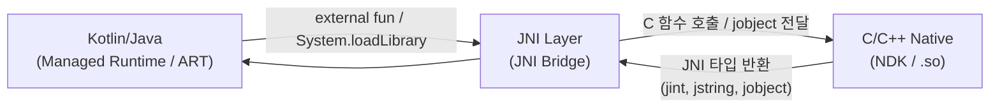

## JNI는 managed runtime과 native code 사이의 명시적 호출 경계다

상위 문서: [HAL native contracts](hal-native.md)

JNI 는 Kotlin/Java managed runtime 과 C/C++ native code 사이의 호출 경계다. `external` 함수 선언, `System.loadLibrary`, native method registration 또는 symbol lookup 이 모두 이 경계를 구성한다.

### 메커니즘: JNI 호출 경계 구조



### 두 가지 native method 등록 방식

```kotlin
// Kotlin 선언부
class NativeLib {
    external fun processData(input: ByteArray): Int

    companion object {
        init { System.loadLibrary("nativelib") }
    }
}
```

```cpp
// C++ 구현 — 방식 1: 긴 함수명 규칙 (symbol lookup)
// JNI가 자동으로 Java_패키지_클래스_메서드 패턴으로 symbol을 탐색
extern "C" JNIEXPORT jint JNICALL
Java_com_example_NativeLib_processData(JNIEnv* env, jobject thiz, jbyteArray input) {
    // ...
    return 0;
}

// 방식 2: JNI_OnLoad + RegisterNatives (권장)
// load 시점에 오류를 드러내고 export symbol을 줄일 수 있다
static const JNINativeMethod methods[] = {
    {"processData", "([B)I", (void*)nativeProcessData},
};

JNIEXPORT jint JNI_OnLoad(JavaVM* vm, void* reserved) {
    JNIEnv* env;
    vm->GetEnv((void**)&env, JNI_VERSION_1_6);
    jclass clazz = env->FindClass("com/example/NativeLib");
    env->RegisterNatives(clazz, methods, sizeof(methods)/sizeof(methods[0]));
    return JNI_VERSION_1_6;
}
```

### 판단 기준

- `jint`, `jlong`, `jobject`, `jstring`, `jarray` 는 native pointer 가 아니라 JNI 호출 규약의 타입이다. 특히 object 계열(`jobject`, `jstring`, `jarray` 등)은 값 자체가 메모리 주소가 아니라 runtime 이 관리하는 **reference handle**(런타임 내부 테이블을 가리키는 간접 토큰 — 자세한 수명 규칙은 [JNI reference는 local, global, weak lifetime이 다르다](jni-references-have-local-global-and-weak-lifetimes.md) 참고)로 취급해야 한다.
- 긴 함수명 방식보다 `RegisterNatives`가 권장된다: load 시점에 오류를 드러내고(심볼 이름 오타가 런타임 크래시 대신 초기화 실패로 즉시 드러남), **export symbol**(다른 바이너리가 링크 시점에 참조할 수 있도록 `.so` 밖으로 노출된 함수 심볼) 노출을 줄이며, **obfuscation**(코드 난독화 — 역공학을 어렵게 만드는 작업)에도 유리하다.
- class name, method signature, class loader 문맥이 런타임 연결의 일부다. 잘못된 signature는 `NoSuchMethodError`로 이어진다.

### 경계

- JNI reference 수명(local/global/weak)은 [JNI reference는 local, global, weak lifetime이 다르다](jni-references-have-local-global-and-weak-lifetimes.md)가 다룬다.
- `JNIEnv`의 thread 귀속성과 native thread attach는 [JNIEnv는 thread-local이고 native thread는 attach가 필요하다](jnienv-is-thread-local-and-native-threads-must-attach.md)가 다룬다.

### 관측 가능한 증거 (Observable Evidence)

```bash
# JNI 로드 성공/실패 로그 확인 (라이브러리 로드 시점)
adb logcat | grep -E "System.loadLibrary|JNI_OnLoad|dlopen"

# native crash(SIGSEGV 등) 발생 시 tombstone 덤프
adb shell ls /data/tombstones/
adb shell cat /data/tombstones/tombstone_00 | head -60

# JNI 경계에서 발생하는 예외
# java.lang.UnsatisfiedLinkError: no nativelib in java.library.path
# java.lang.NoSuchMethodError: processData (wrong signature)
adb logcat | grep -E "UnsatisfiedLinkError|NoSuchMethodError"

# 로드된 native library 목록 확인
adb shell cat /proc/$(adb shell pidof com.example.app)/maps | grep "\.so"
```

### 관련 문서

- [JNI reference는 local, global, weak lifetime이 다르다](jni-references-have-local-global-and-weak-lifetimes.md)
- [JNIEnv는 thread-local이고 native thread는 attach가 필요하다](jnienv-is-thread-local-and-native-threads-must-attach.md)
- [JNI method/field ID와 pending exception은 runtime state다](jni-method-field-ids-and-pending-exceptions-are-runtime-state.md)

공식 문서: [Android JNI tips](https://developer.android.com/ndk/guides/jni-tips)
