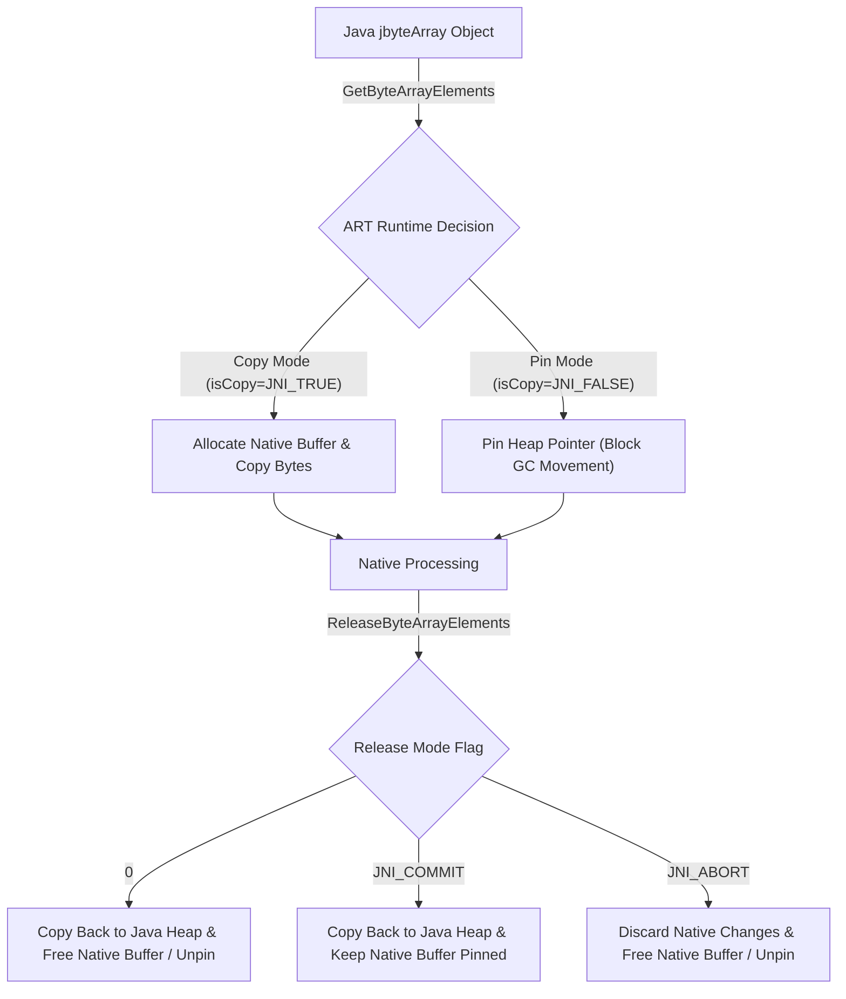

## JNI string/array 접근은 copy, pin, release 계약이다

상위 문서: [HAL native contracts](hal-native.md)

JNI 환경에서 Java String 및 Primitive Array(`byte[]`, `int[]` 등)를 C/C++ Native 레벨로 전달받아 포인터로 접근하는 작업은 직관적인 메모리 주소 참조가 아니라, 런타임에 따라 메모리 복사(Copy) 또는 Pinned 힙 상태(Pinning)가 유발되는 라이프사이클 계약이다.

`GetStringUTFChars` 또는 `GetByteArrayElements`를 통해 획득한 포인터는 조작이 완료된 후 반드시 쌍을 이루는 `ReleaseStringUTFChars` 또는 `ReleaseByteArrayElements`를 명시적으로 호출해야 하며, release 누락 시 힙 릭(Leak)이나 ART GC 동작 교착 상태가 발생한다.

---

### 메커니즘: Copy vs Pinning 동작 및 Release 모드 규격



1. **`GetPrimitiveArrayCritical` / `GetStringCritical`**: 복사 없이 GC 힙을 직접 잠그고(Pinning) 픽셀/배열 버퍼에 초저지연으로 접근하지만, 이 `Critical Section`(일반적인 mutex 기반 상호배제 구간이 아니라, JNI 가 GC 힙을 잠그고 native 코드의 직접 접근을 허용하는 JNI 고유의 특별 구간을 가리키는 용어다) 내부에서는 이종 JNI 함수 호출, 블로킹 I/O, 메모리 할당이 엄격히 금지되며 GC를 일시 정지(Suspend)시킨다.
2. **Release Mode Flags**:
   - `0`: Native 버퍼의 변경 사항을 Java 배열로 복사(Copy back)한 후 Native 버퍼 메모리를 해제/Unpin.
   - `JNI_COMMIT`: Native 버퍼의 변경 사항을 Java 배열로 복사하되, Native 버퍼를 해제하지 않고 유지.
   - `JNI_ABORT`: Native 버퍼의 변경 사항을 파기(Discard)하고 메모리만 해제/Unpin (읽기 전용 조작 시 권장).

---

### C++ JNI String & Array Safe Access 스니펫

```cpp
#include <jni.h>
#include <string>

extern "C" JNIEXPORT void JNICALL
Java_com_example_app_NativeUtils_processData(
        JNIEnv* env, jobject clazz, jstring jstr, jbyteArray jarr) {
    
    // 1. String 읽기 및 Release 계약
    jboolean isCopy = JNI_FALSE;
    const char* strBytes = env->GetStringUTFChars(jstr, &isCopy);
    if (strBytes != nullptr) {
        std::string cppStr(strBytes); // C++ string으로 복사
        env->ReleaseStringUTFChars(jstr, strBytes); // 즉시 해제
    }

    // 2. Small Array 구간 복사 (Release 해제 관리가 불필요하여 메모리 안전)
    jsize len = env->GetArrayLength(jarr);
    if (len > 0 && len <= 1024) {
        jbyte buffer[1024];
        env->GetByteArrayRegion(jarr, 0, len, buffer); // Copy region to stack
        // stack buffer 조작...
    } else if (len > 1024) {
        // 3. Large Array Pinning & Release (JNI_ABORT 옵션 사용)
        jbyte* elems = env->GetByteArrayElements(jarr, nullptr);
        if (elems != nullptr) {
            // Read-only 조작 수행...
            env->ReleaseByteArrayElements(jarr, elems, JNI_ABORT); // Writeback 불필요시 ABORT
        }
    }
}
```

---

### 실무 규칙

- 배열의 일부 구간만 읽거나 쓰고자 할 때는 `GetByteArrayElements` 대신 **`GetByteArrayRegion` / `SetByteArrayRegion`**을 사용해야 한다. Region API는 별도의 Release 호출이 필요 없고 Stack 버퍼에 바로 복사하므로 JNI 릭 위험이 무효화된다.
- `GetStringUTFChars`가 반환하는 인코딩은 Standard UTF-8이 아닌 **Modified UTF-8** (Null 바이트 `\0`를 `\xC0\x80` 2바이트로 표현)이므로, 널 바이트가 포함된 바이너리 바이트 스트림을 jstring으로 전달해서는 안 되며 `jbyteArray`를 사용해야 한다.

---

### 관측 가능한 증거 (Observable Evidence)

1. **CheckJNI 활성화 시 Release 누락 경고 로깅**:
   ```bash
   adb shell setprop debug.checkjni 1
   adb logcat | grep "JNI WARNING"
   # JNI WARNING: JNI function ReleaseStringUTFChars called with pending exception...
   # JNI WARNING: Critical region leak detected in native thread
   ```
2. **`GetPrimitiveArrayCritical` 지속시간 초과 시 ART GC Lock 패닉**:
   ```bash
   adb logcat | grep -i "thread suspending"
   # Thread 123 held critical section for 550ms! GC stalled.
   ```

---

### 관련 문서

- [JNI는 managed runtime과 native code 사이의 명시적 호출 경계다](jni-native-boundary.md)
- [AndroidBitmap native 접근은 format, stride, lock lifetime을 확인해야 한다](androidbitmap-native-access.md)
- [JNI references have local global and weak lifetimes](jni-reference-lifetimes.md)

공식 문서: [Android NDK JNI Tips - Primitive Arrays](https://developer.android.com/ndk/guides/jni-tips#primitive-arrays)

