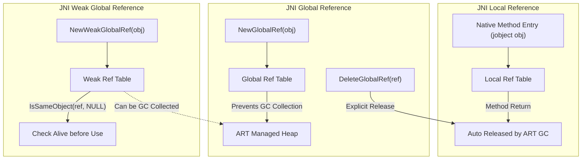

## JNI reference는 local, global, weak 세 가지 수명을 갖는다

상위 문서: [HAL native contracts](hal-native.md)

JNI object reference 는 native pointer 가 아니라 **runtime handle**(실제 메모리 주소를 직접 가리키는 포인터가 아니라, ART 런타임 내부 참조 테이블을 거쳐 간접적으로 객체를 가리키는 값 — 런타임이 그 뒤에서 실제 객체를 옮기거나 회수해도 handle 자체는 안전하게 유지된다)이며, local/global/weak 세 가지 형태에 따라 유효 기간과 GC 와의 상호작용이 달라지는 수명 규칙이 있다.

### 메커니즘: JNI Reference 수명 및 GC 인터랙션



### Reference 수명 유형

| Reference 종류 | 생성 방법 | 유효 범위 | 해제 방법 |
|:---|:---|:---|:---|
| **Local** | 기본 (native method 인자, JNI 반환값) | 현재 native method 호출 및 현재 thread | 메서드 반환 시 자동 해제 (`DeleteLocalRef` 명시 가능) |
| **Global** | `NewGlobalRef(obj)` | `DeleteGlobalRef` 호출 전까지 영구 | `DeleteGlobalRef(ref)` |
| **WeakGlobal** | `NewWeakGlobalRef(obj)` | GC에 의해 수집 가능, 사용 전 유효성 확인 필요 | `DeleteWeakGlobalRef(ref)` |


### C++ 코드 예시

```cpp
// JNI_OnLoad에서 자주 사용하는 클래스의 Global Reference를 캐시하는 패턴
static jclass g_MyClass = nullptr;
static jmethodID g_OnDataReady = nullptr;

JNIEXPORT jint JNI_OnLoad(JavaVM* vm, void* reserved) {
    JNIEnv* env;
    vm->GetEnv((void**)&env, JNI_VERSION_1_6);

    // Local ref → Global ref 승격 (나중에 다른 thread에서 사용 가능)
    jclass localClass = env->FindClass("com/example/MyClass");
    g_MyClass = (jclass)env->NewGlobalRef(localClass);
    env->DeleteLocalRef(localClass);  // local ref는 즉시 해제

    g_OnDataReady = env->GetMethodID(g_MyClass, "onDataReady", "([B)V");
    return JNI_VERSION_1_6;
}

// native thread에서 callback을 Java로 전달하는 패턴
void fireCallback(JNIEnv* env, jobject listener, jbyteArray data) {
    env->CallVoidMethod(listener, g_OnDataReady, data);
    // listener는 local ref → 이 메서드 내에서만 유효
    // 다음 호출까지 보관하려면 GlobalRef로 만들어야 함
}

// GlobalRef 해제 (JNI_OnUnload 또는 명시적 정리)
JNIEXPORT void JNI_OnUnload(JavaVM* vm, void* reserved) {
    JNIEnv* env;
    vm->GetEnv((void**)&env, JNI_VERSION_1_6);
    env->DeleteGlobalRef(g_MyClass);
}
```

### 판단 기준

- `jmethodID` 와 `jfieldID` 는 object reference 가 아니므로 global ref 로 감싸지 않는다. pointer 비교나 map key로도 안전하지 않다.
- `jobject` 값을 `==` 로 비교하거나 map key 로 사용하는 것은 안전한 identity 모델이 아니다. `IsSameObject`를 사용한다.
- local reference 는 같은 thread 내에서도 native method 호출이 끝나면 무효화된다. 루프나 콜백에서 많은 local ref를 쌓으면 `PushLocalFrame`/`PopLocalFrame` 또는 명시적 `DeleteLocalRef`로 관리한다.

### 경계

- JNI 경계 자체(함수 등록, 타입 규약)는 [JNI는 managed runtime과 native code 사이의 명시적 호출 경계다](jni-is-explicit-boundary-between-managed-runtime-and-native-code.md)가 다룬다.
- pending exception 처리는 [JNI method/field ID와 pending exception은 runtime state다](jni-method-field-ids-and-pending-exceptions-are-runtime-state.md)가 다룬다.

### 관측 가능한 증거 (Observable Evidence)

```bash
# Global Reference 누수 → JNI reference table overflow로 나타남
# "JNI ERROR (app bug): global reference table overflow (max=51200)"
adb logcat | grep -E "JNI ERROR|global reference table overflow"

# native crash 발생 시 tombstone에서 JNI ref 상태 확인
adb shell cat /data/tombstones/tombstone_00 | grep -A10 "JNI"

# JNI reference 누수를 CheckJNI 모드로 감지 (개발 빌드)
adb shell setprop debug.checkjni 1
adb shell stop && adb shell start
adb logcat | grep "JNI WARNING"
```

`CheckJNI` 모드에서는 잘못된 local reference 재사용, null dereference, 타입 불일치 등을 런타임에서 검출한다.

### 관련 문서

- [JNI는 managed runtime과 native code 사이의 명시적 호출 경계다](jni-is-explicit-boundary-between-managed-runtime-and-native-code.md)
- [JNI method/field ID와 pending exception은 runtime state다](jni-method-field-ids-and-pending-exceptions-are-runtime-state.md)
- [JNIEnv는 thread-local이고 native thread는 attach가 필요하다](jnienv-is-thread-local-and-native-threads-must-attach.md)

공식 문서: [Android JNI tips - local and global references](https://developer.android.com/ndk/guides/jni-tips#local-and-global-references)
