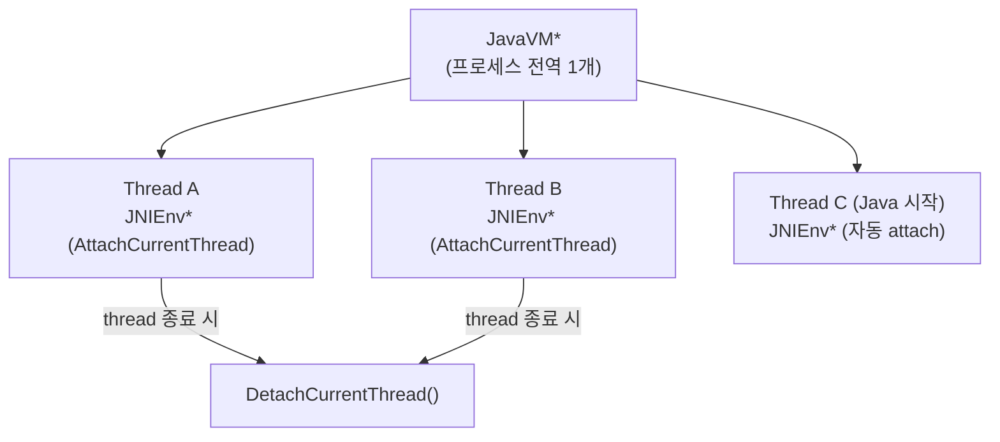

## JNIEnv는 thread-local이고 native thread는 attach가 필요하다

상위 문서: [HAL native contracts](hal-native.md)


`JNIEnv*` 는 현재 thread 의 JNI interface 다. 다른 thread 로 넘겨 재사용할 수 없다.

### 메커니즘: JavaVM vs JNIEnv



`JavaVM*`은 프로세스 전역 1개이며 `JNI_OnLoad`에서 저장해 둔다. 각 thread는 자신의 `JNIEnv*`를 `JavaVM::GetEnv` 또는 `AttachCurrentThread`로 얻어야 한다.

### C++ 코드 예시: native thread에서 JNI 사용

```cpp
static JavaVM* g_jvm = nullptr;

// JNI_OnLoad에서 JavaVM* 저장
JNIEXPORT jint JNI_OnLoad(JavaVM* vm, void* reserved) {
    g_jvm = vm;
    return JNI_VERSION_1_6;
}

// native thread(std::thread, pthread 등)에서 JNI 호출
void nativeWorkerThread(jobject callbackRef) {
    JNIEnv* env = nullptr;
    bool attached = false;

    // 현재 thread가 이미 attach됐는지 확인
    jint result = g_jvm->GetEnv((void**)&env, JNI_VERSION_1_6);
    if (result == JNI_EDETACHED) {
        // Java에서 시작하지 않은 native thread → attach 필요
        g_jvm->AttachCurrentThread(&env, nullptr);
        attached = true;
    }

    // JNI 호출
    jclass clazz = env->GetObjectClass(callbackRef);
    jmethodID mid = env->GetMethodID(clazz, "onResult", "(I)V");
    env->CallVoidMethod(callbackRef, mid, 42);

    // attach했으면 반드시 detach
    if (attached) {
        g_jvm->DetachCurrentThread();
    }
}
```

### 판단 기준

- `JNIEnv*`를 다른 thread로 전달하면 undefined behavior다. thread마다 반드시 자신의 `JNIEnv*`를 사용한다.
- Java/Kotlin에서 시작된 thread는 이미 attach된 상태다(`GetEnv`가 `JNI_OK` 반환). 이 경우 `AttachCurrentThread`를 다시 호출하지 않는다.
- native thread를 attach했으면 thread 종료 전에 반드시 `DetachCurrentThread`를 호출한다. 미호출 시 JVM이 경고를 출력하고 해당 thread의 로컬 참조가 정리되지 않는다.
- Class lookup은 thread의 class loader 문맥에 의존한다. native worker thread에서 `FindClass`를 반복 호출하기보다, `JNI_OnLoad`나 Java 진입점에서 필요한 `jclass`를 Global Ref로 캐시하는 패턴을 사용한다.

### 경계

- JNI reference 수명(local/global) 관리는 [JNI reference는 local, global, weak lifetime이 다르다](jni-reference-lifetimes.md)가 다룬다.
- native crash 디버깅 방법은 [Native 성능과 crash debugging은 경계 비용에서 시작한다](native-performance-debugging.md)가 다룬다.

### 관측 가능한 증거 (Observable Evidence)

```bash
# DetachCurrentThread 미호출 경고 로그
adb logcat | grep -E "thread.*attached|DetachCurrentThread|JavaVM::GetEnv"

# native thread attach/detach 문제로 인한 crash
adb logcat | grep -E "SIGSEGV|signal 11|JNI DETECTED ERROR"

# CheckJNI 모드에서 잘못된 thread 접근 감지
adb shell setprop debug.checkjni 1
# "JNI ERROR: JNI called with thread not attached" 로그 확인
adb logcat | grep "JNI ERROR"
```

### 관련 문서

- [JNI reference는 local, global, weak lifetime이 다르다](jni-reference-lifetimes.md)
- [Native 성능과 crash debugging은 경계 비용에서 시작한다](native-performance-debugging.md)

공식 문서: [Android JNI tips - threads](https://developer.android.com/ndk/guides/jni-tips#threads)
