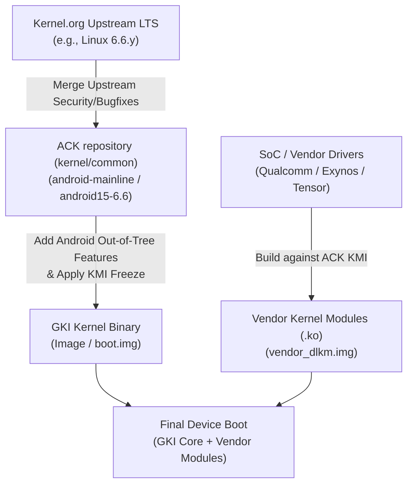

## ACK는 upstream LTS와 Android release를 잇는다

상위 문서: [Kernel contracts](kernel-contracts.md)

Android Common Kernel(ACK)은 Kernel.org의 upstream Linux LTS(Long Term Support) 커널에 Android 플랫폼 실행에 필요한 핵심 패치(Binder, ashmem/DMA-BUF, energy-aware scheduler, eBPF infrastructure, CFI/SELinux 서브시스템 등)를 통합한 커널 소스 트리다. Google의 `kernel/common` repository에서 관리되며, 모든 Android GKI(Generic Kernel Image) 커널은 ACK 소스 트리에서 빌드된다.

ACK를 이해할 때는 단순 브랜치 이름을 제품 지식처럼 외우기보다 브랜치의 역할과 생명주기를 파악해야 한다. 예를 들어 `android15-6.6`은 Android 15 패키징과 Linux 6.6 LTS 커널을 연결하는 ACK KMI(Kernel Module Interface) 안정화 브랜치다.

---

### 메커니즘: Upstream LTS에서 Device Kernel까지의 흐름



1. **Upstream Merge**: Linux 커널 커뮤니티의 LTS 버그 수정 및 보안 패치가 ACK 트리에 수시로 머지된다.
2. **Android Feature Integration**: Android 운영체제가 요구하는 시스템 호출, 전력 관리(Energy Aware Scheduling), 메모리 관리(PSI, zRAM, DMA-BUF), 보안 정책(SELinux MAC) 통합.
3. **KMI Freeze**: 특정 Android 버전에 맞춰 KMI(Kernel Module Interface)가 픽스(Freeze)되면, 커널 내부 ABI 호환성이 보장되어 Vendor 모듈을 재빌드하지 않고도 GKI 커널만 업데이트할 수 있게 된다.

---

### ACK 소스 체크아웃 및 빌드 명령어 예시

ACK 커널은 Kleaf(Bazel 기반 커널 빌드 시스템)를 사용하여 표준화된 헤더 및 툴체인 환경에서 빌드된다.

```bash
# 1. ACK repository 및 KMI branch 체크아웃
repo init -u https://android.googlesource.com/kernel/manifest -b android15-6.6
repo sync -j$(nproc)

# 2. Kleaf / Bazel 을 통한 GKI 커널 및 모듈 빌드
tools/bazel build //common:kernel_aarch64_dist

# 3. 빌드 결과물 확인 (out/virtual-device/dist 디렉터리)
ls -la out/android15-6.6/dist/Image
ls -la out/android15-6.6/dist/abi_symbol_list
```

---

### 실무 규칙

- `android-mainline`은 Android 개발 단계의 최신 개발 브랜치이며, 프로덕션 출시용 브랜치는 `android15-6.6`처럼 특정 Android OS버전 및 KMI 릴리스와 결합된 브랜치다.
- ACK는 커널 내부에 하드웨어 전용 칩셋 드라이버(SoC specific GPU/Camera/Modem)를 직접 포함하지 않는다. 이러한 디바이스 특화 코드는 GKI KMI 규격을 따르는 `vendor_dlkm` 모듈로 분리해야 한다.
- LTS 패치는 버그 및 CVE 보안 패치를 포함하므로 오염되지 않은 GKI 소스를 유지하고 최신 ACK 브랜치를 정기적으로 리베이스하는 것이 OEM 기기의 보안 준수 패치(SPL) 핵심이다.

---

### 관측 가능한 증거 (Observable Evidence)

1. **실행 중인 ACK 및 KMI 버전 정보 확인**:
   ```bash
   adb shell uname -a
   # 출력 예시:
   # Linux localhost 6.6.12-android15-11-g123456789abc #1 SMP PREEMPT Tue Aug 1 00:00:00 UTC 2026 aarch64 Android
   ```
2. **procfs를 통한 커널 컴파일 상세 옵션 및 ACK 빌드 서명 확인**:
   ```bash
   adb shell cat /proc/version
   # Linux version 6.6.12-android15-11-g123456789abc (toolchain clang version 17.0.6) ...
   ```
3. **Android 전용 커널 설정(`CONFIG_ANDROID_*`) 활성화 여부 검증**:
   ```bash
   adb shell zcat /proc/config.gz | grep -E "CONFIG_ANDROID_BINDER|CONFIG_ASHMEM|CONFIG_DMABUF"
   # CONFIG_ANDROID_BINDER_IPC=y
   # CONFIG_ANDROID_BINDERFS=y
   ```

---

### 관련 문서

- [GKI는 공통 core kernel과 vendor module을 분리한다](gki-splits-generic-core-from-vendor-modules.md)
- [KMI 안정성은 같은 GKI LTS/Android branch 안에서만 성립한다](kmi-is-stable-only-within-a-gki-lts-and-android-branch.md)
- [Android kernel build는 branch, toolchain, build system 계약이다](kernel-builds-depend-on-branch-toolchain-and-build-system.md)

공식 문서: [AOSP Android Common Kernels](https://source.android.com/docs/core/architecture/kernel/android-common), [Generic Kernel Image (GKI)](https://source.android.com/docs/core/architecture/kernel/generic-kernel-image)

