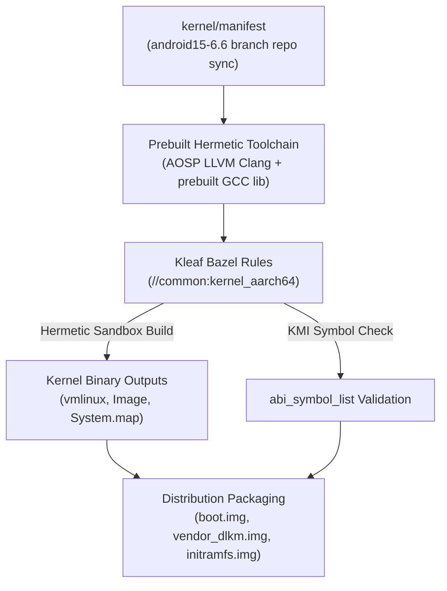

## Android kernel build는 branch, toolchain, build system 계약이다

상위 문서: [Kernel contracts](kernel-contracts.md)

Android kernel 빌드는 단순한 커널 소스상의 `make ARCH=arm64` 실행이 아니다. 대상 ACK 또는 device-kernel branch, 해당 branch가 지원하는 toolchain과 build system, 그리고 boot/vendor module 이미지 패키징 규격을 함께 맞춰야 한다.

Kleaf/Bazel 적용 여부는 Android release 번호만으로 결정하지 않고 branch support matrix로 확인한다. `common-android13-5.10`과 `common-android13-5.15`는 Kleaf와 `build/build.sh`를 모두 공식 지원한다. `common-android14-5.15`, `common-android14-6.1`, `common-android15-6.6`, `common-android-mainline`은 Kleaf를 지원하고 `build/build.sh`를 지원하지 않는다. 일부 board·module branch는 같은 release 계열이어도 표가 다르다.

---

### 메커니즘: Kleaf(Bazel) 기반 Hermetic 커널 빌드 파이프라인



1. **Hermetic Environment (밀폐성)**: 호스트 OS(Ubuntu/Debian)에 설치된 `gcc`나 `make` 버전에 의존하지 않고, repo 내부에 포함된 밀폐된 prebuilt LLVM Clang 바이너리와 헤더를 빌드 툴체인으로 사용.
2. **Kleaf / Bazel Rules**: `BUILD.bazel`에 선언된 `kernel_build`, `kernel_module`, `kernel_images` 룰에 따라 커널 코어, 모듈, boot/vendor 파티션 이미지를 증분(Incremental) 빌드 및 캐싱 처리.

---

### Kleaf `BUILD.bazel` 선언 및 빌드 실행 스크립트 예시

```python
# common/BUILD.bazel 예시 스니펫
load("//build/kernel/kleaf:kernel.bzl", "kernel_build", "kernel_images")

kernel_build(
    name = "kernel_aarch64",
    srcs = glob(["**/*"]),
    build_config = "build.config.common",
    outs = [
        "Image",
        "System.map",
        "vmlinux",
    ],
)

kernel_images(
    name = "kernel_aarch64_images",
    kernel_build = ":kernel_aarch64",
    build_initramfs = True,
)
```

```bash
# Bazel(Kleaf) 커널 빌드 명령어
tools/bazel build //common:kernel_aarch64_dist --config=fast

# 빌드 산출물 확인
ls -la out/kernel_aarch64/dist/Image
```

---

### 실무 규칙

- 먼저 [kernel branch/build-system support matrix](https://source.android.com/docs/setup/reference/bazel-support)를 확인한다. 표에서 `build/build.sh`가 지원되지 않는 branch는 repository가 제공하는 Kleaf target과 wrapper를 사용한다.
- `fastboot boot` 지원 여부, boot image 구성, AVB와 unlock 상태는 기기별로 다르다. 휘발성 boot가 가능하다고 가정하지 말고 제조사 flash/restore 절차와 복구 가능한 artifact를 먼저 확보한다.

---

### 관측 가능한 증거 (Observable Evidence)

1. **커널 바이너리에 기록된 LLVM Clang 빌드 버전 정보 검증**:
   ```bash
   adb shell cat /proc/version
   # Linux version 6.6.12-android15-11-g123456789abc (toolchain Android (10650380, +pgo, +bolton, +lto, +mlgo) clang version 17.0.6)
   ```
2. **Kleaf 빌드 로그 및 캐시 결과 확인**:
   ```bash
   tools/bazel info execution_root
   # bazel 실행 루트 및 hermetic toolchain 격리 경로 확인
   ```

---

### 관련 문서

- [ACK는 upstream LTS와 Android release를 잇는다](android-common-kernel-bridges-upstream-lts-and-android-releases.md)
- [GKI는 공통 core kernel과 vendor module을 분리한다](gki-splits-generic-core-from-vendor-modules.md)
- [Kernel debugging은 logcat 이전의 신호에서 시작한다](kernel-debugging-starts-before-logcat-with-bootloader-dmesg-and-trace.md)

공식 문서: [Building Kernels with Kleaf](https://source.android.com/docs/setup/build/building-kernels), [Kernel branches and build systems](https://source.android.com/docs/setup/reference/bazel-support)
