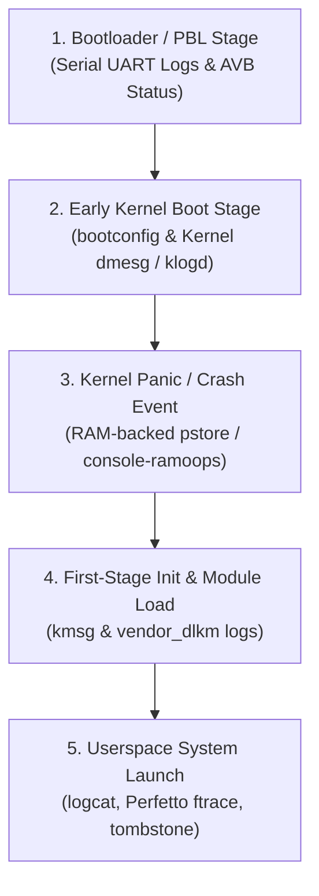

## Kernel debugging은 logcat 이전의 신호에서 시작한다

상위 문서: [Kernel contracts](kernel-contracts.md)

Android 커널 레벨 패닉(Kernel Panic), 부트룹(Bootloop), 드라이버 교착 상태(Deadlock)를 디버깅할 때는 userspace 디버그 로그 데몬인 `logcat`만으로 원인을 파악할 수 없다. `logcat`은 system_server 및 `logd` 데몬이 시작된 이후에야 작동하기 때문이다.

커널 디버깅은 부트로더 Verified Boot 상태, 커널 커맨드라인(`bootconfig`), 커널 Ring Buffer(`dmesg`), 커널 크래시 패닉 덤프 노드(`pstore`/`ramoops`), 그리고 Perfetto Ftrace 시스템 트레이스를 순차적으로 추적해야 한다.

---

### 메커니즘: 부팅 및 커널 장애 단계별 관측 신호 파이프라인



1. **Bootloader Stage**: 커널 이미지 헤더 검증 실패 및 AVB Red/Yellow State 부팅 거부 신호 관측.
2. **Early Kernel Boot**: 커널 링 버퍼(`dmesg`)에 메모리 초기화, CPU 온라인 상태, 디바이스 트리(`dtb`) 파싱 결과 출력.
3. **Kernel Panic / Ramoops**: 커널 크래시 발생 시 NVRAM/DRAM 예약 영역에 로그를 보존하는 `pstore/ramoops` 드라이버를 통해 재부팅 후 패닉 콜스택 추적.
4. **Ftrace & Perfetto**: 커널 스케줄러 스위치(`sched_switch`), CPU 주파수 튜닝, 시스템 콜 이벤트를 마이크로초 단위로 추적.

---

### 커널 디버깅 및 패닉 로그 수집 CLI 스크립트

```bash
# 1. 커널 커맨드라인 및 부트 구성 정보 확인
adb shell cat /proc/cmdline
adb shell cat /proc/bootconfig

# 2. 커널 링 버퍼(dmesg) 전체 수집 및 드라이버 에러 필터링
adb shell dmesg -w | grep -E "panic|BUG|error|denied|OOM"

# 3. 커널 패닉 직후 pstore / ramoops 덤프 추출
adb shell ls -la /sys/fs/pstore/
adb shell cat /sys/fs/pstore/console-ramoops-0

# 4. Ftrace / Perfetto 커널 트레이스 캡처 명령
adb shell perfetto \
  -c - --txt \
  -o /data/misc/perfetto-traces/trace.perfetto-trace <<EOF
buffers: {
    size_kb: 20480
}
data_sources: {
    config: {
        name: "linux.ftrace"
        ftrace_config: {
            ftrace_events: "sched/sched_switch"
            ftrace_events: "power/cpu_frequency"
            ftrace_events: "binder/*"
        }
    }
}
duration_ms: 5000
EOF
```

---

### 실무 규칙

- 부팅 실패 시 `adb logcat`이 응답하지 않으면 즉시 `adb reboot bootloader` 후 UART 콘솔을 연결하거나 `fastboot boot` 방식으로 커널 커맨드라인에 `console=ttyMSM0,115200` 또는 `earlycon` 매개변수를 추가해야 한다.
- 커널 크래시(Kernel Panic / Watchdog Reset) 원인 분석 시 `vmlinux` 바이너리와 `gdb`/`llvm-symbolizer`를 준비하여 `console-ramoops-0` 내의 메모리 주소(Call Trace: `[<ffffff8008123456>]`)를 소스코드 라인으로 심볼리케이션해야 한다.

---

### 관측 가능한 증거 (Observable Evidence)

1. **`pstore` 패닉 로그 보존 노드 활성화 여부 확인**:
   ```bash
   adb shell ls -la /sys/fs/pstore/
   # -rw-r--r-- 1 root root 65536 console-ramoops-0
   # -rw-r--r-- 1 root root 16384 dmesg-ramoops-0
   ```
2. **드라이버 모듈 로드 실패 및 메모리 오류 검증**:
   ```bash
   adb shell dmesg | grep -i "exec format error"
   ```

---

### 관련 문서

- [Vendor kernel module은 first-stage init 경계에서 로드된다](vendor-kernel-modules-load-through-first-stage-init-boundaries.md)
- [LMKD는 free memory가 아니라 memory pressure와 process importance로 종료를 결정한다](lmkd-kills-processes-by-memory-pressure-and-process-importance.md)
- [Boot debugging starts before logcat](../../boot-and-runtime/boot-flow-contracts/boot-debugging-starts-before-logcat-with-kernel-pstore-init-logs.md)

공식 문서: [Debugging Android Kernel](https://source.android.com/docs/core/architecture/kernel/debugging)

