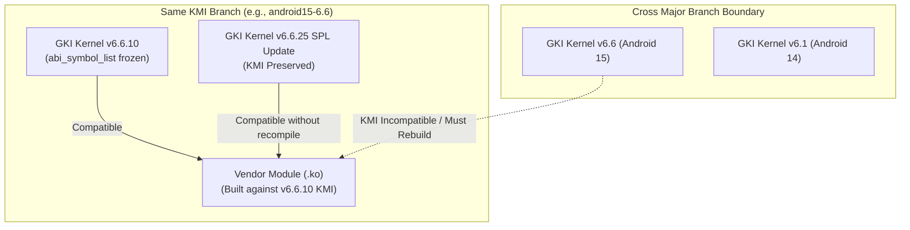

## KMI 안정성은 같은 GKI LTS/Android branch 안에서만 성립한다

상위 문서: [Kernel contracts](kernel-contracts.md)

Kernel Module Interface(KMI)는 GKI(Generic Kernel Image) 코어 커널과 SoC/Vendor 모듈(`.ko`) 간의 C 언어 데이터 구조체 layout, 함수 매개변수, 커널 내보내기 심볼(Exported Symbols)의 Binary Interface(ABI) 안정성을 규정하는 계약이다.

Linux upstream 커널은 전통적으로 커널 내부 ABI 호환성을 보장하지 않으나(`in-kernel ABI is not stable`), Android GKI는 동일한 KMI release 브랜치(예: `android14-6.1` 또는 `android15-6.6`) 내부에서 심볼 동결(Symbol List Freeze)을 적용하여 GKI 커널만 단독으로 업데이트할 수 있게 지원한다.

---

### 메커니즘: KMI 안정성 유효 범위 및 브랜치 경계



1. **Intra-Branch Stability (동일 브랜치 내부)**: `android15-6.6` KMI 브랜치 내에서는 보안 패치(SPL) 수용으로 GKI 커널 버전이 업데이트되어도 기존 `vendor_dlkm` 모듈 재컴파일 없이 동적 로드 보장.
2. **Inter-Branch Non-compatibility (이종 브랜치 간)**: Android Major 버전이 업그레이드되거나 커널 LTS 버전이 변경되면(`6.1` -> `6.6`), 커널 내부 구조체 필드 및 심볼 데이터가 변경되므로 KMI 호환이 불가능하며 모듈을 새 KMI 타깃으로 재빌드해야 함.

---

### KMI ABI Symbol List 선언 파일 예시

```text
# common/android/abi_gki_aarch64_generic (KMI 내보내기 픽스 심볼 명세)
[abi_symbol_list]
  alloc_etherdev_mqs
  binder_alloc_copy_user
  dev_driver_string
  register_netdev
  unregister_netdev
  __tracepoint_binder_transaction
```

```bash
# Bazel을 통한 KMI ABI 핑거프린트 호환성 검증
tools/bazel test //common:kernel_aarch64_abi_diff
```

---

### 실무 규칙

- Vendor 모듈 개발 시 KMI `abi_symbol_list`에 포함되지 않은 커널 내부 비공개 심볼이나 헤더 구조체를 직접 참조해서는 안 된다. 미등록 심볼 참조 시 KMI freeze 빌드 타깃에서 링크 에러가 발생한다.
- 커널 소스상의 C 구조체에 새로운 필드를 추가할 때, KMI 래퍼 영역(Reserved Padding Field, `u64 android_kmi_reserved[4]`)을 활용해야 기존 컴파일된 Vendor 모듈과의 메모리 오프셋 불일치 패닉을 방지할 수 있다.

---

### 관측 가능한 증거 (Observable Evidence)

1. **디바이스의 KMI 커널 릴리스 버전 및 빌드 서명 확인**:
   ```bash
   adb shell uname -r
   # 6.6.12-android15-11-g123456789abc
   # ('android15-6.6' KMI 브랜치 서명 확인)
   ```
2. **KMI Reserved 패딩 필드 심볼 존재 여부 확인**:
   ```bash
   adb shell cat /proc/kallsyms | grep -i "android_kmi_reserved"
   ```

---

### 관련 문서

- [GKI는 공통 core kernel과 vendor module을 분리한다](gki-splits-generic-core-from-vendor-modules.md)
- [ACK는 upstream LTS와 Android release를 잇는다](android-common-kernel-bridges-upstream-lts-and-android-releases.md)

공식 문서: [AOSP KMI Architecture](https://source.android.com/docs/core/architecture/kernel/stable-kmi)

