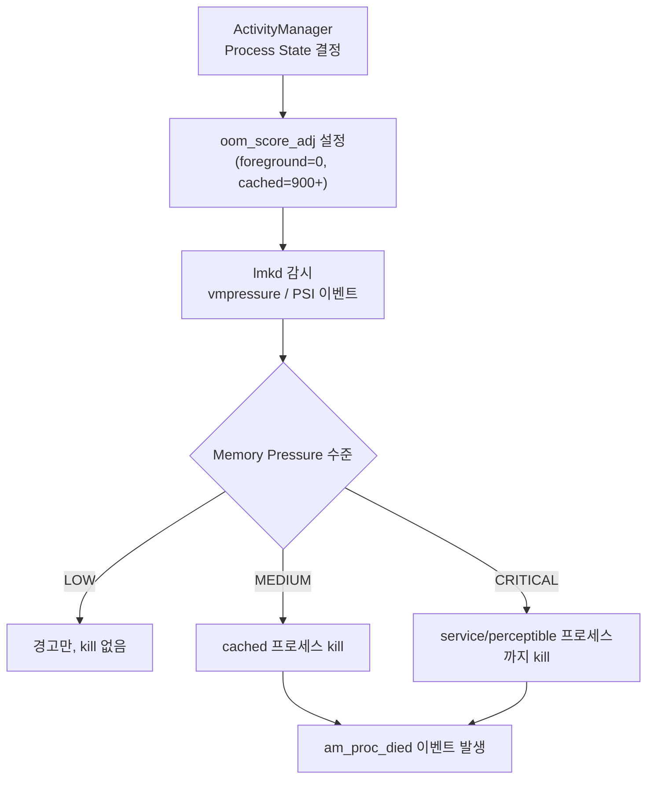

## LMKD는 free memory가 아니라 memory pressure와 process importance로 종료를 결정한다

상위 문서: [Kernel contracts](kernel-contracts.md)

Low memory killer daemon(lmkd)은 Android 시스템의 memory pressure 를 감시하고, 압력이 높을 때 덜 중요한 process 를 종료해 사용자 체감 성능을 유지한다.

### 메커니즘: oom_score_adj 와 PSI 기반 kill 결정



`ActivityManager`는 앱 상태(`FOREGROUND`, `VISIBLE`, `SERVICE`, `CACHED_EMPTY`)에 따라 `oom_score_adj` 값을 `/proc/<pid>/oom_score_adj`에 기록한다. lmkd는 kill 후보를 고를 때 이 값과 memory pressure(PSI 또는 vmpressure)를 함께 사용한다.

### oom_score_adj 등급

| Process State | oom_score_adj 범위 | kill 우선순위 |
|:---|:---:|:---:|
| Foreground (앱 활성 화면) | 0 | 가장 낮음 |
| Visible (배경 visible) | 100 | 낮음 |
| Service | 200 | 중간 |
| Cached (background) | 900–1000 | 가장 높음 |

```kotlin
// 앱 개발자가 직접 oom_score_adj를 제어할 수는 없지만
// foreground Service로 프로세스 중요도를 높일 수 있다
val notif = NotificationCompat.Builder(this, CHANNEL_ID)
    .setContentTitle("작업 실행 중")
    .setSmallIcon(R.drawable.ic_work)
    .build()

// foreground Service 시작 → oom_score_adj 낮아져 kill 가능성 감소
startForeground(NOTIF_ID, notif)
```

### 판단 기준

- 중요한 점은 LMKD 가 단순히 \"남은 메모리가 특정 MB 아래면 kill\"하는 구조가 아니라는 것이다. 현재 userspace lmkd 는 vmpressure 또는 PSI, memory cgroup, swap/thrashing 상태, process importance 를 함께 본다.
- 앱이 background에서 종료됐다면 crash로 오해하지 않는다. `am_proc_died` 이벤트와 lmkd 로그를 먼저 확인한다.
- foreground Service는 oom_score_adj를 낮춰 kill을 방지하지만 배터리/사용자 경험 비용이 있으므로 실제 지속 작업이 필요한 경우에만 사용한다.

### 경계

- 이 노트는 lmkd 의 kill 결정 메커니즘을 다룬다. PSI 지표 자체의 해석은 [PSI는 free memory가 아니라 stall time을 측정한다](psi-measures-stall-time-for-memory-pressure.md)가 다룬다.
- `oom_score_adj` 기반 프로세스 우선순위 정책은 [Process priority는 memory reclaim 정책 입력이다](../../boot-and-runtime/system-server-contracts/process-priority-is-memory-reclaim-policy-input-not-app-state-truth.md)가 다룬다.

### 관측 가능한 증거 (Observable Evidence)

```bash
# 1. 프로세스별 oom_score_adj 확인
adb shell cat /proc/$(adb shell pidof com.example.app)/oom_score_adj

# 2. LMKD가 kill한 프로세스 이벤트 확인
adb logcat -b events | grep -E "am_proc_died|lmkd"

# 3. 현재 memory pressure 상태 확인
adb shell cat /proc/meminfo | grep -E "MemFree|MemAvailable|SwapFree"

# 4. PSI memory pressure 실시간 확인
adb shell cat /proc/pressure/memory
```

`am_proc_died` 이벤트에는 프로세스 이름과 종료 이유가 포함된다. lmkd에 의한 종료는 crash와 달리 `am_crash` 이벤트 없이 `am_proc_died`만 발생한다.

### 관련 문서

- [PSI는 free memory가 아니라 stall time을 측정한다](psi-measures-stall-time-for-memory-pressure.md)
- [Process priority는 memory reclaim 정책 입력이다](../../boot-and-runtime/system-server-contracts/process-priority-is-memory-reclaim-policy-input-not-app-state-truth.md)

공식 문서: [Low memory killer daemon](https://source.android.com/docs/core/perf/lmkd)
