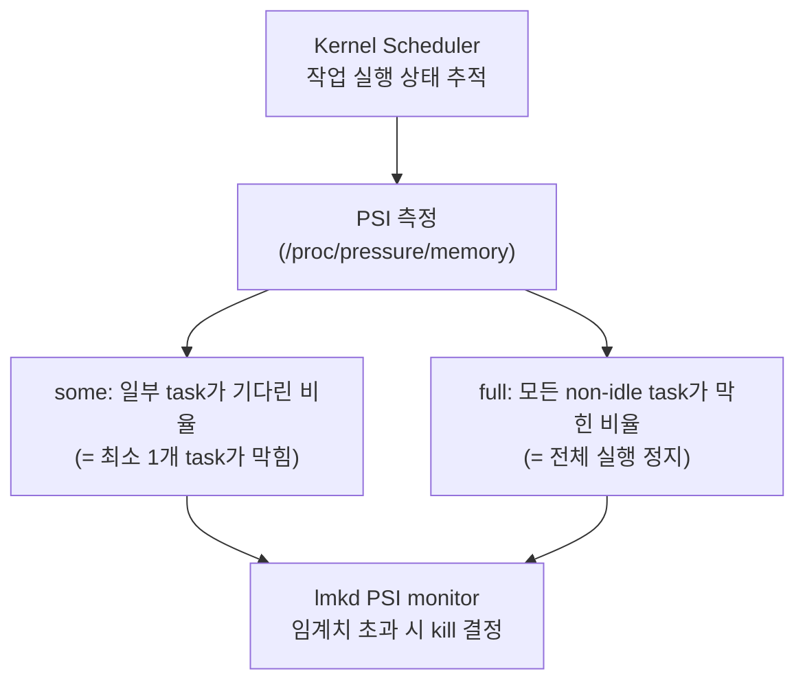

## PSI는 free memory가 아니라 stall time을 측정한다

상위 문서: [Kernel contracts](kernel-contracts.md)


Pressure Stall Information(PSI)은 memory, CPU, I/O 부족으로 task 가 실제로 얼마나 기다렸는지를 측정하는 kernel signal 이다.

### 메커니즘: PSI 지표 구조



### PSI 값 읽기 예시

```bash
# PSI memory pressure 실시간 확인
adb shell cat /proc/pressure/memory
# 출력 예시:
# some avg10=0.02 avg60=0.05 avg300=0.01 total=1234567
# full avg10=0.00 avg60=0.00 avg300=0.00 total=0

# PSI CPU pressure 확인
adb shell cat /proc/pressure/cpu
# PSI I/O pressure 확인
adb shell cat /proc/pressure/io
```

**PSI 필드 해석:**

| 필드 | 의미 |
|:---|:---|
| `some avg10` | 최근 10초 평균, 일부 task가 기다린 시간 비율 (%) |
| `some avg60` | 최근 60초 평균 |
| `full avg10` | 최근 10초 평균, 모든 task가 막힌 시간 비율 (%) |
| `total` | 부팅 이후 누적 stall 시간 (마이크로초) |

```c
// lmkd에서 PSI monitor 설정 방식 (플랫폼 내부 참고용)
// /proc/pressure/memory에 임계치를 등록하면 epoll로 알림을 받는다
int fd = open("/proc/pressure/memory", O_RDWR);
// "some 150000 1000000" → 1초 윈도우에서 150ms 이상 stall 시 알림
write(fd, "some 150000 1000000", 19);
// epoll로 fd 감시 → 임계치 초과 시 lmkd가 kill 결정
```

### 판단 기준

- free memory 숫자는 단독으로 사용자 경험을 잘 설명하지 못한다. page cache, reclaim, swap, thrashing에 따라 같은 free memory라도 체감 성능은 다를 수 있다.
- PSI 는 task delay 를 직접 관찰하므로 memory pressure severity 를 판단하는 데 더 적합하다.
- `some` > 0 이면 일부 task 가 기다리는 중이고, `full` > 0 이면 심각한 압력 상태다.
- PSI 는 `CONFIG_PSI` kernel 옵션이 필요하다. Android 10+ 기기에서는 대부분 지원한다.

### 경계

- PSI를 기반으로 실제 kill 결정을 하는 메커니즘은 [LMKD는 free memory가 아니라 memory pressure와 process importance로 종료를 결정한다](lmkd-kills-processes-by-memory-pressure-and-process-importance.md)가 다룬다.

### 관측 가능한 증거 (Observable Evidence)

```bash
# PSI support 확인
adb shell ls /proc/pressure/
# memory, cpu, io 파일이 있으면 지원

# memory pressure 임계치 초과 시 lmkd 로그
adb logcat | grep -E "lmkd|pressure|kill"

# 앱 프로세스 kill 이벤트 (PSI 기반 lmkd kill)
adb logcat -b events | grep "am_proc_died"

# meminfo와 함께 PSI 상관 분석
adb shell cat /proc/meminfo | grep -E "MemFree|MemAvailable|SwapFree"
adb shell cat /proc/pressure/memory
```

### 관련 문서

- [LMKD는 free memory가 아니라 memory pressure와 process importance로 종료를 결정한다](lmkd-kills-processes-by-memory-pressure-and-process-importance.md)

공식 문서: [Low memory killer daemon](https://source.android.com/docs/core/perf/lmkd)
