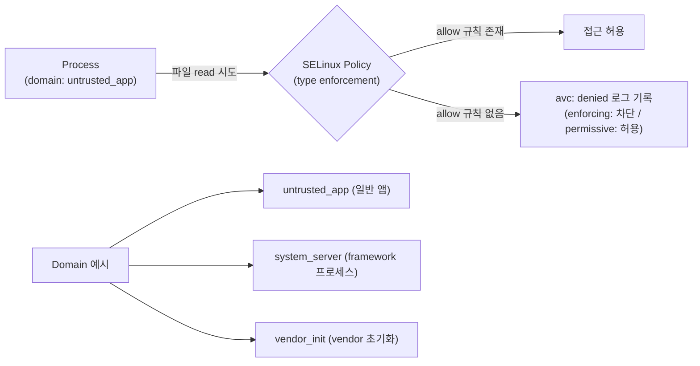

## SELinux는 domain/type 정책으로 mandatory access control을 강제한다

상위 문서: [Kernel contracts](kernel-contracts.md)
배경 지식: [SELinux/DAC/MAC](01_inbox/linux/security/selinux.md)


SELinux 는 Linux **discretionary access control**(DAC — 파일 소유자가 자기 판단으로 다른 사용자에게 권한을 나눠줄 수 있는 전통적 UNIX 권한 모델. `chmod`/`chown` 이 대표적이다)을 대체하는 것이 아니라, 그 위에 **mandatory access control**(MAC — 파일 소유자의 의사와 무관하게 시스템 전체에 걸쳐 고정된 정책이 접근을 강제하는 모델)을 추가한다. 즉 파일 소유자가 `chmod 777` 로 권한을 다 열어줘도, SELinux policy 가 막으면 여전히 접근이 거부된다. root 권한이나 **Linux capability**(전통적으로 root 에게만 허용됐던 권한 묶음을 `CAP_NET_ADMIN` 처럼 세분화해서 개별적으로 부여할 수 있게 만든 커널 메커니즘)가 있더라도 policy 가 허용하지 않은 동작은 차단될 수 있다.

### 메커니즘: Domain/Type Enforcement 모델

SELinux 는 모든 프로세스를 **domain**(도메인 — 프로세스가 속한 보안 카테고리, 예: 일반 앱은 `untrusted_app`, `system_server` 프로세스는 `system_server`)으로 분류하고, 파일·소켓·서비스 같은 모든 객체를 **type**(타입 — 객체가 속한 보안 카테고리, 예: 앱 데이터 파일은 `app_data_file`)으로 분류한다. 정책은 "이 domain 이 저 type 에 대해 이 동작을 해도 되는가"를 `allow` 규칙으로 하나하나 명시하며, 명시되지 않은 조합은 기본적으로 전부 거부(default-deny)된다.



### SELinux 정책 규칙 문법 예시

```bash
# policy 규칙 기본 문법
# allow <domain> <type>:<class> <permission>;
allow untrusted_app app_data_file:file { read write getattr };
allow system_server camera_service:service_manager { find };

# neverallow — 절대 허용하지 않는 규칙 (빌드 타임 검사)
neverallow untrusted_app system_file:file write;
```

```bash
# 개발 중 SELinux context 확인
# 프로세스 context (domain)
adb shell ps -Z | grep com.example.app

# 파일 context (type)
adb shell ls -Z /data/data/com.example.app/

# 특정 소켓/서비스 context
adb shell cat /proc/net/unix | grep "camera"
```

### 판단 기준

- Android 5.0 이상에서는 **enforcing mode**(정책 위반 동작을 실제로 차단하는 모드)가 기본이다. **permissive mode**(정책 위반을 막지 않고 로그만 남기는 모드 — 아래 denial 로그의 `permissive=0/1` 필드가 어느 모드였는지 나타낸다)는 개발/디버깅 전용으로만 사용한다.
- 정책 작성의 목표는 `avc: denied` 로그를 무작정 allow 로 바꾸는 것이 아니다. 어떤 domain 이 어떤 type/class/permission 을 가져야 하는지 최소 권한으로 모델링한다.
- generic denial 이 발생하면 서비스 domain 이나 label 설계가 잘못됐는지 먼저 점검한다.

### 경계

- Binder service 와 file boundary를 제어하는 SELinux 정책 세부 사항은 [SELinux policy는 Binder service와 file boundary를 함께 제어한다](selinux-policy-controls-binder-service-and-file-boundaries.md)가 다룬다.
- 앱 sandbox 와 UID 격리는 [Android app sandbox는 UID와 프로세스 경계로 앱을 격리한다](../../../05_security_privacy/platform-hardening/platform-security-contracts/android-app-sandbox-is-uid-and-process-boundary.md)가 다룬다.

### 관측 가능한 증거 (Observable Evidence)

```bash
# SELinux denial 로그 실시간 확인 (가장 중요한 신호)
adb logcat | grep "avc: denied"

# 구체적인 denial 분석
adb shell dmesg | grep "avc:"

# SELinux 현재 모드 확인
adb shell getenforce
# Enforcing / Permissive / Disabled

# 특정 context에서 허용된 동작 확인
adb shell sesearch /sys/fs/selinux/policy --allow -s untrusted_app -t app_data_file
```

denial 로그 형식: `avc: denied { read } for pid=1234 comm="app" name="file" dev="dm-5" ino=5678 scontext=u:r:untrusted_app:s0 tcontext=u:object_r:system_file:s0 tclass=file permissive=0`

- `scontext`: 요청 주체(domain)
- `tcontext`: 대상 object(type)
- `tclass`: object class (file/dir/socket/service)
- `permissive=0`: enforcing 모드에서 차단

### 관련 문서

- [SELinux policy는 Binder service와 file boundary를 함께 제어한다](selinux-policy-controls-binder-service-and-file-boundaries.md)
- [Android app sandbox는 UID와 프로세스 경계로 앱을 격리한다](../../../05_security_privacy/platform-hardening/platform-security-contracts/android-app-sandbox-is-uid-and-process-boundary.md)

공식 문서: [Security-Enhanced Linux in Android](https://source.android.com/docs/security/features/selinux), [SELinux concepts](https://source.android.com/docs/security/features/selinux/concepts)
