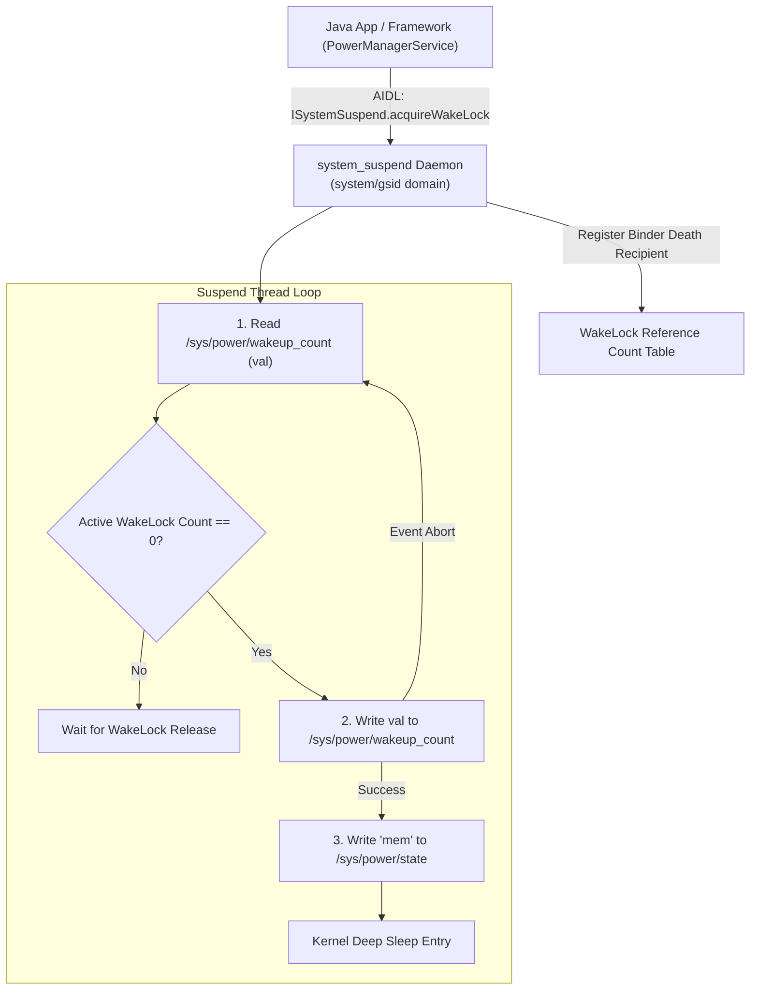

## SystemSuspend는 userspace wakelock과 kernel suspend를 중재한다

상위 문서: [Kernel contracts](kernel-contracts.md)

Android 10부터 도입된 `system_suspend` 네이티브 데몬(SystemSuspend Service)은 userspace 프로세스의 WakeLock 요청과 커널 수준의 Deep Sleep(Suspend-to-RAM) 진입 사이를 중간에서 중재하는 AIDL/HIDL 기반 파워 관리 서비스다.

이전의 `libsuspend` 라이브러리 및 `/sys/power/wake_lock` sysfs 직접 쓰기 방식에서 벗어나, Binder Death Notification 기반의 리소스 라이프사이클 추적과 `/sys/power/wakeup_count` 원자적(Atomic) 동기화를 통해 WakeLock 누수(Leak)를 원천 차단한다.

---

### 메커니즘: SystemSuspend 서비스 및 커널 Suspend 진입 루프



1. **Binder Resource Ownership & Death Notification**: Client 프로세스가 `ISystemSuspend`를 통해 WakeLock을 획득하면, SystemSuspend 데몬은 Client Binder 객체에 Death Recipient(`linkToDeath`)를 등록한다. Client 프로세스가 비정상 종료되거나 킬당하더라도 커널 Binder 드라이버가 사망 신호를 보내 WakeLock을 자동으로 해제(Clear)한다.
2. **Atomic Suspend Loop (`wakeup_count`)**: Suspend 스레드는 커널의 `/sys/power/wakeup_count` 수치를 읽고, 활성화된 WakeLock 수량이 0인지 확인한 후, 동일 수치를 재기록하는 원자적 동기화를 통해 시그널 전달 도중 패킷 수신 등으로 발생할 수 있는 Race Condition(Sleep 진입 직전 Wakeup Event 도착 유실)을 방지한다.

---

### AIDL 인터페이스 및 C++ SystemSuspend 호출 예시

```cpp
// system_suspend AIDL HAL C++ Client 호출 예시
#include <aidl/android/system/suspend/ISystemSuspend.h>
#include <android/binder_manager.h>

using aidl::android::system::suspend::ISystemSuspend;
using aidl::android::system::suspend::IWakeLock;

void acquire_hardware_wakelock() {
    // 1. SystemSuspend AIDL 서비스 획득
    std::string service_name = std::string(ISystemSuspend::descriptor) + "/default";
    std::shared_ptr<ISystemSuspend> suspend_service = 
        ISystemSuspend::fromBinder(ndk::SpAIBinder(AServiceManager_checkService(service_name.c_str())));

    // 2. Suspend Blocker (WakeLock) 획득
    std::shared_ptr<IWakeLock> wakelock;
    suspend_service->acquireWakeLock(
        aidl::android::system::suspend::WakeLockType::PARTIAL,
        "MyNativeServiceLock",
        &wakelock
    );

    // 3. 작업 수행... (wakelock 변수가 scope를 벗어나 destruction되면 Binder 연동 해제)
}
```

---

### 실무 규칙

- Native 데몬이나 HAL 서비스에서 `/sys/power/wake_lock` 파일에 직접 문자열을 조작하여 쓰지 말고, 반드시 `ISystemSuspend` AIDL 인터페이스 또는 libsuspend 래퍼를 사용해야 권한 무단 사용 및 프로세스 사망 후 잔여 WakeLock 누수를 막을 수 있다.
- 배터리 드레인(Battery Drain) 디버깅 시 단순히 앱의 PARTIAL WAKELOCK 수량만 볼 것이 아니라, `system_suspend` 데몬이 보유한 커널 level `wakeup_sources`의 Active Time 및 Count 수치를 함께 대조 분석해야 한다.

---

### 관측 가능한 증거 (Observable Evidence)

1. **`dumpsys suspend_control`을 통한 활성 WakeLock 목록 검증**:
   ```bash
   adb shell dumpsys suspend_control
   # Active Wake Locks:
   #   Name: AudioMixer, Client PID: 567, Type: PARTIAL
   ```
2. **sysfs 및 debugfs를 통한 커널 Wakeup Source 활성화 현황 분석**:
   ```bash
   adb shell cat /sys/kernel/debug/wakeup_sources | grep -E "name|sys_suspend"
   # name            active_count  event_count  active_since
   # sys_suspend     12            12           0
   ```

---

### 관련 문서

- [Wakelock은 background work 권한이 아니라 suspend blocker다](wakelocks-are-suspend-blockers-not-background-work-permission.md)
- [Native system service는 init이 띄우고 Binder로 발견되는 endpoint다](../hal-native-contracts/native-system-services-are-init-managed-binder-endpoints.md)

공식 문서: [AOSP SystemSuspend Service](https://source.android.com/docs/core/power/systemsuspend)

