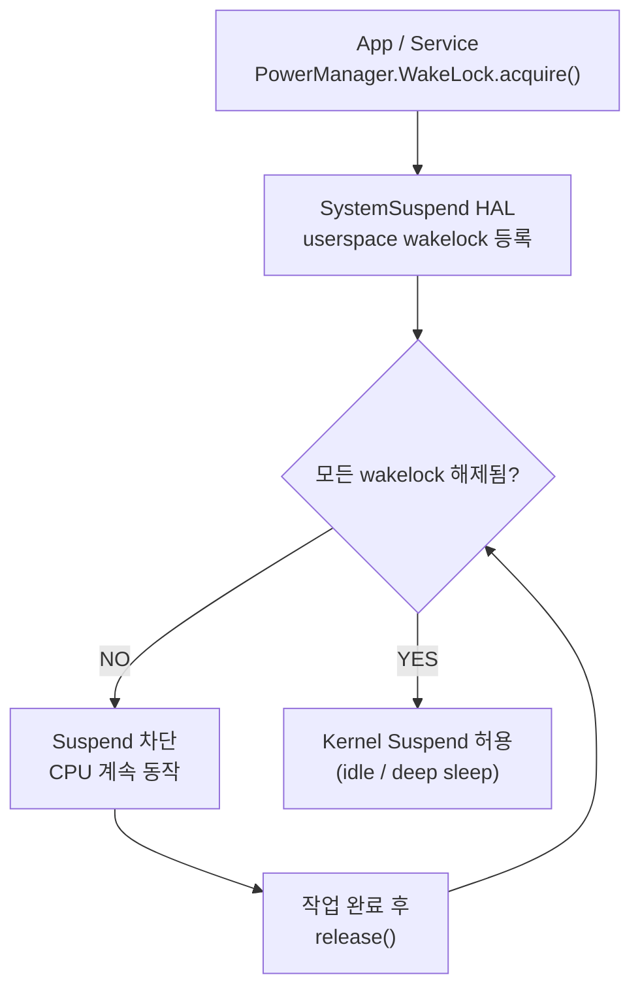

## Wakelock은 background work 권한이 아니라 suspend blocker다

상위 문서: [Kernel contracts](kernel-contracts.md)


Wakelock 은 \"작업을 실행해도 된다\"는 권한이 아니라, 특정 조건에서 device 가 system suspend 로 들어가지 않도록 막는 suspend blocker 다.

### 메커니즘: Wakelock 과 SystemSuspend 상호작용



### Kotlin 코드 예시: WakeLock 올바른 사용 패턴

```kotlin
class DataSyncService : Service() {
    private lateinit var wakeLock: PowerManager.WakeLock

    override fun onStartCommand(intent: Intent?, flags: Int, startId: Int): Int {
        val pm = getSystemService(Context.POWER_SERVICE) as PowerManager
        wakeLock = pm.newWakeLock(
            PowerManager.PARTIAL_WAKE_LOCK,
            "MyApp::DataSyncWakeLock"
        )

        // timeout 명시 권장 — release()를 잊어도 자동 해제
        wakeLock.acquire(10 * 60 * 1000L) // 최대 10분

        doSyncWork()  // 동기 작업 완료 후
        
        if (wakeLock.isHeld) {
            wakeLock.release()
        }
        stopSelf()
        return START_NOT_STICKY
    }
}
```

> **현대 Android에서 더 나은 대안**: 대부분의 background 작업은 `WorkManager`를 사용한다. WorkManager는 내부적으로 WakeLock을 관리하므로 직접 WakeLock을 다룰 필요가 없다.

### 판단 기준

- Wakelock 을 잡았다고 background execution 제한, 네트워크 제한, 작업 스케줄링 제한을 모두 우회하는 것은 아니다. Doze, App Standby, JobScheduler 제약은 별도로 작동한다.
- partial wake lock 은 화면이 꺼진 뒤에도 CPU 가 계속 필요한 작업에서 사용할 수 있지만, 오래 잡고 있으면 배터리 소모와 Android vitals 위반으로 이어진다.
- `acquire(timeout)` 형태로 항상 타임아웃을 명시한다. 이렇게 하면 코드 버그로 release를 빠뜨려도 wakelock이 자동 해제된다.
- 오래된 `/sys/power/wake_lock` 직접 조작 예제를 앱 개발 패턴으로 사용하지 않는다.

### 경계

- SystemSuspend HAL과 kernel suspend 중재 메커니즘은 [SystemSuspend는 userspace wakelock과 kernel suspend를 중재한다](systemsuspend-arbitrates-userspace-wakelocks-and-kernel-suspend.md)가 다룬다.
- background 실행 제한 및 지속 작업 관리는 [Background restrictions require persistent work state](../../../04_system_services/background-and-notifications/background-work-contracts/background-restrictions-require-persistent-work-state.md)가 다룬다.

### 관측 가능한 증거 (Observable Evidence)

```bash
# 현재 잡혀 있는 wakelock 목록 확인
adb shell dumpsys power | grep -A5 "Wake Locks"

# Android vitals - 과도한 wakelock 시간 확인
adb shell dumpsys batterystats | grep -E "wakelock|wake_lock"

# 배터리 소모 분석 (패키지별 wakelock 시간)
adb shell dumpsys batterystats --charged <package_name> | grep "wakelock"

# kernel wakeup source 확인 (어떤 wakelock이 suspend를 막고 있는지)
adb shell cat /sys/kernel/debug/wakeup_sources | head -20
```

### 관련 문서

- [SystemSuspend는 userspace wakelock과 kernel suspend를 중재한다](systemsuspend-arbitrates-userspace-wakelocks-and-kernel-suspend.md)
- [Background restrictions require persistent work state](../../../04_system_services/background-and-notifications/background-work-contracts/background-restrictions-require-persistent-work-state.md)

공식 문서: [PowerManager.WakeLock](https://developer.android.com/reference/android/os/PowerManager.WakeLock), [Excessive partial wake locks](https://developer.android.com/topic/performance/vitals/excessive-wakelock)
