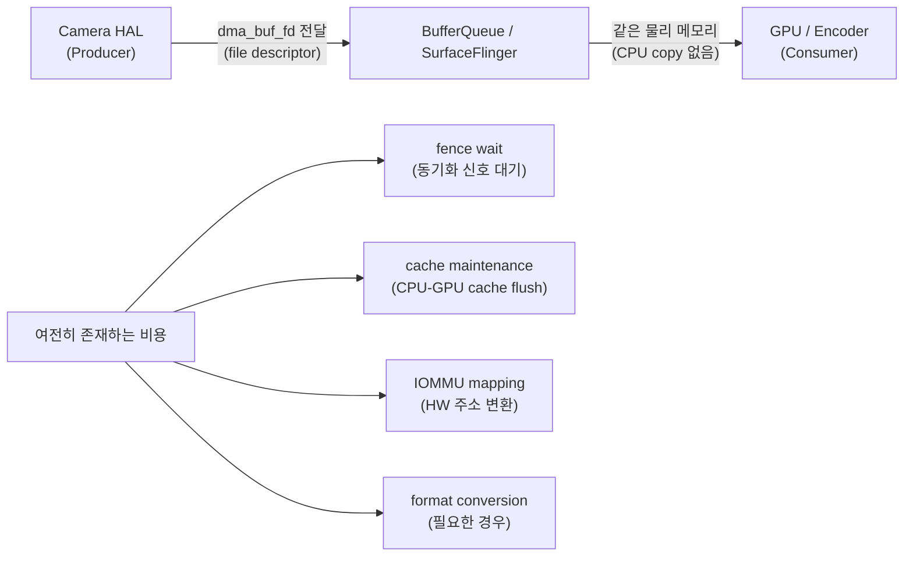

## DMA-BUF zero-copy는 무작업 보장이 아니라 shared buffer ownership이다

상위 문서: [Kernel contracts](kernel.md)

DMA-BUF 기반 경로에서 zero-copy 라고 말할 때는 \"앱이나 중간 계층이 픽셀 데이터를 CPU 로 복사하지 않고 buffer ownership 또는 file descriptor 를 전달한다\"는 뜻으로 좁혀 쓰는 편이 정확하다.

### 메커니즘: DMA-BUF 공유 구조



zero-copy 는 물리 메모리의 CPU-level 복사가 없다는 뜻이지, **시스템 전체에 오버헤드가 없다는 뜻이 아니다**.

### Kotlin/C++ 코드 예시: AHardwareBuffer를 통한 DMA-BUF 접근

```kotlin
// Kotlin: HardwareBuffer로 DMA-BUF 기반 공유 메모리 생성
val hardwareBuffer = HardwareBuffer.create(
    width = 1920,
    height = 1080,
    format = HardwareBuffer.RGBA_8888,
    layers = 1,
    usage = HardwareBuffer.USAGE_GPU_SAMPLED_IMAGE or HardwareBuffer.USAGE_CPU_READ_RARELY
)

// ImageReader를 통한 Camera DMA-BUF 수신
val imageReader = ImageReader.newInstance(
    1920, 1080,
    ImageFormat.PRIVATE,  // PRIVATE = GPU-only, CPU copy 없음
    maxImages = 2
)
```

```cpp
// NDK: AHardwareBuffer 직접 사용 (C++)
AHardwareBuffer_Desc desc = {
    .width = 1920, .height = 1080,
    .layers = 1,
    .format = AHARDWAREBUFFER_FORMAT_R8G8B8A8_UNORM,
    .usage = AHARDWAREBUFFER_USAGE_GPU_FRAMEBUFFER | AHARDWAREBUFFER_USAGE_CPU_READ_RARELY
};
AHardwareBuffer* buffer;
AHardwareBuffer_allocate(&desc, &buffer);

// fence를 통한 동기화 (zero-copy라도 반드시 필요)
int fenceFd = -1;
AHardwareBuffer_acquire(buffer);  // ref count 증가
// ... GPU 사용 완료 후
AHardwareBuffer_release(buffer);  // ref count 감소
```

### 판단 기준

- `ImageFormat.PRIVATE` 포맷은 CPU에서 직접 읽을 수 없다. GPU-only 경로에서 사용하며, 이 경우 CPU copy 비용이 없지만 앱이 픽셀 데이터에 직접 접근하지 못한다.
- zero-copy 경로에서도 fence wait, cache maintenance, IOMMU mapping 비용은 남는다. 분석 지점은 \"복사를 했는가\" 하나가 아니라 allocation heap, usage flag, fence, queue depth 를 함께 봐야 한다.
- "zero-copy 달성: 데이터는 한 번만 메모리에 쓰인다"는 표현은 너무 강하다. 정확한 표현은 "앱 수준 CPU copy 를 줄이는 shared buffer contract"다.

### 경계

- BufferQueue에서의 producer/consumer 소유권 모델은 [BufferQueue는 producer와 consumer를 buffer ownership으로 분리한다](../../graphics-and-media/graphics-media/bufferqueue-separates-producer-and-consumer-with-buffer-ownership.md)가 다룬다.
- Android shared memory 진화 (ashmem→ION→DMA-BUF heaps)는 [Android shared memory는 ashmem, ION, DMA-BUF heaps로 역할이 분화됐다](android-shared-memory-evolved-from-ashmem-ion-to-dmabuf-heaps.md)가 다룬다.

### 관측 가능한 증거 (Observable Evidence)

```bash
# DMA-BUF 할당 상태 확인
adb shell cat /proc/meminfo | grep -E "CmaFree|CmaTotal"

# DMA-BUF fence 상태 (GPU 동기화 지연 감지)
adb shell dumpsys SurfaceFlinger | grep -E "fence|buffer|latency"

# Perfetto로 DMA-BUF 할당 추적
adb shell perfetto --txt -c - <<EOF
buffers { size_kb: 32768 }
data_sources { config { name: "android.gpu.memory" } }
EOF
```

### 관련 문서

- [Android shared memory는 ashmem, ION, DMA-BUF heaps로 역할이 분화됐다](android-shared-memory-evolved-from-ashmem-ion-to-dmabuf-heaps.md)
- [BufferQueue는 producer와 consumer를 buffer ownership으로 분리한다](../../graphics-and-media/graphics-media/bufferqueue-separates-producer-and-consumer-with-buffer-ownership.md)
