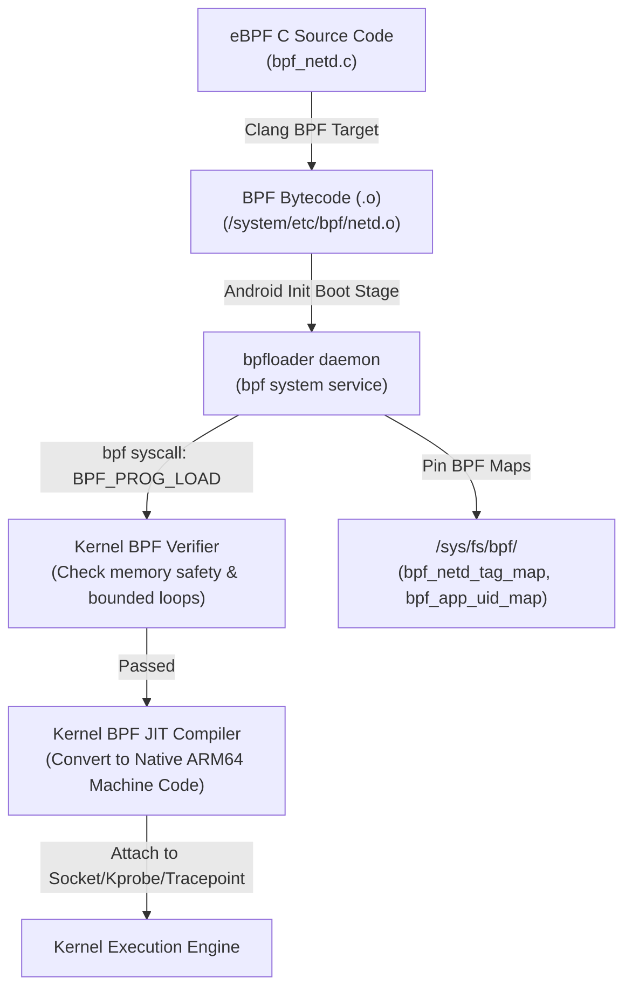

## eBPF는 검증된 프로그램으로 Android kernel 기능을 확장한다

상위 문서: [Kernel contracts](kernel.md)
배경 지식: [eBPF](../../../../../../02_references/operating-systems/kernel.md)

**eBPF**(Extended Berkeley Packet Filter)는 소스코드를 수정하거나 별도의 커널 모듈(LKM)을 다시 빌드하지 않고도, 커널 내부 샌드박스 엔진 내에서 검증된(Verified) 바이트코드를 안전하게 실행하여 네트워크 패킷 필터링, 트래픽 통계(Traffic Accounting), CPU Time-in-State 프로파일링, 메모리 모니터링 기능을 확장하는 메커니즘이다. 일반 커널 모듈(LKM)은 임의의 코드를 커널 권한으로 통째로 심는 방식이라 버그가 곧 커널 크래시나 보안 구멍으로 이어지지만, eBPF 프로그램은 로드 전에 커널이 안전성을 정적으로 검증하고 정해진 hook 지점에서만 제한된 동작을 하도록 샌드박싱된다는 점이 다르다.

Android에서는 시스템 부팅 시 `bpfloader` 서비스가 `/system/etc/bpf/` 및 `/product/etc/bpf/`에 위치한 바이트코드를 커널로 로드하고 BPF 맵을 `/sys/fs/bpf/` 가상 파일시스템에 핀(Pin)하여 관리한다.

---

### 메커니즘: eBPF 프로그램 검증, 로드 및 핀(Pinning) 구조



1. **Safety Verification (검증)**: 커널의 BPF Verifier가 프로그램 내 유효하지 않은 포인터 참조, 정지하지 않는 루프(Unbounded Loop), 승인되지 않은 메모리 접근을 사전에 검증하여 커널 패닉(Kernel Crash)을 원천 차단한다.
2. **BPF Map Persistence (핀닝)**: eBPF 커널 프로그램과 userspace(Java Framework/netd)는 공유 메모리 데이터 구조체인 **BPF Map**을 통해 데이터를 주고받는다. `bpfloader`는 이 맵을 `/sys/fs/bpf/`에 핀(Pin)하여 프로세스가 재시작되어도 상태가 유지되도록 만든다.

---

### eBPF C 소스 및 BPF Map 정의 예시

```c
// AOSP bpf_netd.c 예시 스니펫
#include <bpf_helpers.h>
#include <linux/bpf.h>

// 1. UID별 패킷 통계를 기록할 BPF Map 선언
DEFINE_BPF_MAP(cookie_tag_map, HASH, uint64_t, StatsValue, 1024, AID_NET_BW_ACCT)

// 2. socket filter에 훅(Hook)될 eBPF 커널 함수 정의
SEC("skfilter/tag_socket")
int bpf_tag_socket(struct __sk_buff* skb) {
    uint64_t cookie = bpf_get_socket_cookie(skb);
    StatsValue* val = bpf_cookie_tag_map_lookup_elem(&cookie);
    if (val) {
        val->rxBytes += skb->len;
        val->rxPackets++;
    }
    return 0; // 패킷 허용
}

LICENSE("Apache 2.0");
```

---

### 실무 규칙

- eBPF는 임의의 일반 앱이 커널 레벨 코드를 삽입할 수 있는 Open API가 아니다. SELinux 정책상 `bpfloader` 및 제한된 system_server/netd 획득 권한자만 eBPF 프로그램을 로드할 수 있다.
- Android 네트워크 계층의 Cgroup BPF 훅(`netd` 및 `ConnectivityService`)은 `iptables`/`xt_qtaguid` 대비 CPU 오버헤드를 현저히 낮추며, 화면이 꺼진 대기 상태의 배터리 효율성을 높인다.

---

### 관측 가능한 증거 (Observable Evidence)

1. **마운트된 eBPF 가상 파일시스템 및 핀(Pin)된 BPF Map 목록 조회**:
   ```bash
   adb shell ls -la /sys/fs/bpf/
   # -rw-rw---- 1 root net_bw_acct  map_netd_app_uid_stats_map
   # -rw-rw---- 1 root net_bw_acct  map_netd_cookie_tag_map
   # -r--r--r-- 1 root root          prog_netd_skfilter_allowlist
   ```
2. **`bpfloader` 로깅 및 커널 로드 성공 여부 검증**:
   ```bash
   adb shell logcat -s bpfloader
   # bpfloader: Loaded program /system/etc/bpf/netd.o successfully.
   ```
3. **`dumpsys netd`를 통한 eBPF 기반 네트워크 모니터링 활성화 상태 검증**:
   ```bash
   adb shell dumpsys netd | grep -i "bpf"
   # BPF Traffic Accounting: Enabled
   ```

---

### 관련 문서

- [netd는 routing, DNS, firewall 및 tethering 동작을 강제한다](../../connectivity/connectivity/netd-enforces-routing-dns-firewall-and-tethering-operations.md)
- [SELinux domain/type policy](selinux-enforces-mac-with-domain-type-policy.md)

공식 문서: [AOSP eBPF overview](https://source.android.com/docs/core/architecture/kernel/bpf)

